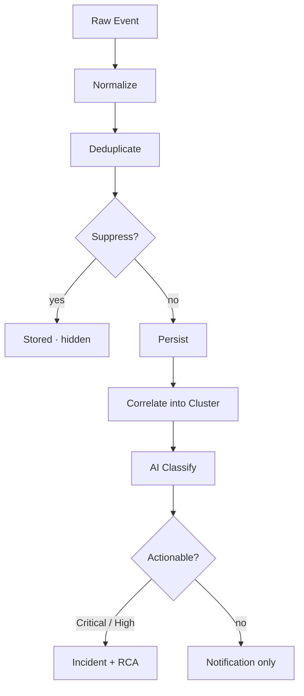

# Introducing Deep Response Engine

**Most platforms tell you something is wrong. CloudThinker tells you why — and starts fixing it before you open your laptop.**

---

## The 3 AM Problem, Revisited

Three months ago we shipped CloudThinker Incidents. The premise was simple: AI investigates, humans validate. From a 45-minute hunt to a sub-10-minute resolution.

It worked. But we kept seeing the same gap upstream of it.

It's 3:14 AM. A page fires. By the time it lands on a phone, your monitoring stack has already produced a few thousand events that night — most duplicates, most internal AWS bookkeeping, most flapping resources. The on-call engineer has to triage which alert, of all of them, is the one that woke them up. Investigation can't even begin until that triage is done.

The signal-to-noise problem isn't an investigation problem. It's a layer earlier. And it was the one CloudThinker Incidents alone couldn't solve.

So we built it.

Today we're announcing **Deep Response Engine** — CloudThinker's end-to-end response loop. It's a rename and an expansion. What used to be _Incidents_ is now one of two pillars under a single module: signal intelligence and AI investigation, joined by an explicit memory layer, designed to operate as one system from the first event in your cloud to a resolved incident with a remediation log.

---

## Two Pillars. One Loop. No Handoff.

Deep Response Engine has two named pillars. Each one stands on its own. Together, they close the loop.

<CardGroup cols={2}>
  <Card title="01 — Pulse" icon="wave-pulse" href="/guide/pulse/overview">
    **Signal Intelligence.** Decides what's worth waking you for. Ingests from 10+ sources, runs seven suppression layers, correlates related events into clusters, AI-classifies severity and actionability.

    - 10+ unified sources, one feed
    - 7 suppression layers, ~98% noise removed
    - Auto-correlation into clusters
    - AI severity + actionability classification
  </Card>
  <Card title="02 — Incident" icon="triangle-exclamation" href="/guide/incident/root-cause-analysis">
    **Investigation to Resolution.** Investigates the moment a cluster escalates. Forms competing hypotheses, tests them against evidence, executes runbooks under your approval gates, and stores the lesson for next time.

    - Hypothesis-driven RCA, confidence scored
    - Transparent reasoning timeline
    - Approval-gated runbook automation
    - Memory: every resolution teaches the next
  </Card>
</CardGroup>

A cluster in Pulse becomes an incident in Incident the moment it crosses the actionability bar. Investigation begins automatically. When the root cause is confirmed, the remediation step is searched, surfaced, and (with your approval gates intact) executed. Every resolution feeds Memory. The next similar incident benefits.

No tickets. No copy-pasting between tools. No human in the middle of the routine work.

---

## Pillar 01 — Pulse

**Most tools detect. Pulse decides what's worth waking you for.**

Your monitoring stack is already catching anomalies. CloudTrail flags a security event. GuardDuty detects unusual API access. Datadog notices a latency spike. Slack pings you about an EC2 instance flapping. The problem isn't detection — it's volume. Engineers spend more time triaging noise than fixing real problems.

Pulse sits in front of all of it.

<CardGroup cols={3}>
  <Card title="13K" icon="bolt">
    **Raw Events**
    Cloud events streaming in from 10+ connected sources
  </Card>
  <Card title="510" icon="filter">
    **Signals**
    After deduplication and seven suppression layers
  </Card>
  <Card title="40" icon="bullseye">
    **Actionable Clusters**
    Correlated, AI-classified, ready for human attention
  </Card>
</CardGroup>

<Tip>
  ~98% of the noise is gone before anyone is paged. No rules, no thresholds, no manual tuning.
</Tip>

It's an 8-stage pipeline, fully automatic.

What this gives you in practice:

- **10+ sources, one feed.** AWS (CloudTrail, GuardDuty, Cost Anomaly, Health, Config, Access Analyzer), Slack, Teams, Datadog, Grafana, New Relic, PagerDuty, Prometheus, plus generic webhooks. All unified, all normalized.
- **Seven suppression layers.** Deduplication, rate limiting, flapping detection, cascade silencing, noise signatures, snooze, severity normalization. Stacked, not toggled.
- **Auto-correlation into clusters.** Nine EC2 alerts about the same node pool become one cluster — not nine pages.
- **AI classification on every signal.** Category, canonical severity, and an actionability verdict. No manual triage rules.
- **One-click escalation.** Any cluster escalates to a full incident in one click. Critical, High, or AI-actionable signals escalate automatically.

<Note>
  **No rules. No thresholds. No manual tuning.** Pulse learns what matters from the signals themselves. The seven suppression layers stack; the AI classifier learns from your environment. The engineer's job is to look at clusters, not configure filters.
</Note>

---

## Pillar 02 — Incident

**From the moment a cluster escalates, the AI is already investigating.**

If you've used CloudThinker Incidents, the foundation is the same — and stronger now. Four named capabilities define how Incident works inside Deep Response Engine.

<CardGroup cols={2}>
  <Card title="Hypothesis-Driven RCA" icon="flask">
    **Theories, tested.** The agent forms explicit competing hypotheses and tests each against evidence from your topology, metrics, and deployments. States move Investigating → Confirmed or Ruled Out, with a confidence score on a 0.0–1.0 scale.
  </Card>
  <Card title="Transparent Reasoning" icon="eye">
    **No black box.** Every step is visible. Which hypothesis was confirmed, which was ruled out, what evidence ran the timeline. Metric deviations, deployment correlations, log links, trace breakdowns — all surfaced live as the agent gathers them.
  </Card>
  <Card title="Automated Remediation" icon="play">
    **Approval gates intact.** CloudThinker searches your runbook library across Confluence, GitHub, GitLab, or manual upload. Per-command policies (Allow / Require Approval / Deny) decide what happens next. Approval requests fire to email, Slack, and in-app simultaneously.
  </Card>
  <Card title="Memory" icon="brain">
    **Every resolution teaches the next.** Each closed incident is captured: root cause, remediation, services, severity, confidence. New incidents search similar past cases and feed the most relevant ones to the agent as context. A badge reads "Informed by N similar incidents."
  </Card>
</CardGroup>

This is the upgrade most teams feel hardest by month two. The first incident is fast. The hundredth one is almost free.

---

## The Lifecycle, End to End

What does this actually look like when it runs?

A signal arrives in Pulse. It is normalized, deduplicated, run through the seven suppression layers, persisted, correlated into a cluster with related signals from the same blast radius, and AI-classified for category, severity, and actionability. If it's Critical, High, or AI-actionable, it escalates.

Incident takes over. **Phase 1 — context gathering.** The AI maps affected services through your topology, pulls metrics from CloudWatch, Prometheus, and Datadog, compares them to baseline, and identifies recent deployments and config changes. **Phase 2 — analysis and hypothesis testing.** Competing theories are formed. Evidence is collected. Theories are ruled out as evidence contradicts them. **Phase 3 — resolution.** The winning hypothesis is confirmed. Strongest evidence is curated. Remediation steps are generated. A disposition is set: `IDENTIFIED`, `NOT_FOUND`, `FALSE_ALARM`, or `ON_HOLD`.

Specialized agents work in parallel. **[Anna](/guide/agents/anna)** coordinates. **[Alex](/guide/agents/alex)** handles cloud and AWS. **[Tony](/guide/agents/tony)** owns databases. **[Kai](/guide/agents/kai)** owns Kubernetes. **[Oliver](/guide/agents/oliver)** covers security and IAM. What used to take a four-hour cross-team sequential investigation now happens in two to ten minutes, in parallel.

When it's resolved, Memory captures the lesson.

---

## What Shipped Today

Three things are new in this release that change how Deep Response Engine feels in production.

<CardGroup cols={3}>
  <Card title="Auto-RCA on agent-created incidents" icon="bolt">
    **Investigation starts itself.** When the system creates an incident — from an agent response, a Pulse escalation, or a webhook — Root Cause Analysis triggers immediately in the background. By the time a human looks, the investigation is already underway.
  </Card>
  <Card title="Incident Memory v1" icon="brain">
    **Every resolution, retrievable.** Every closed incident becomes structured context for future ones. Similarity search runs automatically; the agent's first hypothesis is sharper because it has read what happened the last twelve times.
  </Card>
  <Card title="Hardened webhook suite" icon="plug">
    **15+ platforms, wire it once.** PagerDuty, Opsgenie, ServiceNow, BigPanda, Datadog, Grafana, Prometheus, Splunk, AWS CloudWatch, Azure Monitor, GCP Monitoring, New Relic, Dynatrace, Sentry, generic. HMAC-SHA256, Bearer, API key. Per-source rate limits. State-token validation on every callback.
  </Card>
</CardGroup>

---

## What's Different From Everything Else

We've been direct about this in every conversation with prospects, so we'll be direct here.

| Aspect | What other tools do | What Deep Response Engine does |
|---|---|---|
| **Alert volume** | Detect events, flood you with all of them | Suppress 98% of noise before paging |
| **Routing** | Wake on-call for noise too | Page only Critical / High / AI-actionable clusters |
| **Correlation** | Group duplicates and stop | Form hypotheses, test them, score the answer |
| **Investigation** | Show data, humans investigate | AI investigates in parallel across cloud, db, k8s, security |
| **Timing** | Post-mortem tooling for after the fire | Real-time investigation before a human opens a laptop |
| **Knowledge** | Leaves with employees | Memory persists; future incidents resolve faster |
| **Source sync** | One-way alert ingestion | Bidirectional sync with the source platform |

<Note>
  **AI as investigator, human as decision-maker, system as long-term memory.** We're not improving the old model. We're proposing a new one. Pulse decides what's worth waking you for. Incident investigates the moment it lands. Memory makes the next one faster.
</Note>

---

## Getting Started

Deep Response Engine is available today for all CloudThinker customers. If you already use CloudThinker Incidents, you already have it — Pulse, Memory, and the new automation features are now part of the same module under a clearer name and a reorganized navigation.

**Setup takes minutes:**

<Steps>
  <Step title="Open Deep Response Engine">
    Open **Deep Response Engine** in your CloudThinker dashboard.
  </Step>
  <Step title="Connect a Pulse source">
    Connect AWS, Slack, Datadog, or one of the 15+ webhook integrations. See [Pulse Setup](/guide/pulse/setup).
  </Step>
  <Step title="Run shadow mode for a day">
    Let it run for a day. Watch the noise reduction in the [Pulse Analytics](/guide/pulse/analytics) tab.
  </Step>
  <Step title="Configure runbooks and approval policies">
    Connect [Runbooks](/guide/incident/runbooks) and set per-command Allow / Require Approval / Deny policies.
  </Step>
  <Step title="Flip auto-escalation on">
    The next signal that lands triggers the loop end-to-end.
  </Step>
</Steps>

---

## The Bottom Line

Incident management has been stuck in the same paradigm for too long: humans doing detective work while tools display data, and a flood of alerts on top of it that buries the actual signal.

Deep Response Engine inverts that model. Pulse decides what's worth waking you for. Incident investigates the moment it lands. Memory makes the next one faster.

Your 3 AM self will thank you.

---

**Ready to see it run on your stack?**

<CardGroup cols={2}>
  <Card title="Open Deep Response Engine" icon="arrow-up-right-from-square" href="https://app.cloudthinker.io/incidents">
    Launch the dashboard in your workspace
  </Card>
  <Card title="Read the docs" icon="book" href="/guide/incident/overview">
    Two pillars, end-to-end response loop, full setup guide
  </Card>
</CardGroup>

---

_Deep Response Engine is available now for all CloudThinker platform customers. Contact your account team or visit our documentation to begin setup._
