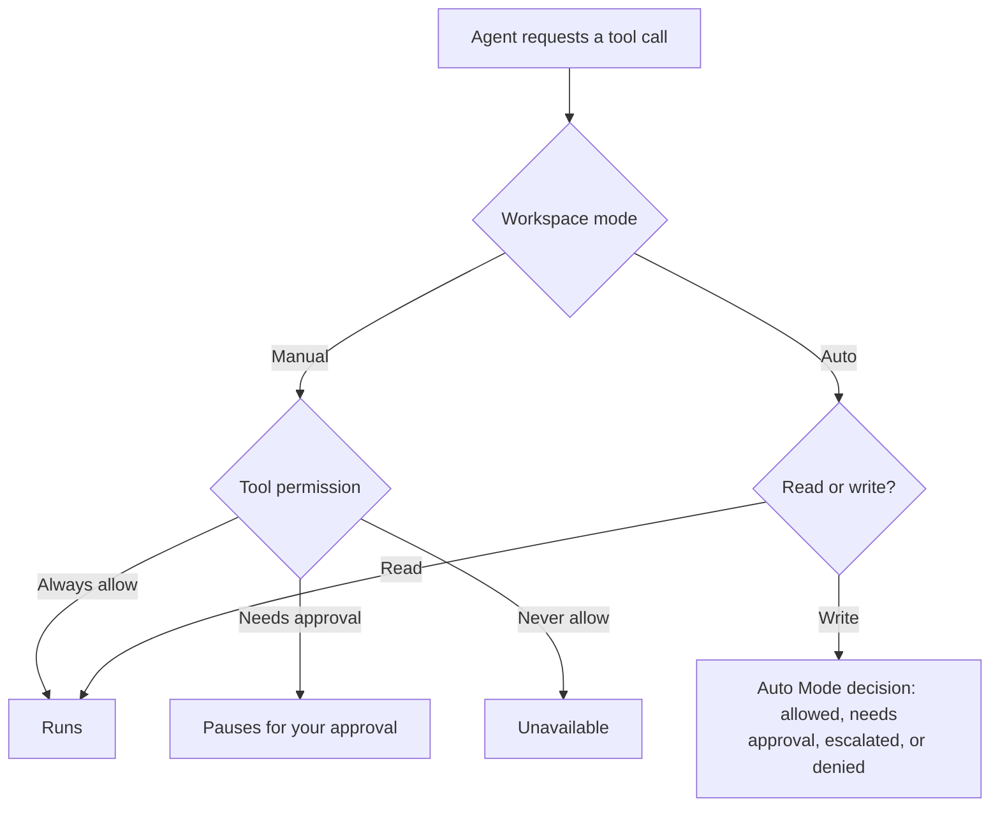

import AutonomyModes from '/snippets/autonomy-modes.mdx';

Tool Permissions control each connection tool — an action an agent can take through a [connection](/guide/connections/overview). In Manual mode, a tool set to **Needs approval** pauses that one call for a person to decide, including a read tool.

## Prerequisites

- The connections edit permission to change Tool Permissions
- The workspace-settings edit permission to switch between Manual and Auto

## Why approval

- **You choose tool by tool.** Each connection tool can be **Always allow**, **Needs approval**, or **Never allow**.
- **Reads can pause too.** A read-only connection tool can use **Needs approval** in Manual mode.
- **The decision is local.** A required-approval decision pauses one inline tool call, not every action in the conversation.
- **The record stays visible.** The tool call and its outcome remain in the conversation.

## The three Approval tabs

| Tab | What it controls |
|-----|------------------|
| **Approvers** | Who can approve a paused action |
| **Tool Permissions** | Each connection tool |
| **Command Permissions** | Each CLI command |

Approval opens on **Approvers**.

## Configure tool permissions

<Steps>
  <Step title="Open Approval">
    Open **Chat Settings** from the gear icon in the chat prompt box, immediately to the right of the **+** button, then select **Approval** under **Workflow**. You can also start from [Connections](https://app.cloudthinker.io/connectors?tab=builtin-connections).
  </Step>
  <Step title="Select Tool Permissions">
    Select the **Tool Permissions** tab.
  </Step>
  <Step title="Select a connection">
    Select the connection whose tools you want to control.
  </Step>
  <Step title="Set each tool permission">
    Choose a setting for each connection tool:

    - **Always allow**
    - **Needs approval**
    - **Never allow**
  </Step>
</Steps>

<Frame>
  
</Frame>

## Tool permission behavior

| Tool permission | In Manual mode |
|-----------------|----------------|
| **Always allow** | The tool can run without an inline approval call |
| **Needs approval** | The agent pauses for one inline approval call before that tool runs |
| **Never allow** | The tool is unavailable to the agent |

Set the control on the tool, not by tool type. A connection read tool can be set to **Needs approval** and pause in Manual mode.

## The approval call

When a Manual **Needs approval** call occurs, the agent pauses on that tool call. Review the operation, its reason, and the available details before you choose **Proceed** or **Cancel**.

<Frame>
  
</Frame>

<Tip>
Review the operation details before you choose **Proceed**. An inline approval applies only to the tool call that requested it.
</Tip>

## Manual, Auto, and Tool Permissions

The two workspace modes describe how agents run:

<AutonomyModes />

Select **Manual** or **Auto** from **Agent settings** in the chat prompt box, or from the Auto Mode control at the top of the **Approval** page. The choice is workspace-scoped and takes effect immediately, with no confirmation step. Tool Permissions remain per-tool controls; in Manual mode, they decide whether each connection tool runs, pauses, or stays unavailable. When Auto is selected, Auto Mode makes the decision instead and these per-tool settings are not applied.

Without the workspace-settings edit permission you see the current mode read-only, marked "Managed by workspace admins".

In Auto mode the per-tool control is replaced by a read-only badge: **Classifier** for a write (Auto Mode's safety check decides it), **Allowed** for a read. Switch back to Manual to edit them.

When Auto is selected, known read-only calls run without a check, and each write receives an Auto Mode decision before it runs: allowed, paused for your approval, escalated, or denied by policy. [Auto Mode](/guide/auto-mode) describes each outcome and its FAQ.

## How a tool call is decided

The decision is per tool call. A paused call waits for **Proceed** or **Cancel**, and the outcome stays visible in the conversation either way.

## Related

<CardGroup cols={2}>
  <Card title="Auto Mode" icon="bolt" href="/guide/auto-mode">
    See the decision each agent write receives in Auto
  </Card>
  <Card title="Automations" icon="calendar-check" href="/guide/automation/automations">
    Run agent instructions on schedules, webhooks, and repository events
  </Card>
  <Card title="Agents" icon="robot" href="/guide/agents">
    Learn how agents work and collaborate
  </Card>
  <Card title="Connections" icon="plug" href="/guide/connections/overview">
    Set up cloud and service connections
  </Card>
</CardGroup>
