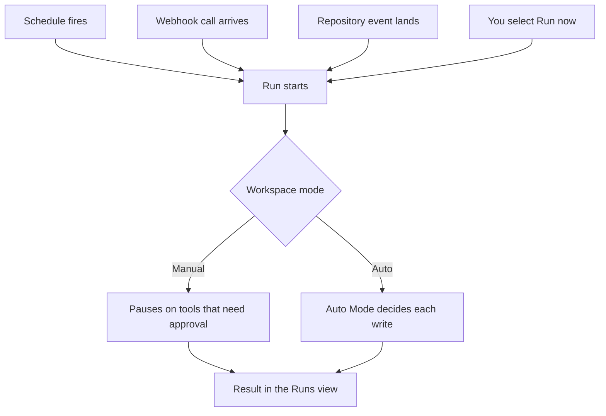

An automation runs stored agent instructions whenever one of its triggers fires: a schedule, an inbound webhook call (an HTTPS request another system sends to a URL CloudThinker gives you), or a repository event. You can also start any automation immediately with **Run now**.

## Prerequisites

- Permission to create and edit automations in the workspace
- Connections are optional; add a [connection](/guide/connections/overview) only when the automation needs that service
- Repository triggers need a git provider connected to [Review](/guide/code-review/setup)

## How an automation starts

An automation is one set of instructions plus any number of triggers. Triggers are independent: whichever one fires starts a run, and the automation's own switch must be on for any trigger to fire.



Whichever trigger starts the run, the workspace's [Manual or Auto mode](/guide/auto-mode) governs what the agent may do during it. A run that pauses for a person shows **Required Approval** in the Runs view.

## Create an automation

<Steps>
  <Step title="Open Automations">
    Open **Automations** from the Home sidebar, then select **New automation**.
  </Step>
  <Step title="Choose how to build it">
    Select **Create with CloudThinker** to describe the automation in chat, select **Create manually** to fill in the form yourself, or pick a template such as **Weekly cost report** to open the form pre-filled.
  </Step>
  <Step title="Name the automation and add triggers">
    Enter an **Automation name**, then add one or more triggers: **Schedule**, **Webhook**, or **Repository**. Triggers are optional — an automation with none runs only when you select **Run now**.
  </Step>
  <Step title="Write the instructions">
    In **Instructions**, tell the agent what to do each time a trigger fires. `@agent` mentions are optional; see [CloudThinker Language](/guide/language).

    ```text
    @kai #alert Check error logs from the last 24 hours and alert on high or critical issues
    ```
  </Step>
  <Step title="Create the automation">
    Select **Create automation**.

    **Success state:** the automation appears in the **Automations** list. If you added a webhook trigger, a dialog first shows its URL and secret — the secret is shown once, so copy it before you close the dialog.
  </Step>
</Steps>

Your plan caps how many automations a workspace can hold; the current count appears beside **New automation** when a limit applies.

## Create one from a conversation

Agents can also propose an automation. When a piece of chat work is worth repeating, the reply ends with a proposal card naming what would run and when. Select **Enable** to create the automation — its timing is computed from the moment you accept, not from when it was proposed — or **Dismiss** to decline. The buttons appear when you can edit automations in the workspace. See [Chat features](/guide/chat-features#from-chat-to-automation) for how proposals appear in chat.

## Schedule triggers

A schedule trigger takes one frequency: **Daily**, **Weekly**, **Monthly**, **No Repeat** (a single future run), or **Custom** (a cron expression). A recurring schedule can also take an optional expiration date, after which it stops firing.

**Custom** takes a 5-field cron expression (`minute hour day month weekday`). The minute and hour fields accept a single value, `*`, or a step such as `*/15`; a list or range in those two fields is rejected with "This schedule format is not supported." Day, month, and weekday accept ranges and lists, and `MON`–`SUN` names are converted for you.

```text
*/15 * * * *     Every 15 minutes
0 */6 * * *      Every 6 hours
0 9 * * MON-FRI  09:00 on weekdays
```

You pick times in your local time zone; CloudThinker stores them in UTC and displays each run back in your zone.

<Note>
A recurring schedule keeps its local clock time and does not shift for daylight saving, so a run can land an hour off across a DST change.
</Note>

## Webhook triggers

A webhook trigger gives an external system a URL to call. CloudThinker issues the URL and a secret when the trigger is created; the caller proves its identity by sending that secret with each request (as a bearer token by default).

- The secret is shown once, in the dialog that follows the save. If you lose it, rotate it from the trigger card — rotation issues a new secret for the same URL, so the caller keeps its address.
- The trigger card lists the most recent deliveries: when each call arrived, how it ended, and any error text.
- The call's body reaches the agent as data alongside the instructions, so the run can act on what the sender reported.

## Repository triggers

A repository trigger starts the automation when an event lands in a repository connected to Review. Choose the repositories and one or more events: a push, a merge request, a comment, or a pipeline result.

- An optional branch filter (a name or a glob such as `release/*`) applies to push and merge request events; leaving it empty matches every branch.
- Merge request events can be narrowed to specific actions: opened, took new commits, merged, or closed without merging.
- Comments written by the CloudThinker review bot start no run, so an automation never fires on its own output.

## Runs and Calendar

The **Automations** page has three tabs:

| Tab | What it shows |
|-----|---------------|
| **Automations** | Every automation in the workspace, with its triggers, next run, and latest run status |
| **Runs** | Every run, newest first, whatever started it — a schedule, a webhook, a repository event, or **Run now**. Each run links to its conversation, where the full output lives |
| **Calendar** | Past and upcoming scheduled runs by month. Select **+** on a day to create a one-time automation for that date |

A run shows one of these statuses:

| Status | What it means |
|--------|---------------|
| **Pending** | The run is queued and waiting to start |
| **Running** | The run is in progress |
| **Succeeded** | The run finished successfully |
| **Failed** | The run ended with an error |
| **Required Approval** | The run paused because an action needs a person to approve it. See [Approval](/guide/approval) |

## Manage automations

Each automation card carries a **Run now** button and an on/off switch. **Edit** and **Delete** live in the card's **…** menu. Turning an automation off keeps its configuration and run history.

If ten consecutive runs fail, CloudThinker turns the automation off and notifies its owner; **Run now** still works for debugging, and turning it back on restores normal triggering.

Pair automations with [notifications](/guide/notifications) so results and failures reach the right people, and review the Runs tab periodically to tune instructions and timing.

## Next steps

<CardGroup cols={2}>
  <Card title="Autonomous Operations" icon="robot" href="/guide/automation/autonomous-agents">
    See everything that runs without a live prompt and how to bound it
  </Card>
  <Card title="Approval" icon="shield-check" href="/guide/approval">
    Control which tools pause for a person in Manual mode
  </Card>
  <Card title="Auto Mode" icon="bolt" href="/guide/auto-mode">
    Understand how Auto decides each agent write before it runs
  </Card>
  <Card title="Notifications" icon="bell" href="/guide/notifications">
    Deliver run results and failure alerts by email, Slack, or Teams
  </Card>
</CardGroup>
