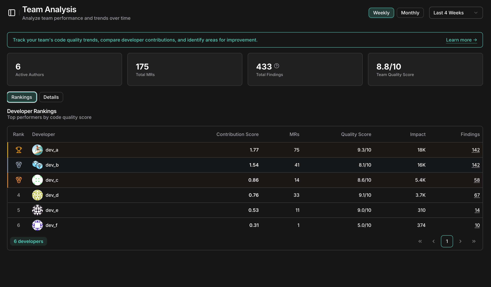

Gain visibility into true engineering performance. The Leaderboard balances **Quality** (AI Scores) and **Impact** (Complexity) to highlight developers who ship robust code, not just those who ship the most lines. By normalizing scores against your team's average, it creates a fair playing field for everyone.

Both metrics contribute equally (50/50 weighting), ensuring that high-volume output doesn't mask low-quality work, and that complex architectural improvements are recognized appropriately.


---

## What you get

- Team-relative scoring that's meaningful within your team context
- Balanced assessment preventing gaming through quantity over quality
- Fair comparison where large refactors count proportionally more than trivial changes
- Quality incentives through AI review scores (1-10 scale)

---

## Core formula

```
Leaderboard Score = (Normalized Quality Score + Normalized Impact Score) / 2
```

Where:
- **Normalized Quality Score** = Author's Average AI Score / Team Average AI Score
- **Normalized Impact Score** = Author's Total Impact / Team Average Impact

---

## Understanding the score

| Score | Interpretation |
|-------|----------------|
| = 1.0 | Exactly at team average on both quality and productivity |
| > 1.0 | Above team average (top performer) |
| < 1.0 | Below team average |
| 2.0   | Twice as productive/high-quality as the average |

---

## Impact calculation

Each Merge Request's impact score measures the complexity of the change:

```
MR Impact = (files_changed × 6.0) + (lines_added × 0.14) + (lines_deleted × 0.28)
```

| Metric | Weight | Rationale |
|--------|--------|-----------|
| Files Changed | 6.0 | Cross-file changes indicate higher complexity |
| Lines Added | 0.14 | New code requires understanding and integration |
| Lines Deleted | 0.28 | Deletions often require more careful analysis (2× addition weight) |
| Minimum Impact | 1.0 | Floor value to prevent division issues |

---

## Example calculation

**Team Data:**

| Author | Avg AI Score | Total Impact |
|--------|--------------|--------------|
| Alice  | 8.5          | 450          |
| Bob    | 7.2          | 280          |
| Carol  | 9.0          | 120          |

**Team Averages:**
- Team Avg AI Score = (8.5 + 7.2 + 9.0) / 3 = **8.23**
- Team Avg Impact = (450 + 280 + 120) / 3 = **283.33**

**Alice's Leaderboard Score:**
- Normalized Quality = 8.5 / 8.23 = **1.03**
- Normalized Impact = 450 / 283.33 = **1.59**
- Leaderboard Score = (1.03 + 1.59) / 2 = **1.31**

<Tip>
  Alice scores **1.31** — 31% above team average!
</Tip>

---

## Use Cases

The leaderboard is more than just a ranking—it's a diagnostic tool for engineering health.

### 1. Identifying Mentors & Leads
Developers with consistently high **Leaderboard Scores** (High Quality + High Impact) are ideal candidates for:
- Mentoring junior developers
- Leading complex architectural refactors
- Reviewing critical PRs

### 2. Spotting Burnout & Process Issues
- **High Impact, Low Quality**: A developer might be rushing to meet deadlines, sacrificing quality. This is a signal to check workload.
- **High Quality, Low Impact**: Could indicate being stuck on a difficult problem, lack of tasks, or over-optimization.

### 3. Balancing Team Load
If one developer has significant impact score dominance, the team has a high "Bus Factor". Use the leaderboard to ensure knowledge and workload are distributed more evenly.

### 4. Quality Gamification
Encourage the team to improve their "AI Score" by writing cleaner, more maintainable code, turning code review into a positive feedback loop rather than a chore.

---

## Reference

<Info>
  The Impact Score formula is derived from [Oobeya GitWiser - Coding Impact Score](https://docs.oobeya.io/gitwiser-repo-analytics/git-analytics-metric-definitions/coding-impact-score) methodology for measuring developer productivity and code complexity.
</Info>
