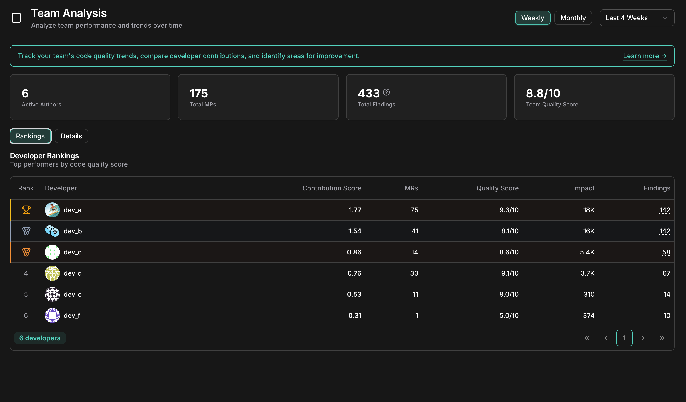

Gain visibility into true engineering performance. The Leaderboard balances **Quality Score** and **Impact** to produce a **Contribution Score** that highlights developers who ship robust code, not just those who ship the most lines. By normalizing scores against your team's average, it creates a fair playing field for everyone.

Both metrics contribute equally (50/50 weighting), ensuring that high-volume output doesn't mask low-quality work, and that complex architectural improvements are recognized appropriately.

---

## The Problem With Traditional Engineering Metrics

Standard engineering metrics (PR count, lines of code, commit frequency) are easily gamed and often counterproductive. A developer who ships 50 small PRs with trivial changes scores higher than one who completes a complex, high-quality architectural refactor in a single PR.

The result: teams optimize for activity over impact. Engineers learn to split work into tiny chunks to maximize PR counts. Code quality metrics are ignored because they're not surfaced alongside productivity. Engineering managers lack data to identify who needs support and who deserves recognition.

---

## How Existing Approaches Compare

| Approach | What It Measures | What's Missing |
|----------|-----------------|----------------|
| **PR count** | Volume of activity | Says nothing about quality or complexity |
| **Lines of code** | Output volume | Incentivizes bloat; deletions are more valuable than additions |
| **Commit frequency** | Engagement | Easily gamed; small commits inflate numbers |
| **Code review turnaround** | Process speed | Doesn't measure review quality or accuracy |
| **Static analysis scores** | Code quality in isolation | No connection to developer productivity or team context |

The Leaderboard is different: it normalizes both quality and impact against your *own team's average*, creating a meaningful relative performance picture that adjusts to your team's context.

---

## What you get

- Team-relative scoring that's meaningful within your team context
- Balanced assessment preventing gaming through quantity over quality
- Fair comparison where large refactors count proportionally more than trivial changes
- Quality incentives through Quality Score (1-10 scale)

---

## Quality score

Each PR receives a **Quality Score** on a 1–10 scale. The score starts at 10 and is reduced based on the number and severity of findings — critical issues have a higher penalty than low-severity ones. The **Team Quality Score** shown on the dashboard is the average across all developers.

---

## Core formula

```
Contribution Score = (Normalized Quality Score + Normalized Impact Score) / 2
```

Where:
- **Normalized Quality Score** = Author's Average Quality Score / Team Quality Score
- **Normalized Impact Score** = Author's Total Impact / Team Average Impact

---

## Understanding the Contribution Score

| Contribution Score | Label | Interpretation |
|--------------------|-------|----------------|
| ≥ 1.5 | Excellent | Significantly above team average |
| 1.0 – 1.5 | Good | Above team average |
| 0.8 – 1.0 | Average | At or near team average |
| < 0.8 | Needs Improvement | Below team average |

---

## Impact calculation

Each Merge Request's impact score measures the complexity of the change:

```
MR Impact = (files_changed × 6.0) + (lines_added × 0.14) + (lines_deleted × 0.28)
```

| Metric | Weight | Rationale |
|--------|--------|-----------|
| Files Changed | 6.0 | Cross-file changes indicate higher complexity |
| Lines Added | 0.14 | New code requires understanding and integration |
| Lines Deleted | 0.28 | Deletions often require more careful analysis (2× addition weight) |
| Minimum Impact | 1.0 | Floor value to prevent division issues |

---

## Example calculation

**Team Data:**

| Author | Avg Quality Score | Total Impact |
|--------|--------------|--------------|
| Alice  | 8.5          | 450          |
| Bob    | 7.2          | 280          |
| Carol  | 9.0          | 120          |

**Team Averages:**
- Team Quality Score = (8.5 + 7.2 + 9.0) / 3 = **8.23**
- Team Avg Impact = (450 + 280 + 120) / 3 = **283.33**

**Alice's Contribution Score:**
- Normalized Quality = 8.5 / 8.23 = **1.03**
- Normalized Impact = 450 / 283.33 = **1.59**
- Contribution Score = (1.03 + 1.59) / 2 = **1.31**

<Tip>
  Alice scores **1.31** — 31% above team average!
</Tip>

---

## Use Cases

The leaderboard is more than just a ranking—it's a diagnostic tool for engineering health.

### 1. Identifying Mentors & Leads
Developers with consistently high **Contribution Scores** (High Quality + High Impact) are ideal candidates for:
- Mentoring junior developers
- Leading complex architectural refactors
- Reviewing critical PRs

### 2. Spotting Burnout & Process Issues
- **High Impact, Low Quality**: A developer might be rushing to meet deadlines, sacrificing quality. This is a signal to check workload.
- **High Quality, Low Impact**: Could indicate being stuck on a difficult problem, lack of tasks, or over-optimization.

### 3. Balancing Team Load
If one developer has significant impact score dominance, the team has a high "Bus Factor". Use the leaderboard to ensure knowledge and workload are distributed more evenly.

### 4. Quality Gamification
Encourage the team to improve their Quality Score by writing cleaner, more maintainable code, turning code review into a positive feedback loop rather than a chore.

---

## Related

- [Skill Matrix](/guide/code-review/skill-matrix) — See per-developer proficiency across Security, Performance, Correctness, and Patterns domains

## Reference

<Info>
  The Impact Score formula is derived from [Oobeya GitWiser - Coding Impact Score](https://docs.oobeya.io/gitwiser-repo-analytics/git-analytics-metric-definitions/coding-impact-score) methodology for measuring developer productivity and code complexity.
</Info>
