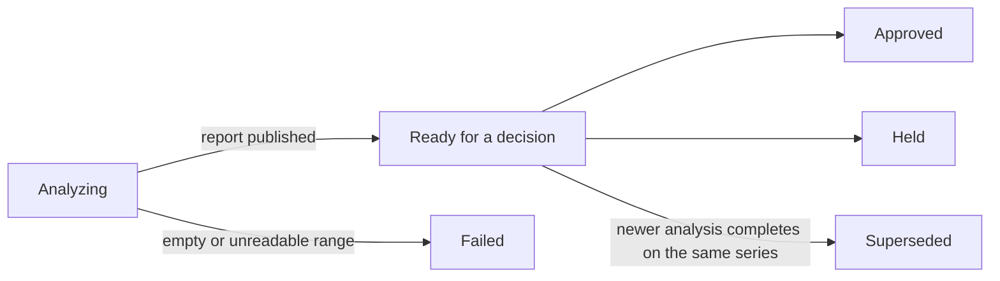

A release is one on-demand risk assessment of a commit range in a connected repository, listed under **Review → Releases**. An agent reads the actual diff and publishes a 0–100 risk score with the evidence behind it, and you record the Approve or Hold call.

## Why release reports

- **One answer to "is this safe to ship?"** The report opens with what the release does, then the score, the risk band, and a review verdict.
- **Evidence, not a checklist.** The agent reads the real diff of the range, so a nullable migration and a table rewrite score differently even when they touch the same file.
- **A recorded decision.** Approve or Hold is a CloudThinker record with a note, visible to the whole workspace.
- **Nothing blocks your pipeline.** The decision is never written back to your Git provider as a commit status, check, or approval.
- **You choose when to spend.** An analysis starts only when a person asks for one — tagging or pushing never opens a release.

## Analyze a range

<Steps>
  <Step title="Open the Releases list">
    Go to **Review → Releases** and click **Analyze a range**.
  </Step>
  <Step title="Pick the range">
    Select the **Repository**, then pick the **Release head** — a tag, branch, or commit — and the comparison base. CloudThinker resolves both refs and verifies the base precedes the head; an unknown or unrelated base fails with an actionable message before any analysis starts.
  </Step>
  <Step title="Start the analysis">
    Confirm the measured range and start the analysis.

    **Success state:** the release appears in the list under the **Analyzing** tab, and moves to **Needs your decision** when the report is published.
  </Step>
</Steps>

Every analysis is its own release row, even for a range you analyzed before — repeat analyses of one release form a *series*. The lifecycle of a row:

A failed analysis publishes no score — CloudThinker never fabricates a "safe" number for a range it could not read.

## What the report contains

The report opens with a short release summary, the risk score, and a review verdict: **Full review required** when any factor is blocking, otherwise **Standard review**. The score falls into one of three bands:

| Band | Score |
|------|-------|
| Low | 0–34 |
| Medium | 35–64 |
| High | 65–100 |

Below the verdict sit three lists that never repeat each other:

| List | What it answers | Shape |
|------|-----------------|-------|
| Changes | What shipped and who it affects | 1–5 rows, each categorized as Feature, Fix, Breaking change, Data change, Dependency change, Infrastructure change, or Internal change |
| Risk factors | Why a change affects the ship decision | Rows from a fixed set of nine areas (for example Data and migrations, Rollback safety, Blast radius), each **Blocking** or **Watch**, with evidence and a mitigation |
| Next actions | What to do about it | Up to 5 imperative instructions in three tiers: **Before you ship**, **Recommended**, and **Watch after rollout** |

A blocking factor always arrives with at least one **Before you ship** action, so the report never names a ship-stopper without something to do about it. When the agent could not assess part of the range, the report says so with explicit limitations instead of scoring blind.

The report also shows the measured size of the range — commits, merge requests, files, and line counts — plus unresolved Critical and High review findings on the range's merge requests. On AWS CodeCommit, merge request counts read **not available** because the provider keeps no commit-to-pull-request index; line counts are likewise unavailable on Azure DevOps and AWS CodeCommit.

<Note>
Counts are point-in-time. A release scored with three unresolved critical findings keeps showing three after you fix them — re-analyze the range for a fresh number.
</Note>

## Approve or hold

**Approve** and **Hold** sit beside the report. Each opens a dialog with a note; holding a release whose report published no blocking factor requires one, so the next reader always sees why it is paused. The decision stays inside CloudThinker — it never blocks anything on your Git provider.

The list's tabs are the decision queue:

| Tab | What it holds |
|-----|---------------|
| Needs your decision | Latest published report per repository release series with no decision yet |
| On hold | Releases a person held |
| Approved | Releases a person approved |
| Analyzing | Runs that have not published a report yet |
| Failed | Runs that stopped without a report |
| Superseded | Reports a newer analysis of the same series replaced |
| All | Everything, filterable by repository and risk level |

Held releases also surface on the [Review overview](/guide/code-review/overview) as a **Releases on hold** card, naming each held release and why. Re-analyzing a series supersedes the older report: it stays readable for history, but only the latest published report accepts Approve or Hold.

## Act on the report

Each open next action offers **Mark resolved** and **Dismiss** — a dismissal always records a reason. Your decision on an action carries forward to the next analysis of the same series when the instruction is unchanged, so work you already settled does not reopen. A tick is your claim, not a verification; only a re-analysis confirms a risk is gone.

You can also hand the open actions to an agent: **Fix all** has the agent work through the list on the branch and verify each change, and **Chat about these** opens a chat with the report as context. The download button renders the report as a PDF for sharing outside CloudThinker.

## FAQ

<AccordionGroup>
  <Accordion title="Does tagging a release start an analysis?">
    No. A release opens only when a person clicks **Analyze a range**. Pushes, tags, and webhooks never start one, so every report is one you asked for.
  </Accordion>
  <Accordion title="Is the decision sent to my Git provider?">
    No. Approve and Hold are CloudThinker records. No commit status, check run, or provider approval is created, and nothing blocks your deployment pipeline.
  </Accordion>
  <Accordion title="What happens when I analyze the same range again?">
    A new release row is created. When its report publishes, the older report becomes Superseded — still readable, but it no longer accepts a decision.
  </Accordion>
  <Accordion title="Will two analyses of one range produce the same score?">
    Not necessarily. The score is the agent's judgment on the diff, not an arithmetic formula, so treat trends and bands as the signal rather than exact score differences.
  </Accordion>
</AccordionGroup>

## Related

<CardGroup cols={2}>
  <Card title="Review" icon="code-pull-request" href="/guide/code-review/overview">
    What the Review module does across your repositories
  </Card>
  <Card title="Review Setup" icon="gear" href="/guide/code-review/setup">
    Connect the repositories a release analysis can read
  </Card>
  <Card title="Pipelines" icon="timeline" href="/guide/code-review/pipelines">
    Turn failed CI runs into agent analysis and findings
  </Card>
  <Card title="Review Insights" icon="chart-mixed" href="/guide/code-review/analytics">
    Track review coverage, trends, and repository reports
  </Card>
</CardGroup>
