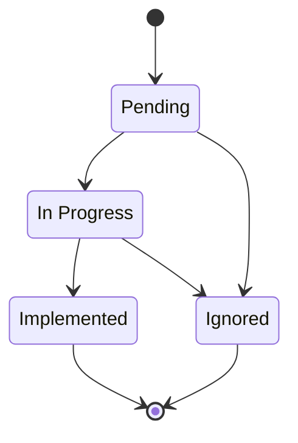

Findings is the workflow board for savings opportunities verified during a scan in Optimize. Each card stays on this page from discovery to your team's final decision.

## Finding classes

| Class | What it means | Included in potential savings |
|---|---|---|
| Quick win | High-confidence, low-effort work that is straightforward to reverse | Yes |
| Needs review | A plausible opportunity that needs more context, effort, or care | Yes |
| No action | Spend the scan checked and found justified | No |

Use the class tabs to filter every board column at once. You can also filter by service for the selected cloud connection.

## Work the board

The columns show the finding's current workflow status:

| Status | Use it for |
|---|---|
| Pending | Newly discovered work that nobody has started |
| In Progress | Work your team is actively evaluating or implementing |
| Implemented | Work completed by your team |
| Ignored | Work your team chose not to pursue |

A finding typically moves through the board like this:

If you have Optimize management permission, drag a card to another column to change its status. Open a card to read its evidence, estimate, confidence, effort, risk, reversibility, and service context.

## Record a disposition

A disposition records why the finding should leave the active queue without erasing it.

| Disposition | Use it when |
|---|---|
| Expected | The spend is intentional and should not require action |
| Snoozed | The finding may matter later, but not before the date or condition you record |
| Disputed | The evidence or conclusion needs correction or further review |

Expected and snoozed findings are hidden by default. Select **Expected/Snoozed** to reveal them and review their recorded reasons. Disputed findings remain visible because they still need attention.

## Discuss a finding

Open a finding and select the **Discussion** tab to keep the decision next to the evidence. Add a comment, reply in a thread, and mark a thread resolved when the question is settled.

Type `@` in the composer to reference a workspace teammate from the member list. A finding an agent linked to a cost spike also appears in that anomaly's **Explained by** list — see [Anomalies](/guide/cost-optimization/anomalies).

## Understand the totals

**Potential monthly savings** sums open Quick win and Needs review estimates for the selected connection. It is an upper bound — individual estimates can overlap — not guaranteed savings.

Changing a finding's status or disposition updates the potential savings total. Filters change what the board shows, while the summary continues to describe the selected account's full finding set.

Read [Savings Estimates](/guide/cost-optimization/savings) before using the total in a forecast or business case.

## Run and recover scans

Select **Run scan** or **Re-scan** to refresh findings when you have Optimize management permission. Progress remains visible while you move around the product.

If one part of a scan fails, Optimize preserves completed work and shows the failure. Retry the scan after fixing the named permission, billing source, or provider problem.

## Related

<CardGroup cols={2}>
  <Card title="Optimize" icon="piggy-bank" href="/guide/cost-optimization/overview">
    Return to the account decision snapshot
  </Card>
  <Card title="Savings estimates" icon="chart-pie" href="/guide/cost-optimization/savings">
    Interpret the potential monthly savings total
  </Card>
  <Card title="Anomalies" icon="wave-pulse" href="/guide/cost-optimization/anomalies">
    Review cost changes that may explain a finding
  </Card>
  <Card title="Reports" icon="file-chart-column" href="/guide/cost-optimization/reports">
    Create a ranked savings opportunities report
  </Card>
</CardGroup>
