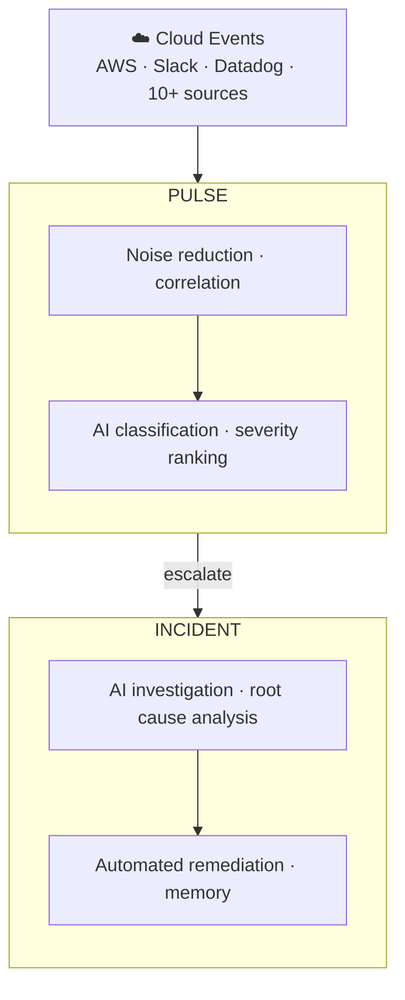

**Most platforms tell you something is wrong. CloudThinker tells you why — and starts fixing it before you open your laptop.**

The Deep Response Engine is CloudThinker's full incident lifecycle system. It covers every stage from the moment an event fires in your infrastructure to the moment the root cause is understood, the remediation is applied, and the lesson is stored for next time.

---

## The Full Response Loop

No stage requires manual handoff. Each layer feeds the next automatically.

---

## Pulse — Signal Intelligence

Your infrastructure generates thousands of events per day. Most of them are noise — duplicate alerts, AWS-internal bookkeeping, rate-limited bursts, flapping resources. Pulse handles all of that before anything reaches your team.

<CardGroup cols={2}>
  <Card title="10+ Sources, One Feed" icon="satellite-dish">
    AWS (CloudTrail, GuardDuty, Cost Anomaly, Health, Config, Access Analyzer), Slack, Teams, Datadog, Grafana, New Relic, PagerDuty — all unified.
  </Card>
  <Card title="98% Noise Reduction" icon="filter">
    Seven suppression layers run automatically: deduplication, rate limiting, flapping detection, cascade silencing, noise signatures, and more.
  </Card>
  <Card title="Auto-Correlation" icon="share-nodes">
    Related signals are grouped into clusters. Nine EC2 alerts about the same node pool become one item, not nine.
  </Card>
  <Card title="AI Classification" icon="brain">
    Every signal is assigned a category, canonical severity, and actionability score. No manual triage.
  </Card>
</CardGroup>

When a cluster crosses the severity threshold — Critical or High, or marked actionable by the AI — it automatically escalates to an Incident. No page, no manual trigger.

<Card title="How Pulse works →" icon="wave-pulse" href="/guide/pulse/overview">
  Pipeline walkthrough, cluster management, noise suppression, and analytics
</Card>

---

## Incident — Investigation to Resolution

An Incident is created the moment a cluster escalates. An AI agent begins investigating immediately — forming hypotheses, gathering evidence, correlating metrics and logs across your connected infrastructure. By the time an on-call engineer opens their laptop, the investigation is already underway.

<CardGroup cols={2}>
  <Card title="Hypothesis-Driven RCA" icon="flask">
    The AI forms explicit theories and tests each one systematically. The result is a structured report: most likely root cause, evidence chain, ruled-out hypotheses, and remediation steps.
  </Card>
  <Card title="Transparent Reasoning" icon="eye">
    Every step is visible — which hypothesis was confirmed, which was ruled out, and why. No black box.
  </Card>
  <Card title="Automated Remediation" icon="book">
    When the root cause is identified, CloudThinker searches your runbook library and can execute matching procedures — with your approval gates in place.
  </Card>
  <Card title="Memory" icon="brain">
    Every resolved incident makes the next one faster. The AI captures which techniques worked, which queries were useful, and which runbook steps resolved the issue.
  </Card>
</CardGroup>

<Card title="How Incident works →" icon="triangle-exclamation" href="/guide/incident/root-cause-analysis">
  AI investigation, root cause analysis, runbooks, and incident memory
</Card>

---

## Getting Started

<CardGroup cols={2}>
  <Card title="Connect Signal Sources" icon="satellite-dish" href="/guide/pulse/setup">
    Connect AWS, Slack, Teams, and webhook sources to start feeding Pulse
  </Card>
  <Card title="Set Up Webhook Integrations" icon="webhook" href="/guide/incident/webhook-integrations/overview">
    Connect PagerDuty, Datadog, Prometheus, CloudWatch, and 10+ monitoring platforms
  </Card>
  <Card title="Add Runbooks" icon="book" href="/guide/incident/runbooks">
    Connect your operational runbooks so AI agents can execute remediation steps
  </Card>
  <Card title="Explore Pulse Analytics" icon="chart-bar" href="/guide/pulse/analytics">
    Measure noise reduction, cluster MTTR, and signal conversion rates
  </Card>
</CardGroup>
