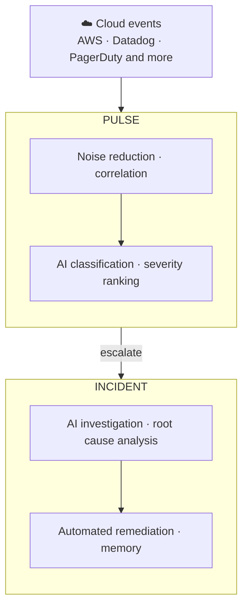

The Deep Response Engine is CloudThinker's incident lifecycle module. It carries every event from first signal to resolved incident — noise reduction, escalation, root cause analysis, remediation, and memory.

Most monitoring stacks tell you something is wrong and stop there. The Deep Response Engine tells you why: [Pulse](/guide/pulse/overview) filters and correlates signals before they page anyone, and Incident starts investigating the moment a cluster escalates — often before an on-call engineer opens a laptop.

## How it works

```mermaid
flowchart TD
    A["☁️ Cloud events\nAWS · Datadog · PagerDuty and more"] --> B

    subgraph B["PULSE"]
        direction TB
        B1["Noise reduction · correlation"]
        B2["AI classification · severity ranking"]
        B1 --> B2
    end

    B --> |escalate| C

    subgraph C["INCIDENT"]
        direction TB
        C1["AI investigation · root cause analysis"]
        C2["Automated remediation · memory"]
        C1 --> C2
    end
```

No stage requires a manual handoff — each layer feeds the next automatically:

1. **Collect** — events stream in from sources like AWS, Datadog, Slack, and PagerDuty into one Pulse feed.
2. **Filter and correlate** — suppression layers remove duplicates, rate-limited bursts, and flapping resources. Related signals are grouped into clusters, so nine alerts about the same node pool become one item.
3. **Classify and escalate** — every signal gets a category, canonical severity, and actionability score. When a cluster is Critical or High, or the AI marks it actionable, it escalates to an incident automatically.
4. **Investigate** — an AI agent forms explicit hypotheses, tests each one against metrics and logs, and produces a structured report: most likely root cause, evidence chain, and ruled-out theories.
5. **Resolve and remember** — the agent matches your [runbooks](/guide/incident/runbooks) to the root cause and executes them under the autonomy mode you set (Manual or Auto). Each resolution feeds [incident memory](/guide/incident/incident-memory), making the next investigation faster.

Every investigation step is visible — which hypothesis was confirmed, which was ruled out, and why.

## What you can do

| Capability | Description | Guide |
|---|---|---|
| Connect signal sources | Feed AWS, Slack, Teams, and webhook events into Pulse | [Pulse setup](/guide/pulse/setup) |
| Manage signal clusters | Review, merge, and act on correlated signal groups | [Clusters](/guide/pulse/clusters) |
| Run AI root cause analysis | Follow hypothesis-driven investigations to a structured RCA report | [How it works](/guide/incident/root-cause-analysis) |
| Ingest monitoring webhooks | Route alerts from PagerDuty, Datadog, CloudWatch, and more | [Webhook integrations](/guide/incident/webhook-integrations/overview) |
| Automate remediation | Let agents execute matching runbook procedures | [Runbooks](/guide/incident/runbooks) |
| Log incidents manually | Record incidents that started outside Pulse | [Manual logging](/guide/incident/manual-logging) |
| Learn from every incident | Reuse what worked — queries, techniques, runbook steps | [Incident memory](/guide/incident/incident-memory) |
| Measure the loop | Track noise reduction, cluster MTTR, and conversion rates | [Pulse analytics](/guide/pulse/analytics) |

## Key concepts

| Concept | Meaning |
|---|---|
| Signal | A single normalized event from any connected source |
| Cluster | A group of correlated signals treated as one item |
| Incident | The investigation object created when a cluster escalates |
| Runbook | An operational procedure agents can match and execute during remediation |
| Incident memory | The record of techniques, queries, and steps that resolved past incidents |

## Get started

<CardGroup cols={2}>
  <Card title="Connect signal sources" icon="satellite-dish" href="/guide/pulse/setup">
    Connect AWS, Slack, Teams, and webhook sources to start feeding Pulse.
  </Card>
  <Card title="Set up webhook integrations" icon="webhook" href="/guide/incident/webhook-integrations/overview">
    Route alerts from PagerDuty, Datadog, CloudWatch, and more into the response loop.
  </Card>
  <Card title="Add runbooks" icon="book" href="/guide/incident/runbooks">
    Give agents the procedures they can execute during remediation.
  </Card>
  <Card title="See how investigation works" icon="flask" href="/guide/incident/root-cause-analysis">
    Follow a hypothesis-driven root cause analysis end to end.
  </Card>
</CardGroup>
