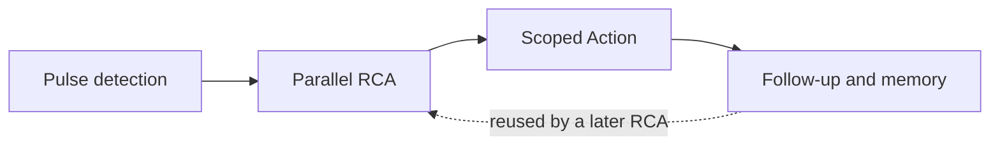

Resolve is CloudThinker's four-stage incident response flow. [Pulse](/guide/pulse/overview) detects actionable problems, Anna investigates them, approved [runbooks](/guide/incident/runbooks) — pre-written fix procedures — carry out tightly scoped actions, and useful lessons can inform later investigations.

## How it works

Resolve runs the platform's agentic loop — Detect → Analyze → Resolve → Validate — end to end; see [How CloudThinker works](/#how-cloudthinker-works) for the loop itself. These are the Resolve-specific stages:

```mermaid
flowchart LR
    A[Pulse detection] --> B[Parallel RCA]
    B --> C[Scoped Action]
    C --> D[Follow-up and memory]
    D -. "reused by a later RCA" .-> B
```

1. **Pulse detection** — [Pulse](/guide/pulse/overview) takes in raw events, suppresses known noise, groups related events into Clusters, and routes actionable ones into Incidents.
2. **Parallel RCA** — Anna runs a three-phase root-cause analysis (RCA). She can delegate focused, read-only hypothesis checks to temporary subagents — short-lived helper agents — and then records the verdict.
3. **Scoped Action** — a matching, enabled runbook can become a Scoped Action. Policy decides whether it runs, waits for approval, or is denied.
4. **Follow-up and memory** — the agent can schedule one follow-up check and write incident memory. Reusable lessons return at the start of a later RCA, not during Pulse classification.

<Note>
Resolve does not guarantee that every incident reaches every stage. An investigation can end without a root cause, a runbook may not match, and post-fix verification depends on the runbook and agent-written follow-up.
</Note>

## Start from the cockpit

Open **Resolve → Overview** to answer two questions: what needs you now, and what Resolve handled without you.

| Area | What it shows |
|---|---|
| Detect funnel | Raw events, visible Signals, Clusters, and Incidents over the Overview time window |
| Needs your decision | RCA reached a verdict or paused and now needs human input |
| Awaiting your approval | A runbook is staged behind an approval decision |
| Critical & high open | Unresolved Incidents at the top two severities |
| AI is handling | Incidents currently queued or under investigation |
| Recent incidents | The latest Incidents, regardless of outcome |

Each attention tile opens the matching slice of the [Investigation queue](/guide/incident/root-cause-analysis). A source-health banner appears when an enabled polling source — a feed Resolve checks on a schedule — fails or pauses, so a broken intake path does not look like a quiet system.

## Control automatic investigation

**On Duty** (the automatic-investigation toggle) in [Settings](/guide/incident/settings) controls whether detection hands off to analysis on its own.

| Setting | Behavior |
|---|---|
| On | Routed clusters create Incidents and eligible system-triggered RCA starts automatically |
| Off | Pulse still detects, routes, and files Incidents, but RCA waits for you to click **Investigate** |

Manual investigation always remains available. Turning automatic investigation back on does not start a backlog of Incidents created while it was off.

## What you can do

| Capability | Description | Guide |
|---|---|---|
| Connect Resolve platforms | Configure connections, Signals, and Outcomes for each external platform | [Integrations](/guide/incident/integrations) |
| Triage Pulse | Work the Needs you, Active, Forming, Routed, Resolved, and All lanes | [Pulse](/guide/pulse/overview) |
| Follow RCA | Review the verdict, confidence, causal graph, evidence, timeline, and remediation queue | [Investigation and RCA](/guide/incident/root-cause-analysis) |
| Govern actions | Supply runbooks and set per-command execution effects | [Runbooks](/guide/incident/runbooks) |
| Measure results | Review response trends, human-judged accuracy, Pulse performance, and runbook coverage | [Insights](/guide/incident/insights) |
| Reuse lessons | Feed agent-written observations, recollections, and lessons into later RCA runs | [Incident memory](/guide/incident/incident-memory) |

## Get started

<CardGroup cols={2}>
  <Card title="Connect a source" icon="plug" href="/guide/incident/integrations">
    Add one webhook, polling source, or messaging channel to Resolve.
  </Card>
  <Card title="Review Pulse" icon="wave-pulse" href="/guide/pulse/overview">
    Triage current clusters and inspect what Pulse routed or suppressed.
  </Card>
  <Card title="Open Investigation" icon="magnifying-glass" href="/guide/incident/root-cause-analysis">
    Follow active RCA and act on completed verdicts.
  </Card>
  <Card title="Set Resolve behavior" icon="sliders" href="/guide/incident/settings">
    Choose automatic investigation, repeat sensitivity, and manual severity defaults.
  </Card>
</CardGroup>
