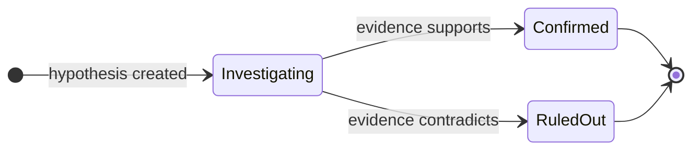

Root Cause Analysis (RCA) is the investigation engine of the [Deep Response Engine](/guide/incident/overview). Specialized agents run hypothesis-driven investigations, build structured evidence chains, and suggest remediation — with full visibility into the reasoning at every step.

## How an investigation runs

1. **Trigger** — an incident is created, either automatically when a [Pulse](/guide/pulse/overview) cluster escalates or manually from the incident detail page. Cluster escalations inject the cluster summary and all member signals into the agent's context, so investigation starts with the full signal history loaded. CloudThinker queues an RCA task in the background and opens a dedicated AI conversation.
2. **Agent activation** — [Anna](/guide/agents/anna) coordinates the investigation while specialists cover their domains, based on your connected infrastructure.
3. **Context gathering** — agents explore infrastructure [topology](/guide/infrastructure/topology), collect baseline metrics, identify affected services, and examine recent deployments and configuration changes.
4. **Analysis** — agents form competing hypotheses and test each one against logs, traces, and dependencies.
5. **Resolution** — the confirmed hypothesis becomes the root cause. Evidence is curated, remediation suggestions are generated, and a disposition is set with a confidence score.

| Agent | Investigates |
|-------|--------------|
| [Alex](/guide/agents/alex) (Cloud Engineer) | Cloud infrastructure — EC2, load balancers, VPC networking |
| [Tony](/guide/agents/tony) (Database Engineer) | RDS Aurora and DocumentDB performance, slow queries, connection pool exhaustion |
| [Kai](/guide/agents/kai) (Kubernetes Engineer) | Pod health, container restarts, resource limits, service mesh configuration on EKS |
| [Oliver](/guide/agents/oliver) (Security Engineer) | Security groups, network policies, IAM permissions, security-related failure modes |
| [Anna](/guide/agents/anna) (General Manager) | Coordination and cross-domain synthesis |

Agents investigate in parallel across these domains and correlate findings in real time. Root causes surface even when symptoms appear far from the underlying issue.

## Investigation phases

RCA follows a structured three-phase workflow. When agents move to a new phase, the previous phase completes automatically if still in progress.

| Phase | Goal | Activities |
|-------|------|------------|
| 1. Context gathering | Establish baseline conditions | Map affected services and dependencies via [topology](/guide/infrastructure/topology); gather metrics from CloudWatch, Prometheus, and Datadog; compare incident metrics to historical baselines; identify recent deployments and configuration changes |
| 2. Analysis and hypothesis testing | Narrow down the root cause | Generate competing theories from symptoms; collect logs, traces, dependency, and resource evidence; rule out hypotheses the evidence contradicts; track confidence as evidence accumulates |
| 3. Resolution | Finalize root cause with evidence | Resolve all remaining hypotheses; confirm the winner as root cause; curate the strongest evidence; generate remediation steps; set disposition and confidence score |

Agents must gather supporting evidence and investigate for sufficient time before confirming any hypothesis.

<Note>
Setting a disposition is mandatory to close an investigation. Without it, the incident remains in **Investigating** status.
</Note>

## Evidence chain

RCA builds a structured evidence chain with automatic calculations. Each item can link to a specific hypothesis to show which findings support each theory.

| Evidence type | What it captures | Fields |
|---------------|------------------|--------|
| Metrics | Incident vs baseline comparison with auto-calculated deviation percentage — for example, "CPU 95% vs 25% baseline = 280% deviation" | `incident_value`, `baseline_value`, `baseline_period`, `threshold`, `unit` |
| Deployments and changes | Recent changes with auto-calculated time delta from incident start; positive delta = before the incident (likely causative) | `type`, `description`, `timestamp`, `correlation`, `service` |
| Logs | Relevant log entries with deep links to log consoles such as CloudWatch, Splunk, and Datadog | `source`, `description`, `deep_link`, `timestamp`, `severity` |
| Traces | Distributed trace data showing request flow and latency breakdowns | `source`, `description`, `raw_data` |
| Configuration | Configuration changes with exact parameter modifications | `source`, `description`, `timestamp` |
| Alerts | Related alerts from monitoring systems during the incident window | `source`, `severity`, `description` |

Evidence is ranked by severity: **Critical** (direct cause) → **High** (strong support) → **Medium** (context) → **Low** (background).

## Confidence scoring

Every identified root cause carries a confidence score from 0.0 to 1.0.

| Score range | Category | Meaning | Action |
|-------------|----------|---------|--------|
| 0.9 – 1.0 | Very high | Root cause identified with overwhelming evidence | Implement remediation immediately |
| 0.7 – 0.9 | High | Root cause identified with strong evidence | Implement remediation with normal priority |
| 0.5 – 0.7 | Medium | Probable root cause, but gaps remain | Implement remediation; monitor for alternatives |
| 0.3 – 0.5 | Low | Possible root cause, evidence is circumstantial | Validate findings manually before action |
| 0.0 – 0.3 | Uncertain | Insufficient evidence to establish root cause | Cannot determine; consider `NOT_FOUND` |

Confidence rises with temporal correlation, metric anomalies above 50% deviation, matching error patterns, ruled-out alternatives, and multiple corroborating data sources. It falls with alternative explanations, weak temporal correlation, missing verification, or conflicting evidence.

## Hypothesis tracking

RCA runs hypothesis-driven investigation inspired by "5 Whys" and Fishbone methodologies.



| State | Meaning |
|-------|---------|
| Investigating | Actively gathering evidence to test the theory |
| Confirmed | Sufficient evidence supports this as root cause |
| Ruled out | Evidence contradicts or disproves the hypothesis |

Agents confirm at least one hypothesis before setting a root cause, and resolve every hypothesis — confirmed or ruled out — before closing the investigation.

An example hypothesis chain from a latency incident:

```text
Timeline Entry 1: hypothesis_created
├── Hypothesis 1: "Database connection pool exhaustion"
├── Confidence: 0.75
└── Message: "Pool exhaustion likely given 500s response times"

Timeline Entry 3: hypothesis_ruled_out
├── Hypothesis 1: Ruled Out
├── Reason: "DB metrics show 45/100 connections—well within limits"
└── Evidence: Max concurrent connections remained stable

Timeline Entry 6: hypothesis_created
├── Hypothesis 2: "Lambda cold start latency after memory reduction"
├── Confidence: 0.85

Timeline Entry 8: hypothesis_confirmed
├── Hypothesis 2: Confirmed
├── Updated Confidence: 0.92
└── Evidence: CloudWatch init duration spike, deployment timing match
```

## Investigation timeline

RCA streams a real-time timeline of every investigation step, showing phase progress, hypothesis testing, and evidence collection with timestamps. Each investigation holds up to 100 entries (enforced at the database level).

| Entry type | Meaning |
|------------|---------|
| `info` | General investigation note |
| `finding` | Specific discovery impacting analysis |
| `warning` | Potential issue requiring verification |
| `error` | Failed investigation attempt |
| `success` | Confirmed finding |
| `hypothesis_created` | New theory proposed |
| `hypothesis_ruled_out` | Theory disproven |
| `hypothesis_confirmed` | Hypothesis validated as root cause |

## Disposition

Every investigation concludes with a disposition, which updates the incident status.

| Disposition | Meaning | Resumable? |
|-------------|---------|------------|
| `IDENTIFIED` | Root cause found with supporting evidence | No (terminal) |
| `NOT_FOUND` | Investigation exhausted, no clear root cause | No (terminal) |
| `FALSE_ALARM` | Issue was not a real incident | No (terminal) |
| `ON_HOLD` | Awaiting external input or additional data | Yes — resumes when new information arrives |

After disposition is set, the incident can progress through additional lifecycle statuses (Resolved, Post-Mortem, Closed) as your team completes follow-up actions.

## Start an investigation

### Automatically

Configure [webhook integrations](/guide/incident/webhook-integrations/overview) to auto-trigger RCA. When an incident meets the severity threshold, the investigation starts in the background:

```json
{
  "auto_trigger_rca": true,
  "auto_trigger_rca_min_severity": "medium"
}
```

### Manually

<Steps>
  <Step title="Open the incident detail page">
    Select the incident you want to investigate.
  </Step>
  <Step title="Click Start RCA Analysis">
    CloudThinker validates that no duplicate RCA is running, then starts the investigation within 1–3 seconds. Timeline entries appear in real time as agents discover findings.
  </Step>
</Steps>

## Reading the results

| Section | What it shows |
|---------|---------------|
| Root cause summary | Clear explanation of the root cause with confidence score and identification timestamp |
| Hypothesis tracking | Every hypothesis with its lifecycle: creation → testing → confirmation or ruling out, with reasoning |
| Evidence chain | Evidence organized by type with severity ranking, source attribution, and deep links |
| Investigation timeline | Chronological log of investigation steps and phase transitions |
| Remediation actions | Suggested fixes with priority levels (critical, high, medium, low) |
| Affected services | Services impacted during the incident, with blast radius visualization when [topology](/guide/infrastructure/topology) is connected |

You can run multiple investigations on the same incident with version tracking (v1, v2, v3…). Rerun RCA when new information becomes available or the first run was inconclusive, and compare results from the history dropdown.

## Example: EC2 terminations and EKS network failures

Continuous monitoring surfaced two interconnected findings in one workspace: frequent EC2 instance terminations and `CreateNetworkInterface` failures on EKS. Here is how the agents investigated them together.

First, Alex analyzes the termination pattern:

```text
@alex #report investigate EC2 termination patterns for the past 60 days.
Break down by Auto Scaling group, termination reason, instance type, and
availability zone — and explain the 17:15 UTC daily terminations.
```

<Frame>
  
</Frame>
<p style={{textAlign: 'center', fontSize: '0.9em', color: '#666', marginTop: '8px'}}>EC2 termination pattern analysis showing AutoScaling events</p>

Next, Alex cross-correlates the network failures with the terminations:

```text
@alex #report correlate CreateNetworkInterface failures with EC2
termination events over the last 60 days. Determine whether aggressive
scale-downs cause IP address fragmentation and whether lifecycle hooks
allow proper ENI cleanup.
```

<Frame>
  
</Frame>
<p style={{textAlign: 'center', fontSize: '0.9em', color: '#666', marginTop: '8px'}}>Network failure correlation with CreateNetworkInterface errors and IP exhaustion</p>

Finally, Anna synthesizes the findings from Alex (infrastructure and cost), Kai (EKS networking), and Oliver (security) into one document:

```text
@anna #report comprehensive RCA for the EC2 termination and EKS network
interface failures. Include an executive summary, the 60-day timeline,
remediation steps with owners and due dates, and preventive measures.
```

<Frame>
  
</Frame>
<p style={{textAlign: 'center', fontSize: '0.9em', color: '#666', marginTop: '8px'}}>Comprehensive RCA report with findings and remediation steps</p>

## Best practices

- Connect [topology](/guide/infrastructure/topology) before incidents happen — blast radius analysis and service correlation depend on it.
- Configure [webhooks](/guide/incident/webhook-integrations/overview) to auto-trigger RCA for medium and higher severity incidents.
- Add context to the incident description; it guides where agents look first.
- Watch the timeline during the investigation to follow which hypotheses were tested and ruled out, and verify evidence timestamps correlate with incident start.
- Validate the root cause manually before remediating when confidence is below 0.7, and start with critical-priority remediation actions.
- Connect [Runbooks](/guide/incident/runbooks) so agents can find and execute remediation procedures during future investigations.

## Related

<CardGroup cols={2}>
  <Card title="Pulse" icon="wave-pulse" href="/guide/pulse/overview">
    Upstream signal intelligence that suppresses noise and escalates actionable clusters into incidents
  </Card>
  <Card title="Webhook integrations" icon="webhook" href="/guide/incident/webhook-integrations/overview">
    Auto-trigger RCA from PagerDuty, Datadog, Prometheus, and more
  </Card>
  <Card title="Topology" icon="diagram-project" href="/guide/infrastructure/topology">
    Build live dependency maps for faster blast radius analysis during incidents
  </Card>
  <Card title="Runbooks" icon="book" href="/guide/incident/runbooks">
    Connect operational runbooks so agents can execute remediation steps
  </Card>
</CardGroup>
