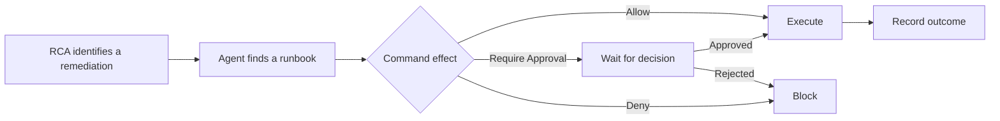

Runbooks give DRE approved operational procedures for the Resolve stage. During RCA, an agent can find a relevant runbook, propose its commands, and apply the configured effect before any mutation runs.

<Frame>
  
</Frame>

Keep the procedures that DRE can use during an Incident in one place.

## Add a runbook source

Open **DRE → Runbooks**, then add one of these sources:

| Source | Use it for |
|---|---|
| Confluence | Search operational procedures in selected spaces or labels. |
| GitHub | Read runbook files from a repository, branch, and optional path. |
| GitLab | Read runbook files from a GitLab project, branch, and optional path. |
| Manual upload | Store Markdown procedures directly in CloudThinker. |

<Frame>
  
</Frame>

Choose the system that already owns the operational procedure.

External sources remain in their original system. During RCA, agents use the corresponding connection tools to search and read them. Manual uploads are stored in the workspace.

For a manual upload, select up to 20 Markdown files at once. Each file can be up to 5 MB. DRE extracts mutating commands from their code blocks so you can review the permitted effect.

## Control command effects

Each mutating command has one of three effects:

| Effect | Behavior |
|---|---|
| Allow | DRE can execute the command without a separate approval. |
| Require Approval | DRE pauses and waits for a human decision. |
| Deny | DRE cannot execute the command. |

Read-only investigation commands do not need a runbook effect. Commands from external runbook sources require approval. Per-command controls are available for manually uploaded runbooks.

<Frame>
  
</Frame>

Review each extracted mutation before it can become part of an Incident response.

## Use a runbook during RCA

The Runbooks page keeps execution history with the source and command context. Review the recorded result before you resolve the Incident or rely on the remediation as verified.

## Related

<CardGroup cols={2}>
  <Card title="Investigate incidents" icon="magnifying-glass" href="/guide/incident/root-cause-analysis">
    See how RCA produces evidence and remediation proposals.
  </Card>
  <Card title="Review approvals" icon="check-circle" href="/guide/approval">
    Approve or reject actions that require a human decision.
  </Card>
  <Card title="Analyze runbooks" icon="chart-line" href="/guide/incident/insights">
    Review runbook coverage, executions, and gaps.
  </Card>
  <Card title="Reuse verified lessons" icon="brain" href="/guide/incident/incident-memory">
    Feed useful remediation outcomes into later investigations.
  </Card>
</CardGroup>
