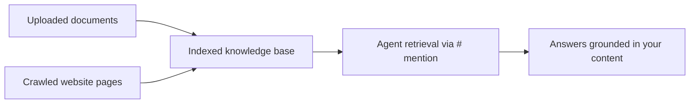

Knowledge bases give agents access to your runbooks, policies, and documentation. Upload documents or crawl websites, and agents reference that content when they answer.

## How it works



1. You add sources to a knowledge base — uploaded files, or pages crawled from a website.
2. CloudThinker indexes the content in the background; each document shows a **Pending**, **Processing**, **Completed**, or **Failed** status in the documents list.
3. Agents search the indexed content when you `#`-mention a knowledge base in chat, and can search it on their own when a task calls for workspace knowledge.

Knowledge bases are workspace-scoped: every member of the workspace can use them, and agents in other workspaces cannot.

## Create a knowledge base

<Steps>
  <Step title="Open Knowledge">
    Go to **Knowledge** in CloudThinker, or open **Chat Settings → Knowledge**.
  </Step>
  <Step title="Click Create KB">
    Click **Create KB** to open the creation dialog.
  </Step>
  <Step title="Enter the details">
    Give the knowledge base a descriptive title, an optional description of its purpose, and tags for organization.

    **Success state:** the new knowledge base appears in the Knowledge list.
  </Step>
</Steps>

## Add content

Open a knowledge base and click **Add Documents**. The dialog offers two tabs:

<Tabs>
  <Tab title="Files">
    Drag and drop files, or click to select them:

    - Up to **10 files** per upload, **10MB** per file
    - Supported formats: PDF, DOC, DOCX, TXT, MD, CSV, XLSX, XLS, ODS
    - Password-protected files cannot be indexed
  </Tab>
  <Tab title="Website">
    Enter the **Website URL** to import. Turn on **Deep Crawl** to crawl all linked pages within the same domain; leave it off to import the single page.

    Website content is processed in the background — check progress in the documents list.
  </Tab>
</Tabs>

## Search knowledge in chat

Type `#` after an agent mention to open the composer's resource picker. Its **Knowledge Base** column lists your knowledge bases by name — pick one to insert its name as a tag and scope retrieval to that collection. Pick **Search Knowledge Base** (`#search-knowledge-base`) instead to search across every collection in the workspace:

```text
@oliver #runbooks what are the incident escalation steps?
@tony #search-knowledge-base what is the PostgreSQL backup procedure?
```

Ask about the content you need, in your own words — agents search by meaning, so a specific question returns better passages than a document title. See [CloudThinker Language](/guide/language) for the full prompt syntax.

## Best practices

- Use clear headings and short sections in documents so search returns focused passages.
- Write descriptive titles and descriptions — they help your team pick the right knowledge base.
- Remove outdated documents and upload the current version; agents cannot tell which copy is newer.
- Start with the handful of documents your team references most, then grow from usage.

## Troubleshooting

<AccordionGroup>
  <Accordion title="Agents can't find information">
    - Check the documents list: only content with a **Completed** status is searchable.
    - Ask about the content as a specific question, and `#`-mention the knowledge base to scope the search to it.
    - Confirm the knowledge base belongs to the workspace you are chatting in; knowledge bases are workspace-scoped.
  </Accordion>
  <Accordion title="Documents won't upload">
    - Check the file size — the maximum is 10MB per file, 10 files per upload.
    - Confirm the file type is supported (PDF, DOC, DOCX, TXT, MD, CSV, XLSX, XLS, ODS).
    - Remove password protection before uploading.
  </Accordion>
  <Accordion title="Website crawl returns nothing">
    - Verify the URL is publicly accessible over HTTP or HTTPS.
    - Some sites block crawlers; try a different starting page.
    - Turn off **Deep Crawl** and import a single page first to confirm the site can be read.
  </Accordion>
</AccordionGroup>

## Next steps

<CardGroup cols={2}>
  <Card title="Configure agents" icon="robot" href="/guide/agents">
    Meet the agents that draw on your knowledge bases
  </Card>
  <Card title="CloudThinker Language" icon="code" href="/guide/language">
    Learn the @agent #tool prompt syntax
  </Card>
</CardGroup>
