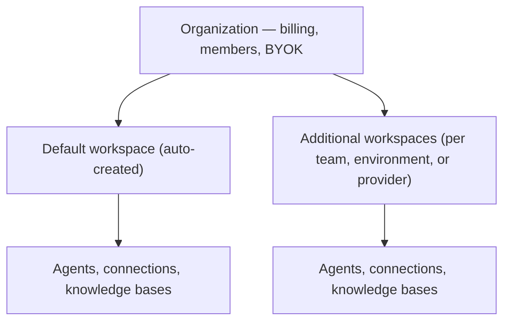

Organizations are the top-level entity in CloudThinker that groups your [workspaces](/guide/workspaces), team members, and billing under a single account. Every user automatically gets a personal organization at signup, named after them (for example "John's Organization") and containing a ready-to-use default workspace.

## Organization structure

The organization holds billing, members, and optional [BYOK](/guide/byok) credentials (your own AI-model keys); each workspace inside it keeps its own isolated [agents](/guide/agents), [connections](/guide/connections/overview), and [knowledge bases](/guide/knowledge).

| Aspect             | Organization             | Workspace                         |
| ------------------ | ------------------------ | --------------------------------- |
| **Creation**       | Auto-created at signup   | Created manually                  |
| **Billing**        | Centralized subscription | Inherits from organization        |
| **Members**        | All team members         | Subset with workspace access      |
| **Cloud provider** | N/A                      | Single provider per workspace     |
| **Resources**      | Shared quota pool        | Isolated agents, connections, knowledge bases |

## Organization settings

Navigate to **Admin Settings** from the user menu in the top-right corner. The Admin Settings sidebar provides access to all organization management pages:

| Page                      | Description                                    |
| ------------------------- | ---------------------------------------------- |
| **Organization**          | Edit organization name, view stats, and manage members |
| **Workspaces**            | Create and manage workspaces                   |
| **Billing**               | View subscription and usage (Owner only)       |
| **Usage**                 | Monitor credit usage and quotas (Owner and Admin) |
| **BYOK**                  | Configure AWS Bedrock credentials (Owner only) |
| **Identity and access**   | Domain verification, SSO, and provisioning     |

<Note>Admin Settings is only visible to organization Owners and Admins, and only they can edit organization settings.</Note>

Under **Organization**, give the organization a clear, descriptive name (a team or company identifier, such as "Acme Corp" or "Platform Team") and a concise description of its purpose.

## Organization members

Invite team members to collaborate within your organization. Members can be assigned to specific workspaces with role-based access control.

### Invite members

<Steps>
  <Step title="Open organization settings">
    Go to **Admin Settings → Organization** and scroll to the Members section.
  </Step>
  <Step title="Click Invite Members">
    Click the **Invite Members** button in the members section.
  </Step>
  <Step title="Enter email addresses">
    Add one or more email addresses (up to 10 at a time).
  </Step>
  <Step title="Select a role">
    Choose the organization role for the invitees.
  </Step>
  <Step title="Assign workspaces and send">
    Optionally select which workspaces the new members should access, then click **Send Invites**.

    **Success state:** the invitees appear in the members list as pending until they accept the emailed invitation.
  </Step>
</Steps>

### Organization roles

| Role | Summary |
|---|---|
| **Owner** | Full control — all settings, billing and subscription, member management, BYOK, ownership transfer; implicit access to all workspaces |
| **Admin** | Manage members and workspaces; implicit access to all workspaces; cannot manage billing or BYOK |
| **Developer** | Use agents and run operations in assigned workspaces only; cannot create workspaces |
| **Viewer** | Read-only view of assigned workspaces, for observation and audit |

| Permission                  | Owner | Admin | Developer | Viewer |
| --------------------------- | :---: | :---: | :-------: | :----: |
| Edit organization settings  |   ✓   |   ✓   |     -     |   -    |
| Manage billing/subscription |   ✓   |   -   |     -     |   -    |
| Configure BYOK              |   ✓   |   -   |     -     |   -    |
| Invite/remove members       |   ✓   |   ✓   |     -     |   -    |
| Change member roles         |   ✓   |   ✓   |     -     |   -    |
| Create workspaces           |   ✓   |   ✓   |     -     |   -    |
| Access all workspaces       |   ✓   |   ✓   |     -     |   -    |
| Access assigned workspaces  |   ✓   |   ✓   |     ✓     |   ✓    |
| Run operations              |   ✓   |   ✓   |     ✓     |   -    |

### Manage members

| Action                    | How to                                                                       |
| ------------------------- | ---------------------------------------------------------------------------- |
| **Change role**           | Click the role dropdown next to a member and select a new role               |
| **Edit workspace access** | Click the grid icon to manage which workspaces a Developer/Viewer can access |
| **Remove member**         | Click the trash icon and confirm removal                                     |
| **Resend invitation**     | For pending invitations, click the refresh icon                              |
| **Cancel invitation**     | For pending invitations, click the X icon                                    |

When editing workspace access for Developers or Viewers, you can also set a role override per workspace — Admin, Developer, or Viewer. This lets an organization Viewer act as a Developer in one workspace, or a Developer act as an Admin where needed.

<Warning>
  Removing a member from the organization removes them from all workspaces within that organization.
</Warning>

## Subscription and billing

Organization Owners manage the subscription from **Admin Settings → Billing**: current plan and billing cycle, payment method, upgrades and downgrades, plus usage tracking for [credits](/guide/billing/usage) (the currency agent work consumes), members, and workspaces across the organization.

Plans use **per-seat billing** — each seat grants a credit allocation and allows one active member, and you can pre-purchase seats to grow the credit pool before adding people. Only active members count toward seat usage; pending invitations do not consume seats. See [Pricing & Plans](/guide/billing/pricing) for per-plan seat ranges and credit allocations.

## BYOK

[BYOK (Bring Your Own Key)](/guide/byok) lets an organization use its own AWS Bedrock credentials for the AI-model (LLM) calls behind every agent response, instead of CloudThinker's shared pool. LLM usage then bypasses the credit system, limited only by your AWS quota, and the data sent to the model stays in your AWS account. Owners configure BYOK at the organization level, and it applies to all workspaces.

## Best practices

Follow least privilege when assigning roles:

- Assign Owner sparingly (1–2 people) and use Admin for team leads who manage workspaces.
- Make most team members Developers, and use Viewer for stakeholders who only need visibility.
- Explicitly assign Developers and Viewers to relevant workspaces, using role overrides for fine-grained control.
- Review access regularly for compliance.

| Team size | Suggested structure |
|---|---|
| **2–5 members** | 1 Owner, 1–2 Admins, rest Developers; single workspace or a dev/prod split |
| **5–20 members** | 1 Owner, 2–3 Admins (tech leads), Developers assigned per workspace, Viewers for stakeholders; workspaces by environment or team |
| **20+ members** | 1–2 Owners, Admins per team or department, workspace-scoped Developers, Viewers for audit; workspaces by team, environment, and project; consider [BYOK](/guide/byok) for cost control |

## Next steps

<CardGroup cols={2}>
  <Card title="Create workspaces" icon="building" href="/guide/workspaces">
    Set up workspaces for your teams and projects
  </Card>
  <Card title="Configure agents" icon="robot" href="/guide/agents">
    Set up AI agents for your cloud operations
  </Card>
</CardGroup>
