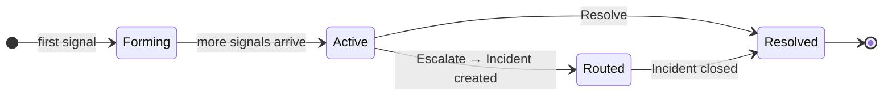

Two concepts sit at the heart of what makes Pulse useful: **suppression** (cutting noise before it reaches you) and **clustering** (grouping what remains into single units of action).

---

## Suppression — Cutting the Noise

Every signal that arrives passes through seven layers before it reaches your feed. If any layer fires, the signal is stored but hidden. It won't create noise, but it's still there if you need to audit it.

<AccordionGroup>
  <Accordion title="Duplicate" icon="copy">
    If an identical event already arrived within the last hour, the dedup count on the existing signal is incremented instead of creating a new row. You see one signal marked "×47" rather than 47 separate items. Typically the largest suppression category.
  </Accordion>
  <Accordion title="Rate Limited" icon="gauge-high">
    If a source emits more than 100 signals per minute, signals above that threshold are suppressed for the duration of the burst. Prevents a misconfigured alert from flooding your feed.
  </Accordion>
  <Accordion title="Snoozed" icon="clock">
    Signals matching an active snooze rule are suppressed. This is the only layer you control directly — see [Snooze](#snooze) below.
  </Accordion>
  <Accordion title="Noise Signature" icon="waveform">
    Known-noisy AWS patterns are suppressed automatically — KMS grant lifecycle events, EBS volume churn, AutoScaling internal operations, Signin token redirects. These are AWS bookkeeping events that almost never indicate a real problem.
  </Accordion>
  <Accordion title="Flapping" icon="arrows-left-right">
    If a signal toggles state four or more times within 10 minutes, it is suppressed for 5 minutes. A resource oscillating between healthy and unhealthy collapses into a single notification once state stabilizes.
  </Accordion>
  <Accordion title="Cascade" icon="sitemap">
    When a parent resource is suppressed, signals from its child resources are also suppressed for 30 minutes — so you don't get child alerts for something that's already known noise.
  </Accordion>
  <Accordion title="Severity Normalization" icon="arrow-down">
    AWS automation services sometimes emit events with inflated severity. Pulse detects events from AWS internal actors and downgrades the severity before routing. The original severity is preserved for auditing.
  </Accordion>
</AccordionGroup>

<Frame>
  
</Frame>

Suppression breakdown over time — visible in the Analytics tab

To review suppressed signals, enable **Show suppressed** in the filter bar. They appear at reduced opacity with a label showing which layer caught them.

### Snooze

Snooze is the only suppression layer you control. Hover over any signal and click the snooze button. Choose a duration (1 minute to 30 days) and a scope:

| Scope | What it silences |
|---|---|
| **Signal** | This exact signal only |
| **Pattern** | All signals with the same source, type, and title pattern |
| **Resource** | All signals from this resource ID |

<Tip>
  Use **Pattern** for recurring maintenance windows. Use **Resource** when decommissioning a resource during teardown.
</Tip>

---

## Clusters — One Unit of Action

A **cluster** is the primary unit of work in Pulse. Instead of presenting every individual signal separately, Pulse groups related signals — the same EKS node pool firing nine alerts in 15 minutes becomes one cluster. You investigate once, act once, resolve once.

### Status Lifecycle

Every cluster moves through four statuses:

| Status | Meaning |
|---|---|
| **Forming** | First signal arrived; collecting related signals |
| **Active** | Signals continuing to arrive; open and needs attention |
| **Routed** | Escalated — a linked Incident has been created |
| **Resolved** | Closed by a user or automatically |

Use the **Active / All** toggle in the feed to switch between active clusters only (default) or all statuses.

### The Cluster Detail Panel

Click any cluster to open the detail panel.

<Frame>
  
</Frame>

AI-generated description, signal timeline, resource details, and actions

The panel shows:

- **AI-generated description** — plain-English summary of what happened and likely impact
- **Cluster context** — all member signals listed chronologically
- **Correlation info** — technique used (e.g. `time_window`) and confidence score
- **Resource metadata** — id, type, region, tags of the selected signal
- **Tabs** — Overview for signal detail, Routing for escalation history, Raw for the full event payload

### Actions

<CardGroup cols={2}>
  <Card title="Acknowledge" icon="check">
    Mark as seen without closing. Signals the cluster is on your radar. Reversible.
  </Card>
  <Card title="Assign" icon="user">
    Hand to a team member. They're notified and their avatar appears in the feed.
  </Card>
  <Card title="Escalate" icon="triangle-exclamation">
    Create a linked Incident. Cluster moves to Routed and RCA begins automatically — the cluster summary and all member signals are passed to the RCA agent as starting context, so investigation begins with full signal history already loaded.
  </Card>
  <Card title="Resolve" icon="circle-check">
    Close the cluster when the issue is addressed and no Incident is needed.
  </Card>
</CardGroup>

### Automatic Escalation

Pulse auto-escalates clusters where any signal has **Critical** or **High** severity, or where the AI marks the signal **actionable**. These go directly to Routed and trigger root cause analysis — no manual escalation needed.
