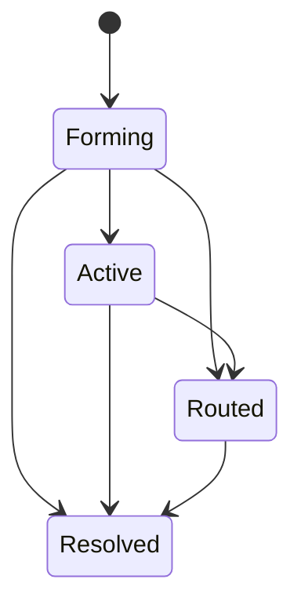

A Cluster groups related surviving raw events into one candidate Signal. It gives operators one place to assess impact, ownership, timing, and whether the problem should become an Incident.

## Cluster lifecycle

```mermaid
stateDiagram-v2
    [*] --> Forming
    Forming --> Active
    Forming --> Routed
    Active --> Routed
    Forming --> Resolved
    Active --> Resolved
    Routed --> Resolved
```

| State | Meaning |
|---|---|
| Forming | Pulse is collecting related raw events and updating the Cluster. |
| Active | The Cluster represents a current operational problem. |
| Routed | The Cluster has an open Incident. New matching Signals still join this Cluster rather than starting a new one. |
| Resolved | The operational problem is closed. Only this state is terminal. |

A single-signal Cluster can route straight from **Forming**, without waiting for correlation. A critical-severity signal takes this path.

Resolving an Incident does not close its Cluster. A later matching Signal opens a successor Incident, and the Cluster follows it.

The Pulse lanes add an attention view on top of this lifecycle. **Needs you** shows unacknowledged high or critical forming Clusters without an owner. **All** shows Clusters across every visible state.

## Noise suppression

Before a Signal contributes to a Cluster, Pulse applies eight suppression layers:

| Layer | What it prevents |
|---|---|
| Deduplication | Exact repeated events inside the deduplication window. |
| Rate limit | Excessive events from one source or pattern. |
| Snooze | Signals covered by an active operator snooze. |
| Verdict | Repeated events that match a stable-noise verdict recorded by Pulse Memory. |
| Noise signature | Known non-actionable event patterns. |
| Flapping | Rapid state changes that do not represent separate problems. |
| Cascade | Downstream symptoms already explained by a parent problem. |
| Severity normalization | Source-specific severity differences that would distort routing. |

A Cluster the classifier judges non-actionable is also suppressed, and appears as **Not Actionable** in the suppression breakdown.

<Frame>
  
</Frame>

Suppression analysis helps identify which sources create the most avoidable noise.

## Review a Cluster

Open a Cluster to inspect its event history, severity, source, timestamps, and routing state.

<Frame>
  
</Frame>

Cluster detail keeps the evidence for one operational problem together.

Use the available actions to move the work forward:

| Action | Result |
|---|---|
| Acknowledge | Mark the Cluster as seen. |
| Assign | Give the Cluster an owner. |
| Escalate | Route the problem into an Incident. |
| Resolve | Close the Cluster. |
| Snooze | Temporarily suppress matching Signals. |

When you snooze a Cluster, choose the duration. Pulse uses resource scope when the Signal has a resource ID; otherwise it uses the source and event-type pattern.

## Related

<CardGroup cols={2}>
  <Card title="Connect Pulse sources" icon="plug" href="/guide/pulse/setup">
    Add webhook, polling, or chat signal paths.
  </Card>
  <Card title="Analyze Pulse" icon="chart-line" href="/guide/pulse/analytics">
    Review correlation yield, suppression, volume, and Cluster MTTR.
  </Card>
  <Card title="Investigate incidents" icon="magnifying-glass" href="/guide/incident/root-cause-analysis">
    Follow a routed Cluster into RCA.
  </Card>
  <Card title="Tune DRE behavior" icon="sliders" href="/guide/incident/settings">
    Control automatic RCA and re-investigation sensitivity.
  </Card>
</CardGroup>
