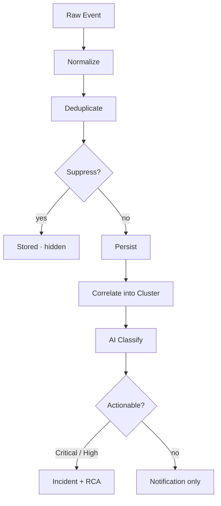

**Most tools detect. Pulse decides what's worth waking you for.**

Your monitoring stack is already catching anomalies — CloudTrail, GuardDuty, Datadog, Grafana, Slack alerts — but the flood of events it produces means engineers spend more time triaging noise than fixing real problems. Pulse sits in front of all of that. It ingests signals from every source, automatically cuts the noise, groups related events into clusters, and surfaces only what matters — ranked by severity, ready to escalate to an Incident in one click.

<Frame>
  
</Frame>

Pulse reduces 13K raw events to 40 actionable clusters — live, in one view

---

## How Existing Tools Compare

| Tool | What It Does | What's Missing |
|------|-------------|----------------|
| **PagerDuty / Opsgenie** | Routes alerts to on-call engineers | Pages you for everything — noise included |
| **Datadog Watchdog** | Correlates related alerts | Correlation only — no suppression, no escalation |
| **AWS Console** | Shows CloudTrail, Health, Cost Anomaly, GuardDuty | Scattered across 6 separate tabs, no unified view |
| **Slack / Teams** | Chat alerts from bots and pipelines | Unstructured, no severity ranking, no action path |
| **Pulse** | Ingests all of the above, suppresses noise, correlates, and escalates | — |

---

## How It Works

Every event that reaches Pulse goes through the same eight-stage pipeline before it becomes something you see.

<Steps>
  <Step title="Ingest">
    An event arrives from any connected source — an AWS poller picks up a GuardDuty finding, a Slack message fires from your alerts channel, or a Datadog webhook posts an alert.
  </Step>
  <Step title="Normalize">
    A source-specific collector translates the raw event into a common Signal shape — extracting title, severity, category, resource ID, and timestamp regardless of where it came from.
  </Step>
  <Step title="Deduplicate">
    A SHA-256 fingerprint is computed from the signal's source, type, resource, and timestamp minute. If an identical event already arrived within the last hour, the dedup count on the existing signal is incremented — no new row is created.
  </Step>
  <Step title="Suppress">
    The signal passes through seven suppression layers in priority order. If any layer fires, the signal is stored as suppressed and hidden from your feed. The pipeline stops here for noise.
  </Step>
  <Step title="Persist">
    The signal is written with its final suppressed status, severity, and extracted fields. Suppressed signals are retained for 90 days — toggle "Show suppressed" to review what was filtered.
  </Step>
  <Step title="Correlate">
    Within a 15-minute window, Pulse looks for signals sharing the same resource, service, or title pattern. Matching signals are grouped into a Cluster — nine EC2 alerts become one cluster with nine members.
  </Step>
  <Step title="Classify">
    An AI model assigns category, canonical severity, a one-line summary, and an actionability verdict — whether this warrants creating an Incident.
  </Step>
  <Step title="Route">
    Critical and High severity signals, and any signal the AI marked actionable, are automatically escalated — a linked Incident is created and root cause analysis begins. Everything else is delivered as a notification only.
  </Step>
</Steps>

---

## What the Pipeline Panel Shows

The left sidebar renders all four stages as a live funnel:

| Stage | What the count means |
|---|---|
| **Raw events** | Every event ingested — before any filtering |
| **Signals** | De-duplicated, normalized events. The severity breakdown shows what's active |
| **Clusters** | Correlated groups. "grouped from 510 · 189 suppressed" shows how much was silenced |
| **Incidents** | Clusters that were escalated — links directly to the Incidents list |

---

## What Makes Pulse Different

<CardGroup cols={2}>
  <Card title="Noise Reduction at the Source" icon="filter">
    Seven automatic suppression layers cut ~98% of raw events before anything reaches your feed.
  </Card>
  <Card title="Auto-Correlation into Clusters" icon="share-nodes">
    Related signals are grouped automatically. Nine alerts about the same resource become one cluster to investigate.
  </Card>
  <Card title="AI Severity Classification" icon="brain">
    Every signal is classified by category, severity, and actionability — no manual triage.
  </Card>
  <Card title="One-Click Escalation" icon="triangle-exclamation">
    Any cluster escalates to a full Incident in one click, with automatic root cause analysis.
  </Card>
</CardGroup>

---

## Next Steps

<CardGroup cols={2}>
  <Card title="Clusters & Suppression" icon="layer-group" href="/guide/pulse/clusters">
    Understand how signals are grouped and how noise is filtered
  </Card>
  <Card title="Setup" icon="gear" href="/guide/pulse/setup">
    Connect AWS, Slack, Teams, and third-party webhook sources
  </Card>
  <Card title="Analytics" icon="chart-bar" href="/guide/pulse/analytics">
    Measure noise reduction, cluster MTTR, and signal conversion rates
  </Card>
  <Card title="Back to Deep Response Engine" icon="arrow-left" href="/guide/incident/overview">
    See how Pulse feeds into Incidents, RCA, Runbooks, and Memory
  </Card>
</CardGroup>
