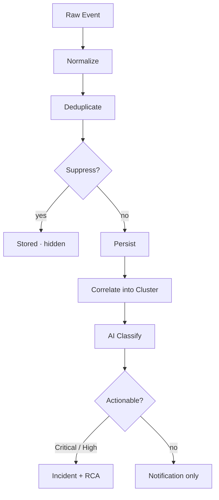

Pulse ingests events from every connected source — CloudTrail, GuardDuty, Datadog, and more — suppresses the noise, and surfaces only clusters worth your attention. Each cluster is ranked by severity and escalates to an incident in one click.

<Frame>
  
</Frame>

Pulse reduces 13K raw events to 40 actionable clusters — live, in one view

Your monitoring stack already catches anomalies. The problem is volume: engineers spend more time triaging alert floods than fixing real problems. Pulse sits in front of every source and decides what deserves your attention, so you open a ranked list of clusters instead of six dashboards.

## How it works

Every event that reaches Pulse goes through the same eight-stage pipeline before it becomes something you see.

```mermaid
flowchart TD
    A[Raw Event] --> B[Normalize]
    B --> C[Deduplicate]
    C --> D{Suppress?}
    D -- yes --> E[Stored · hidden]
    D -- no --> F[Persist]
    F --> G[Correlate into Cluster]
    G --> H[AI Classify]
    H --> I{Actionable?}
    I -- Critical / High --> J[Incident + RCA]
    I -- no --> K[Notification only]
```

1. **Ingest** — An event arrives from any connected source: an AWS poller picks up a GuardDuty finding, a Slack message fires from your alerts channel, or a Datadog webhook posts an alert.
2. **Normalize** — A source-specific collector translates the raw event into a common signal shape, extracting title, severity, category, resource ID, and timestamp regardless of origin.
3. **Deduplicate** — A SHA-256 fingerprint is computed from the signal's source, type, resource, and timestamp minute. If an identical event arrived within the last hour, the existing signal's dedup count increments instead of creating a new row.
4. **Suppress** — The signal passes through suppression layers in priority order; if any layer fires, the signal is stored as suppressed and hidden from your feed. See [Clusters & Suppression](/guide/pulse/clusters) for how each layer works.
5. **Persist** — The signal is written with its final suppressed status, severity, and extracted fields. Suppressed signals are retained for 90 days — toggle **Show suppressed** to review what was filtered.
6. **Correlate** — Within a 15-minute window, Pulse groups signals sharing the same resource, service, or title pattern into a cluster. Nine EC2 alerts become one cluster with nine members.
7. **Classify** — An AI model assigns category, canonical severity, a one-line summary, and an actionability verdict — whether this warrants creating an incident.
8. **Route** — Critical and High severity signals, plus any signal marked actionable, escalate automatically: a linked incident is created and root cause analysis begins. Everything else is delivered as a notification only.

## What you can do

| Capability | Description | Learn more |
|---|---|---|
| Connect signal sources | Wire AWS pollers, Slack and Teams channels, and third-party webhooks into Pulse | [Pulse Setup](/guide/pulse/setup) |
| Review clusters and suppression | See how related signals group together and audit what was silenced | [Clusters & Suppression](/guide/pulse/clusters) |
| Escalate to an incident | Promote any cluster to a full incident with automatic root cause analysis | [Deep Response Engine](/guide/incident/overview) |
| Measure noise reduction | Track suppression rates, cluster resolution time, and signal conversion | [Pulse Analytics](/guide/pulse/analytics) |

## Key concepts

The pipeline panel in the left sidebar renders all four stages as a live funnel:

| Stage | What the count means |
|---|---|
| **Raw events** | Every event ingested — before any filtering |
| **Signals** | De-duplicated, normalized events. The severity breakdown shows what's active |
| **Clusters** | Correlated groups. "grouped from 510 · 189 suppressed" shows how much was silenced |
| **Incidents** | Clusters that were escalated — links directly to the incidents list |

## Next steps

<CardGroup cols={2}>
  <Card title="Clusters & Suppression" icon="layer-group" href="/guide/pulse/clusters">
    Understand how signals are grouped and how noise is filtered
  </Card>
  <Card title="Setup" icon="gear" href="/guide/pulse/setup">
    Connect AWS, Slack, Teams, and third-party webhook sources
  </Card>
  <Card title="Analytics" icon="chart-bar" href="/guide/pulse/analytics">
    Measure noise reduction, cluster resolution time, and conversion rates
  </Card>
  <Card title="Deep Response Engine" icon="arrow-right" href="/guide/incident/overview">
    See how Pulse feeds into incidents, RCA, runbooks, and memory
  </Card>
</CardGroup>
