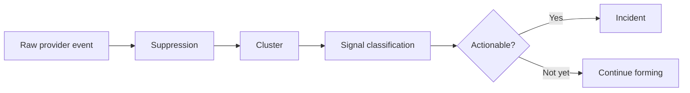

Pulse is the Detect stage of [Resolve](/guide/incident/overview). It receives raw provider events, removes known noise, groups related survivors into Clusters, and classifies each Cluster into a Signal that can route into an Incident.

```mermaid
flowchart LR
    A["Raw provider event"] --> B["Suppression"]
    B --> C["Cluster"]
    C --> D["Signal classification"]
    D --> E{"Actionable?"}
    E -->|Yes| F["Incident"]
    E -->|Not yet| G["Continue forming"]
```

## What Pulse does

| Step | Result |
|---|---|
| Ingest | Accept raw provider events from webhook, polling, and chat sources. |
| Suppress | Apply deduplication, rate limits, snoozes, prior verdicts, noise patterns, flapping checks, cascade suppression, and severity normalization. |
| Correlate | Group related surviving events into a Cluster that represents one candidate Signal. |
| Route | Classify the Cluster into a Signal and create an Incident when severity or the actionable assessment qualifies it. |

Pulse creates the Incident before RCA begins. Turning **Resolve auto-investigates** off pauses automatic analysis; it does not stop detection or Incident creation.

## Work from the queue

Pulse organizes Clusters into these lanes:

| Lane | Use it for |
|---|---|
| Needs you | Unacknowledged high or critical forming Clusters that have no owner. |
| Active | Current Clusters that still need monitoring or work. This is the default lane. |
| Forming | Clusters still collecting related raw events. |
| Routed | Clusters with an open Incident. New matching Signals still join them. |
| Resolved | Closed Clusters. |
| All | Every visible Cluster across the lifecycle. |

Open a Cluster to inspect its Signals, source, severity, timing, and routing state. From the Cluster you can **Acknowledge**, **Assign**, **Escalate**, or **Resolve**.

<Frame>
  
</Frame>

Pulse keeps related operational signals together so you can review the problem as one unit.

## Connect a source

Open **Resolve → Integrations** to connect a platform and configure how Resolve listens for Signals. A source is ready after at least one webhook, polling, or chat path succeeds.

## Related

<CardGroup cols={2}>
  <Card title="Understand clusters" icon="layer-group" href="/guide/pulse/clusters">
    Follow the Cluster lifecycle and review suppression behavior.
  </Card>
  <Card title="Connect Pulse sources" icon="plug" href="/guide/pulse/setup">
    Configure a platform to send or expose operational Signals.
  </Card>
  <Card title="Analyze Pulse" icon="chart-line" href="/guide/pulse/analytics">
    Measure correlation yield, suppression, volume, and Cluster MTTR.
  </Card>
  <Card title="Manage integrations" icon="arrows-rotate" href="/guide/incident/integrations">
    See each platform's connections, signal paths, and outcomes.
  </Card>
</CardGroup>
