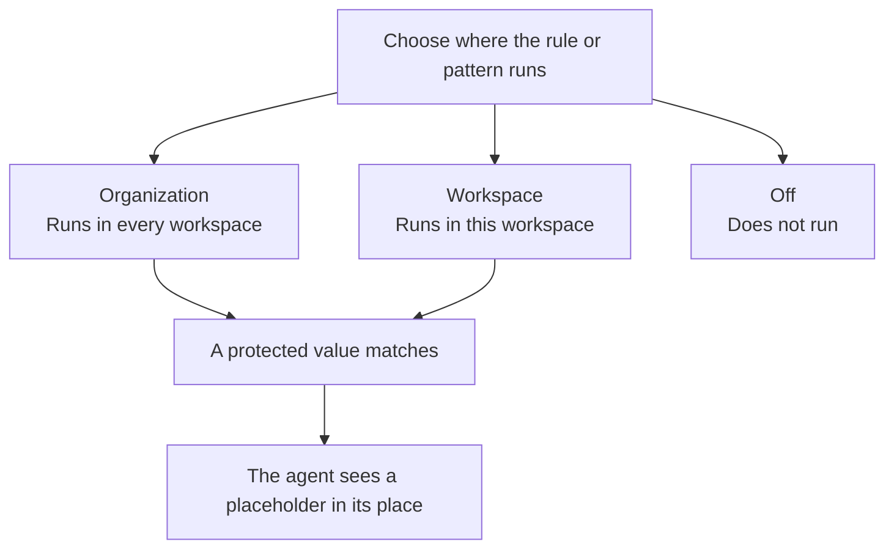

Guardrails lets admins choose which built-in identifiers CloudThinker protects and add patterns for structured personal or business identifiers unique to their team. Custom patterns extend identifier protection; they do not add secret-detection rules. When a pattern matches, an agent sees a placeholder in place of the matched value.

## Before you start

- You need workspace admin permission to edit Guardrails for a workspace.
- Organization Owners and Admins can also edit the organization baseline, which applies across its workspaces.
- Open **Admin Settings → Guardrails**.

## Choose where a protection applies

Built-in identifiers and custom patterns appear in the same table. Search for an identifier, or filter the table by scope or type.

| Scope | What it does |
|---|---|
| **Off** | Stops this protection from running at that scope. |
| **Workspace** | Applies in the current workspace. |
| **Organization** | Applies across the organization’s workspaces. Organization Owners and Admins manage this baseline. |

An organization admin can lock a built-in rule at the organization scope. A locked rule stays on for every workspace until an organization admin unlocks it. A custom pattern cannot be locked. If an organization rule is on but unlocked, a workspace admin can turn it off for their workspace.

Only an enabled rule or pattern produces a placeholder when it matches.

## Add a custom pattern

Use a custom pattern when your team has a structured identifier format that the built-in protections do not cover. The pattern is a regular expression that describes the format; do not enter real identifier values.

Make the pattern specific to your identifier. Avoid broad checks such as a generic UUID pattern, which could mask unrelated values the agent needs to see.

<Steps>
  <Step title="Start a pattern">
    In **Admin Settings → Guardrails**, click **Add pattern**. The new pattern starts at the **Workspace** scope.
  </Step>
  <Step title="Name and categorize it">
    Enter a **Name** and choose a suggested **Category** or type one. The category describes the kind of value an agent should see in its place. Categories used by built-in protections are reserved.

    A matched value is replaced with a placeholder such as `ct:pii:v3:<category>:<hash>`.
  </Step>
  <Step title="Describe the format and save">
    Enter the regular expression in **Pattern**, then click **Save**. For example, `ACC-\d{6}` describes the prefix `ACC-` followed by six digits. Guardrails checks that your pattern is valid, specific enough not to match empty text, and fast enough to run on messages.
  </Step>
</Steps>

Names can be up to 200 characters, patterns up to 512 characters, and categories up to 32 characters.

New patterns apply to the current workspace. An organization Owner or Admin can move a saved pattern to **Organization** with its scope control; it then applies across the organization’s workspaces. Organization patterns appear in each workspace’s table, but only organization admins can edit, move, or delete them.

The form does not ask for sample text or provide a match preview. Each workspace can have up to five custom patterns total, counting its own patterns and organization patterns that apply to it. Moving a pattern between scopes does not use another slot.

## Change or remove a pattern

- **Edit:** Open a pattern’s row to change its name or regular expression. Its category is fixed; to use another category, add a new pattern.
- **Turn off:** Set its scope to **Off**. The pattern remains saved and uses one of your five slots, so you can turn it back on later.
- **Delete:** Use the row’s delete action and confirm. Deletion cannot be undone; agents may see matching values again if no other protection catches them.

## If a pattern cannot be saved

| Message | What to do |
|---|---|
| The pattern is not valid | Check the regular expression syntax, including brackets and escapes. |
| The pattern matches empty text | Make it more specific so it only matches the identifier format you intend to protect. |
| The pattern would slow down every message | Narrow the expression and avoid patterns that can take a long time to find a match. |
| The category is used by a built-in protection | Choose a different category. |
| You already have five custom patterns | Delete a pattern you no longer need before adding another. Turning a pattern off does not free its slot. |

## Related

<CardGroup cols={2}>
  <Card title="Data Protection" icon="shield-halved" href="/guide/security/data-protection">
    Learn how CloudThinker handles detected secrets and personal identifiers
  </Card>
  <Card title="Security & Authentication" icon="lock" href="/guide/security/overview">
    Manage sign-in security and access roles
  </Card>
</CardGroup>
