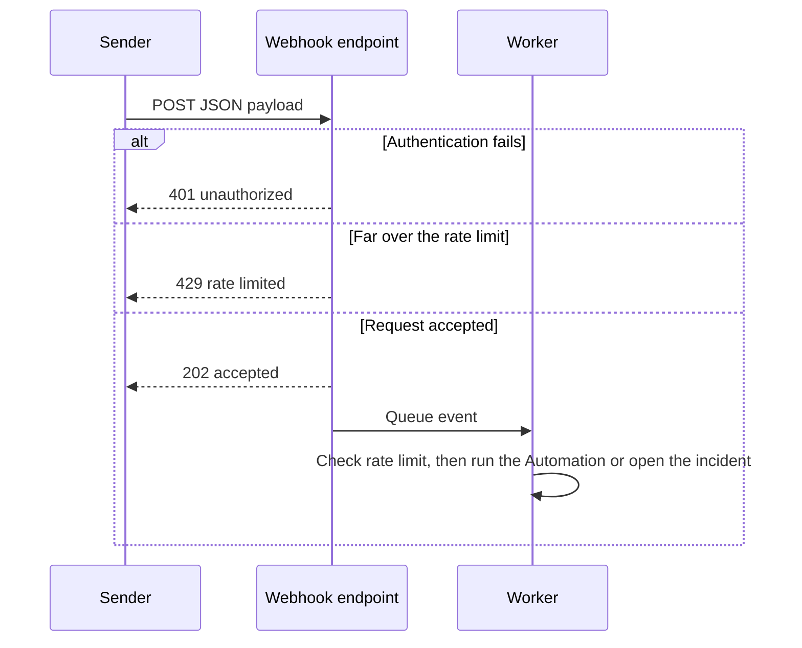

Webhooks let external systems push events into CloudThinker. Each webhook gives you a unique URL; POST to it and CloudThinker runs an [Automation](/guide/automation/automations) or opens an incident in [Resolve](/guide/incident/overview).

<Note>
Webhooks are inbound only. CloudThinker does not POST events out to your endpoints. To send results outward, use [notifications](/guide/notifications), [Slack](/guide/slack-integration), or [Microsoft Teams](/guide/teams-integration).
</Note>

## Prerequisites

- An **Admin** [workspace role](/guide/workspace-users) to create or change a webhook
- An external system that can send HTTPS POST requests with a JSON body

## Two kinds of webhook

| Kind | Where you create it | What a request does |
|------|---------------------|---------------------|
| **Automation webhook trigger** | On an [Automation](/guide/automation/automations), as a trigger | Runs the Automation with the request body as its trigger payload |
| **Resolve webhook** | In [Resolve webhook integrations](/guide/incident/webhook-integrations/overview) | Opens an incident, and optionally runs automatic RCA (root-cause analysis) |

To start an agent from an HTTP call, add a webhook trigger to an Automation. The standalone Conversation webhook is gone from the app. Existing Conversation webhooks keep working.

## How it works

1. CloudThinker issues a unique URL containing the webhook token, plus a secret shown once.
2. Your system POSTs a JSON body to that URL.
3. CloudThinker authenticates the request, records the event, and returns **202 Accepted**.
4. A worker checks the hourly rate limit, dispatches the payload, and writes the final status.



## Add a webhook trigger to an Automation

<Steps>
  <Step title="Open the Automation">
    Open an [Automation](/guide/automation/automations) and open its trigger menu.
  </Step>
  <Step title="Add a Webhook trigger">
    Select **Webhook**: "When an HTTP call arrives at a URL we issue." Save the trigger.
  </Step>
  <Step title="Copy the URL and secret">
    The dialog shows the **Webhook URL**, the **Secret**, and a **Test command**.

    **Success state:** the trigger card shows the webhook, and each call appears in its delivery list.
  </Step>
</Steps>

<Warning>
The secret is shown only once. To rotate it, delete the trigger and add a new one. A deleted trigger's URL stops answering at once.
</Warning>

The caller sends the secret as an `Authorization: Bearer` header. The URL answers 401 without it.

```bash
curl -X POST "$WEBHOOK_URL" \
  -H "Authorization: Bearer $WEBHOOK_SECRET" \
  -H "Content-Type: application/json" \
  -d '{"message": "hello"}'
```

If the Automation is still running when a call arrives, CloudThinker parks the newest call and runs it when the current run finishes.

## Resolve webhooks

A Resolve webhook opens an incident from an alert. Automatic RCA is **on by default** with a minimum severity of **Medium**. Create one from [webhook integrations](/guide/incident/webhook-integrations/overview). The wizard has three steps: **Basic Info**, **Configure**, and **Advanced**.

## Request body

```json
{
  "message": "Hello from webhook!",
  "metadata": {
    "source": "external-system",
    "priority": "normal"
  }
}
```

| Field | Required | Description |
|-------|----------|-------------|
| `message` | No | The request text. The Test command sends it |
| `metadata` | No | Custom fields carried into the incident payload |

<Note>
For a Resolve webhook, put every custom field inside `metadata`. An Automation receives the whole body as its trigger payload.
</Note>

The response returns `success`, `request_id`, and — depending on the action type — `conversation_id`, `incident_id`, `rca_run_id`, and `signal_id`.

## Authentication

An Automation webhook trigger always uses Bearer auth. For a Resolve webhook, choose one auth mode. CloudThinker verifies each incoming request before it accepts the payload.

| Mode | How the sender authenticates |
|------|------------------------------|
| **Bearer** | `Authorization: Bearer <token>` |
| **HMAC** | A signature header, `X-Webhook-Signature` by default, computed with the webhook's signing secret |
| **API key** | A key header, `X-Api-Key` by default |
| **None** | No authentication. Rely on the unguessable token in the URL |

The header name is configurable for HMAC and API key. Sign the raw request body with HMAC-SHA256 and send `sha256=<hex digest>`:

```bash
SIGNATURE="sha256=$(printf '%s' "$BODY" | openssl dgst -sha256 -hmac "$WEBHOOK_SECRET" -hex | awk '{print $2}')"

curl -X POST "$WEBHOOK_URL" \
  -H "Content-Type: application/json" \
  -H "X-Webhook-Signature: $SIGNATURE" \
  -d "$BODY"
```

## Limits

| Limit | Value |
|-------|-------|
| Request body | 1 MB |
| Rate limit | 100 requests per hour by default |
| Raw body retention | 90 days |

A request over the hourly limit still gets 202, but the worker drops it and records `rate_limited`. Above 10 times the limit, the endpoint answers 429 and records nothing.

## Review deliveries

An Automation webhook trigger lists its deliveries on the trigger card. Each delivery has one of four statuses: **Accepted**, **Processed**, **Failed**, or **Rate limited**. CloudThinker never shows stored request headers or bodies, and keeps them internally for 90 days.

To stop a webhook trigger, turn it **Off** on the trigger card. A call to a disabled trigger fails and does not start a run.

## Troubleshooting

<AccordionGroup>
  <Accordion title="401 or 403 on every request">
    The auth mode does not match what you send. Check the header name and confirm you are signing with the webhook's own secret. An Automation webhook trigger accepts only `Authorization: Bearer <secret>`.
  </Accordion>
  <Accordion title="Signature mismatch">
    Sign the exact raw body bytes, before any reformatting, and send the digest as `sha256=<hex>`. Re-serializing JSON changes the bytes and breaks the signature.
  </Accordion>
  <Accordion title="429 responses">
    The webhook is more than 10 times over its hourly rate limit. Slow the sender down. A smaller excess returns 202 and shows as **Rate limited** in the deliveries.
  </Accordion>
  <Accordion title="413 or a rejected large payload">
    The body is over the 1 MB cap. Send a reference instead of the full document.
  </Accordion>
</AccordionGroup>

## Related

<CardGroup cols={3}>
  <Card title="Resolve Webhook Integrations" icon="bell-on" href="/guide/incident/webhook-integrations/overview">
    Route alerts from monitoring platforms into incidents
  </Card>
  <Card title="Automations" icon="robot" href="/guide/automation/automations">
    Run an agent on a schedule, a webhook, or a repository event
  </Card>
  <Card title="Notifications" icon="bell" href="/guide/notifications">
    Deliver CloudThinker results to email, Slack, and Teams
  </Card>
</CardGroup>
