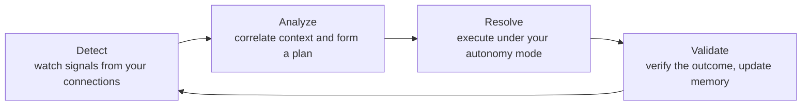

CloudThinker is the intelligent OS for your cloud: specialized [AI agents](/guide/agents) operate, secure, and optimize your cloud infrastructure 24/7 — they investigate, decide, and act, always under your policy — so you reduce cloud costs, resolve incidents faster, and operate safely at scale across AWS, Azure, GCP, and Kubernetes.

## Start here

Three first tasks, each 5–10 minutes with a result you can verify. Just created your account? [Connect AWS](/guide/connections/aws) first — the [quickstart](/quickstart) walks you through it with zero setup assumed.

<CardGroup cols={3}>
  <Card title="Run your first cost analysis" icon="dollar-sign" href="/guide/cost-optimization/overview">
    Find idle resources, oversized instances, and unused commitments — with projected monthly savings
  </Card>
  <Card title="Set up Review" icon="code-pull-request" href="/guide/code-review/setup">
    Connect a Git repository and get AI review comments on the next pull request
  </Card>
  <Card title="Investigate an incident" icon="triangle-exclamation" href="/guide/pulse/setup">
    Route alerts into Pulse — the filter that strips noise from your monitoring — and let agents gather evidence and propose fixes
  </Card>
</CardGroup>

## Choose your goal

Pick the outcome you want next. Each goal maps to a guided path.

<CardGroup cols={2}>
  <Card title="Spend less" icon="piggy-bank" href="/guide/cost-optimization/overview">
    **Optimize** — continuous spend audit across AWS, Azure, and GCP with rightsizing recommendations and approval-gated remediation
  </Card>
  <Card title="Ship safer" icon="shield-check" href="/guide/code-review/overview">
    **Review** — every PR reviewed with context from running infrastructure, past incidents, and your team's conventions
  </Card>
  <Card title="Resolve incidents faster" icon="bolt" href="/guide/incident/overview">
    **Resolve** — Pulse strips noise from monitoring; agents investigate the rest and run approved runbooks
  </Card>
  <Card title="Test an app for vulnerabilities" icon="shield-halved" href="/guide/security/cyber-overview">
    **Cyber** — give [Oliver](/guide/agents/oliver), the security agent, one app target, optional authentication, and source context to test and verify
  </Card>
  <Card title="Automate recurring ops" icon="repeat" href="/guide/automation/autonomous-agents">
    **Autonomous agents + skills** — teach agents your runbooks, conventions, and policies once, as reusable skills, so the loop runs without restating them
  </Card>
  <Card title="Learn the platform end to end" icon="graduation-cap" href="/guide/tutorial/agenticops">
    **Tutorial** — run your role's first prompts against your live environment, then follow the chain into your first module setup
  </Card>
</CardGroup>

## How CloudThinker works

Every module runs the same agentic loop: **Detect → Analyze → Resolve → Validate**.

Agents **detect** signals from your connections — metrics, cost data, pull requests, alerts. They **analyze** each signal against topology, history, and [team knowledge](/guide/knowledge) to form a plan. The plan **resolves** under your autonomy mode — [Manual or Auto](/guide/auto-mode) — with [approvals](/guide/approval) gating sensitive actions. Finally the agent **validates** the outcome and writes the result back into memory, so the next iteration starts smarter.

You stay on the loop, not in every step: set the goal, choose the autonomy mode, and intervene when judgment matters. The [AgenticOps field guide](/learn/aio/introduction) covers the reference architecture and governance discipline behind the loop.

## The four modules

<CardGroup cols={2}>
  <Card title="Review" icon="code-pull-request" href="/guide/code-review/overview">
    AI review on every PR with context from running infrastructure, [past incidents](/guide/incident/incident-memory), and [team conventions](/guide/code-review/convention-rules). Inline comments, reproduction steps, suggested patches.
  </Card>
  <Card title="Resolve" icon="triangle-exclamation" href="/guide/incident/overview">
    [Pulse](/guide/pulse/overview) suppresses monitoring noise. When something escalates, agents form hypotheses, gather evidence, and run approved [runbooks](/guide/incident/runbooks).
  </Card>
  <Card title="Optimize" icon="dollar-sign" href="/guide/cost-optimization/overview">
    Continuous spend audit across [AWS](/guide/connections/aws), [Azure](/guide/connections/azure), and [GCP](/guide/connections/gcp). Idle resources, oversized instances, unused commitments — surfaced with projected savings and approval-gated remediation.
  </Card>
  <Card title="Cyber (Beta)" icon="shield-halved" href="/guide/security/cyber-overview">
    Oliver continuously tests one live application target, preserves its attack surface and findings between runs, and verifies each issue with reproducible proof.
  </Card>
</CardGroup>

## Why CloudThinker

AI coding agents accelerate delivery; cloud operations must keep up. CloudThinker carries that work from pull-request review through production operations with agents that already hold the context. No human reassembles it from disconnected consoles — Cost Explorer, Datadog, GitHub, and more — before every incident, cost review, or security fix. Agents investigate, decide, and act around the clock, always under your policy: one control plane, shared memory so each run starts smarter, and an auditable, approval-gated trail behind every action. You get the leverage of a larger operations team without the tool sprawl. Start with the [quickstart](/quickstart), or read the [AgenticOps field guide](/learn/aio/introduction) for the architecture and adoption discipline behind the platform.
