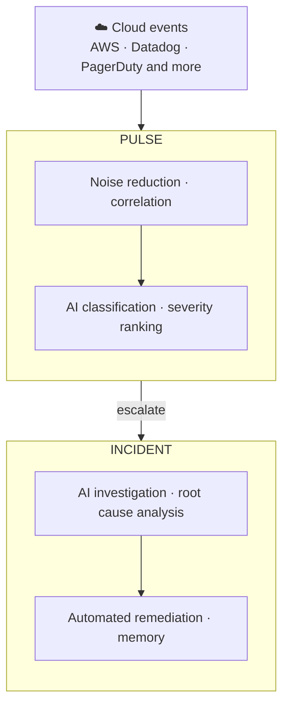

Deep Response Engine は CloudThinker のインシデントライフサイクルモジュールです。最初のシグナルから解決済みのインシデントまで、すべてのイベントを処理します — ノイズの削減、エスカレーション、根本原因分析、修復、そして記憶。

ほとんどの監視スタックは何かがおかしいと伝えるだけです。Deep Response Engine はその理由を教えます：[Pulse](/ja/guide/pulse/overview) が誰かへの通知の前にシグナルをフィルタリングして相関させ、クラスターがエスカレーションした瞬間に Incident が調査を開始します — オンコールのエンジニアがラップトップを開く前に調査が始まることも多くあります。

## 仕組み

どのステージも手動の引き継ぎを必要とせず、各レイヤーが自動的に次に渡ります：

1. **収集** — AWS、Datadog、Slack、PagerDuty などのソースから 1 つの Pulse フィードにイベントがストリームされます。
2. **フィルタリングと相関** — 抑制レイヤーが重複、レート制限されたバースト、フラッピングするリソースを削除します。関連するシグナルはクラスターにグループ化されるため、同じノードプールに関する 9 つのアラートが 1 つのアイテムになります。
3. **分類とエスカレーション** — すべてのシグナルにカテゴリ、正規化された深刻度、実行可能性スコアが付与されます。クラスターが Critical または High の場合、または AI が実行可能とマークした場合、自動的にインシデントにエスカレーションされます。
4. **調査** — AI エージェントが明示的な仮説を立て、メトリクスとログに対してそれぞれを検証し、構造化されたレポートを生成します：最も可能性の高い根本原因、エビデンスチェーン、除外された仮説。
5. **解決と記憶** — エージェントが設定した自律モード（Manual または Auto）のもと、[ランブック](/ja/guide/incident/runbooks) を根本原因に対応付けて実行します。各解決は [インシデントメモリ](/ja/guide/incident/incident-memory) に記録され、次の調査を高速化します。

どの調査ステップも可視化されています — どの仮説が確認され、どれが除外されたか、そしてその理由。

## できること

| 機能 | 説明 | ガイド |
|---|---|---|
| シグナルソースの接続 | AWS、Slack、Teams、Webhook イベントを Pulse に流し込む | [Pulse セットアップ](/ja/guide/pulse/setup) |
| シグナルクラスターの管理 | 相関されたシグナルグループをレビュー、マージ、対応する | [Clusters](/ja/guide/pulse/clusters) |
| AI 根本原因分析の実行 | 仮説駆動の調査を構造化された RCA レポートまで追う | [仕組み](/ja/guide/incident/root-cause-analysis) |
| 監視 Webhook の取り込み | PagerDuty、Datadog、CloudWatch などのアラートをルーティングする | [Webhook 統合](/ja/guide/incident/webhook-integrations/overview) |
| 修復の自動化 | エージェントに対応するランブックの手順を実行させる | [Runbooks](/ja/guide/incident/runbooks) |
| 手動のインシデント記録 | Pulse の外で始まったインシデントを記録する | [手動ロギング](/ja/guide/incident/manual-logging) |
| すべてのインシデントから学ぶ | 使えたものを再利用する — クエリ、テクニック、ランブックのステップ | [インシデントメモリ](/ja/guide/incident/incident-memory) |
| ループを測定する | ノイズ削減、クラスターの MTTR、コンバージョン率を追跡する | [Pulse Analytics](/ja/guide/pulse/analytics) |

## キーコンセプト

| 概念 | 意味 |
|---|---|
| Signal（シグナル） | 接続された任意のソースからの単一の正規化されたイベント |
| Cluster（クラスター） | 1 つのアイテムとして扱われる相関シグナルのグループ |
| Incident（インシデント） | クラスターがエスカレーションしたときに作成される調査オブジェクト |
| Runbook（ランブック） | 修復時にエージェントが対応付けて実行できる運用手順 |
| Incident memory（インシデントメモリ） | 過去のインシデントを解決したテクニック、クエリ、ステップの記録 |

## はじめる

<CardGroup cols={2}>
  <Card title="シグナルソースを接続する" icon="satellite-dish" href="/ja/guide/pulse/setup">
    AWS、Slack、Teams、Webhook ソースを接続して Pulse へのフィードを開始する。
  </Card>
  <Card title="Webhook 統合を設定する" icon="webhook" href="/ja/guide/incident/webhook-integrations/overview">
    PagerDuty、Datadog、CloudWatch などのアラートをレスポンスループに流し込む。
  </Card>
  <Card title="Runbooks を追加する" icon="book" href="/ja/guide/incident/runbooks">
    修復時にエージェントが実行できる手順を提供する。
  </Card>
  <Card title="調査の仕組みを確認する" icon="flask" href="/ja/guide/incident/root-cause-analysis">
    仮説駆動の根本原因分析をエンドツーエンドで追う。
  </Card>
</CardGroup>
