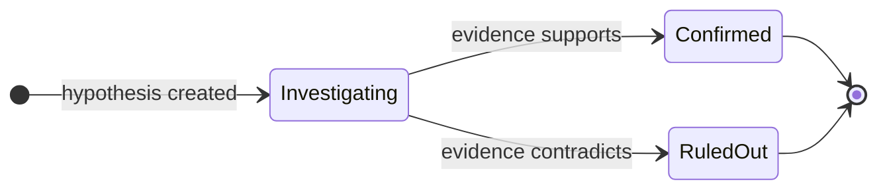

根本原因分析（RCA）は [Resolve](/ja/guide/incident/overview) の調査エンジンです。専門エージェントが仮説駆動型の調査を実行し、構造化されたエビデンスチェーンを構築し、修復策を提案します。各ステップの推論過程を完全に可視化できます。

## 調査の流れ

1. **トリガー** — [Pulse](/ja/guide/pulse/overview) クラスターが自動エスカレーションするか、インシデント詳細ページから手動でインシデントが作成されます。クラスターのエスカレーションでは、クラスターの要約とすべてのメンバーシグナルがエージェントのコンテキストに注入されるため、完全なシグナル履歴がロード済みの状態で調査が始まります。CloudThinker はバックグラウンドで RCA タスクをキューに入れ、専用の AI 会話を開きます。
2. **エージェントの起動** — [Anna](/ja/guide/agents/anna) が調査を統括し、接続されたインフラに基づいてスペシャリストがそれぞれのドメインをカバーします。
3. **コンテキストの収集** — エージェントがインフラトポロジーを探索し、ベースラインメトリクスを収集し、影響を受けたサービスを特定し、最近のデプロイや設定変更を調査します。
4. **分析** — エージェントが競合する仮説を立て、ログ・トレース・依存関係に対してそれぞれを検証します。
5. **解決** — 確認された仮説が根本原因になります。エビデンスがキュレーションされ、修復提案が生成され、信頼度スコアとともにディスポジションが設定されます。

| エージェント | 調査対象 |
|-------|--------------|
| [Alex](/ja/guide/agents/alex)（クラウドエンジニア） | クラウドインフラ — EC2、ロードバランサー、VPC ネットワーキング |
| [Tony](/ja/guide/agents/tony)（データベースエンジニア） | RDS Aurora および DocumentDB のパフォーマンス、スロークエリ、接続プールの枯渇 |
| [Kai](/ja/guide/agents/kai)（Kubernetes エンジニア） | EKS のポッドヘルス、コンテナの再起動、リソース制限、サービスメッシュ設定 |
| [Oliver](/ja/guide/agents/oliver)（セキュリティエンジニア） | セキュリティグループ、ネットワークポリシー、IAM 権限、セキュリティ関連の障害モード |
| [Anna](/ja/guide/agents/anna)（ジェネラルマネージャー） | 統括とクロスドメインの統合 |

エージェントはこれらのドメインを並行して調査し、リアルタイムで所見を相関付けます。症状が根本的な問題から遠く離れて現れる場合でも根本原因を特定します。

## 調査フェーズ

RCA は構造化された 3 フェーズのワークフローに従います。エージェントが新しいフェーズに移行すると、前のフェーズがまだ進行中であれば自動的に完了します。

| フェーズ | 目標 | 活動内容 |
|-------|------|------------|
| 1. コンテキスト収集 | ベースライン条件の確立 | トポロジーで影響を受けたサービスと依存関係をマッピング。CloudWatch・Prometheus・Datadog からメトリクスを収集。インシデントメトリクスを過去ベースラインと比較。最近のデプロイと設定変更を特定 |
| 2. 分析と仮説検証 | 根本原因の絞り込み | 症状から競合する仮説を生成。ログ・トレース・依存関係・リソースのエビデンスを収集。エビデンスが否定する仮説を除外。エビデンスの蓄積に応じて信頼度を追跡 |
| 3. 解決 | エビデンスとともに根本原因を確定 | 残存する仮説をすべて解決。勝者を根本原因として確認。最強のエビデンスをキュレーション。修復ステップを生成。ディスポジションと信頼度スコアを設定 |

エージェントは仮説を確認する前に、十分な支持エビデンスを収集し、十分な時間をかけて調査する必要があります。

<Note>
ディスポジションの設定は調査を終了するために必須です。設定しない場合、インシデントは **Investigating** ステータスのままになります。
</Note>

## エビデンスチェーン

RCA は自動計算付きの構造化エビデンスチェーンを構築します。各アイテムは特定の仮説にリンクでき、どの所見がどの仮説を支持するかを示します。

| エビデンスタイプ | 記録内容 | フィールド |
|---------------|------------------|--------|
| メトリクス | インシデント値とベースラインの比較（自動計算された偏差率付き）— 例：「CPU 95% vs ベースライン 25% = 偏差 280%」 | `incident_value`、`baseline_value`、`baseline_period`、`threshold`、`unit` |
| デプロイと変更 | インシデント開始からの時間差を自動計算した最近の変更。正のデルタ = インシデント前（原因の可能性あり） | `type`、`description`、`timestamp`、`correlation`、`service` |
| ログ | CloudWatch・Splunk・Datadog などのログコンソールへのディープリンク付き関連ログエントリ | `source`、`description`、`deep_link`、`timestamp`、`severity` |
| トレース | リクエストフローとレイテンシの内訳を示す分散トレースデータ | `source`、`description`、`raw_data` |
| 設定 | 正確なパラメーター変更内容を持つ設定変更 | `source`、`description`、`timestamp` |
| アラート | インシデントウィンドウ中のモニタリングシステムからの関連アラート | `source`、`severity`、`description` |

エビデンスは重要度でランク付けされます：**Critical**（直接的な原因）→ **High**（強い支持）→ **Medium**（コンテキスト）→ **Low**（背景情報）。

## 信頼度スコアリング

特定されたすべての根本原因は 0.0〜1.0 の信頼度スコアを持ちます。

| スコア範囲 | カテゴリー | 意味 | 推奨アクション |
|-------------|----------|---------|--------|
| 0.9 – 1.0 | 非常に高い | 圧倒的なエビデンスにより根本原因を特定 | 直ちに修復を実施 |
| 0.7 – 0.9 | 高い | 強いエビデンスにより根本原因を特定 | 通常の優先度で修復を実施 |
| 0.5 – 0.7 | 中程度 | 根本原因として有力だが、ギャップが残る | 修復を実施し、代替案を監視 |
| 0.3 – 0.5 | 低い | 根本原因の可能性があるが、エビデンスは状況証拠 | アクション前に手動で所見を検証 |
| 0.0 – 0.3 | 不確定 | 根本原因を確立するエビデンスが不十分 | 判断不能。`NOT_FOUND` を検討 |

信頼度は、時間的相関・50% 超のメトリクス異常・一致するエラーパターン・除外された代替案・複数の裏付けデータソースにより上昇します。代替説明・弱い時間的相関・検証の欠如・相反するエビデンスにより低下します。

## 仮説追跡

RCA は「5 つのなぜ」とフィッシュボーン手法にインスパイアされた仮説駆動型調査を実行します。



| 状態 | 意味 |
|-------|---------|
| Investigating | 仮説を検証するためにエビデンスを積極的に収集中 |
| Confirmed | 十分なエビデンスにより根本原因として支持されている |
| Ruled out | エビデンスが仮説を否定または反証 |

エージェントは根本原因を設定する前に少なくとも 1 つの仮説を確認し、調査を終了する前にすべての仮説を（確認または否定として）解決します。

レイテンシインシデントの仮説チェーンの例：

```text
Timeline Entry 1: hypothesis_created
├── Hypothesis 1: "Database connection pool exhaustion"
├── Confidence: 0.75
└── Message: "Pool exhaustion likely given 500s response times"

Timeline Entry 3: hypothesis_ruled_out
├── Hypothesis 1: Ruled Out
├── Reason: "DB metrics show 45/100 connections—well within limits"
└── Evidence: Max concurrent connections remained stable

Timeline Entry 6: hypothesis_created
├── Hypothesis 2: "Lambda cold start latency after memory reduction"
├── Confidence: 0.85

Timeline Entry 8: hypothesis_confirmed
├── Hypothesis 2: Confirmed
├── Updated Confidence: 0.92
└── Evidence: CloudWatch init duration spike, deployment timing match
```

## 調査タイムライン

RCA はすべての調査ステップのリアルタイムタイムラインをストリーミングします。フェーズの進捗、仮説のテスト、タイムスタンプ付きのエビデンス収集が表示されます。各調査は最大 100 エントリーを保持します（データベースレベルで適用）。

| エントリータイプ | 意味 |
|------------|---------|
| `info` | 一般的な調査ノート |
| `finding` | 分析に影響する特定の発見 |
| `warning` | 検証が必要な潜在的問題 |
| `error` | 失敗した調査の試み |
| `success` | 確認された所見 |
| `hypothesis_created` | 新しい仮説の提案 |
| `hypothesis_ruled_out` | 仮説の否定 |
| `hypothesis_confirmed` | 仮説の根本原因としての検証 |

## ディスポジション

すべての調査はディスポジションで終了し、インシデントのステータスを更新します。

| ディスポジション | 意味 | 再開可能？ |
|-------------|---------|------------|
| `IDENTIFIED` | 支持エビデンスとともに根本原因を発見 | 不可（終端） |
| `NOT_FOUND` | 調査を尽くしたが明確な根本原因なし | 不可（終端） |
| `FALSE_ALARM` | 実際のインシデントではなかった | 不可（終端） |
| `ON_HOLD` | 外部入力または追加データを待機中 | 可能 — 新しい情報が届くと再開 |

ディスポジション設定後、チームがフォローアップアクションを完了するにつれて、インシデントは追加のライフサイクルステータス（Resolved・Post-Mortem・Closed）に進むことができます。

## 調査を開始する

### 自動で

[Webhook インテグレーション](/ja/guide/incident/webhook-integrations/overview)を設定して RCA を自動トリガーします。インシデントが重要度のしきい値を満たすと、バックグラウンドで調査が開始されます。

```json
{
  "auto_trigger_rca": true,
  "auto_trigger_rca_min_severity": "medium"
}
```

### 手動で

<Steps>
  <Step title="インシデント詳細ページを開く">
    調査したいインシデントを選択します。
  </Step>
  <Step title="「RCA 分析を開始」をクリックする">
    CloudThinker が重複する RCA が実行されていないことを検証し、1〜3 秒以内に調査を開始します。エージェントが所見を発見するにつれ、タイムラインエントリーがリアルタイムで表示されます。
  </Step>
</Steps>

## 結果の読み取り方

| セクション | 表示内容 |
|---------|---------------|
| 根本原因サマリー | 信頼度スコアと特定タイムスタンプ付きの根本原因の明確な説明 |
| 仮説追跡 | 各仮説のライフサイクル：作成 → 検証 → 確認または否定（理由付き） |
| エビデンスチェーン | タイプ別に整理されたエビデンス（重要度ランキング、ソース帰属、ディープリンク付き） |
| 調査タイムライン | 調査ステップとフェーズ遷移の時系列ログ |
| 修復アクション | 優先度レベル（critical・high・medium・low）付きの推奨修正手順 |
| 影響サービス | インシデント中に影響を受けたサービス。トポロジーが接続されている場合はブラストラジウスの可視化も表示 |

バージョン追跡（v1・v2・v3…）付きで同一インシデントに対して複数回の調査を実行できます。新しい情報が入手可能になった場合や最初の実行が決定的でなかった場合は RCA を再実行し、履歴ドロップダウンで結果を比較します。

## 例：EC2 の終了と EKS ネットワーク障害

あるワークスペースで継続的モニタリングにより、2 つの相互に関連する所見が浮上しました。頻繁な EC2 インスタンスの終了と EKS の `CreateNetworkInterface` 障害です。エージェントがこれらをどのように一緒に調査したかを紹介します。

まず、Alex が終了パターンを分析します。

```text
@alex #report investigate EC2 termination patterns for the past 60 days.
Break down by Auto Scaling group, termination reason, instance type, and
availability zone — and explain the 17:15 UTC daily terminations.
```

<Frame>
  
</Frame>
<p style={{textAlign: 'center', fontSize: '0.9em', color: '#666', marginTop: '8px'}}>EC2 終了パターン分析：AutoScaling イベントを表示</p>

次に、Alex がネットワーク障害と終了を相互関連付けします。

```text
@alex #report correlate CreateNetworkInterface failures with EC2
termination events over the last 60 days. Determine whether aggressive
scale-downs cause IP address fragmentation and whether lifecycle hooks
allow proper ENI cleanup.
```

<Frame>
  
</Frame>
<p style={{textAlign: 'center', fontSize: '0.9em', color: '#666', marginTop: '8px'}}>ネットワーク障害の相関：CreateNetworkInterface エラーと IP 枯渇</p>

最後に、Anna が Alex（インフラとコスト）、Kai（EKS ネットワーキング）、Oliver（セキュリティ）の所見を 1 つのドキュメントに統合します。

```text
@anna #report comprehensive RCA for the EC2 termination and EKS network
interface failures. Include an executive summary, the 60-day timeline,
remediation steps with owners and due dates, and preventive measures.
```

<Frame>
  
</Frame>
<p style={{textAlign: 'center', fontSize: '0.9em', color: '#666', marginTop: '8px'}}>包括的 RCA レポート：所見と修復ステップ</p>

## ベストプラクティス

- インシデントが発生する前にトポロジーを接続する — ブラストラジウス分析とサービス相関はトポロジーに依存します。
- Medium 以上の重要度のインシデントに対して RCA を自動トリガーするよう[Webhook](/ja/guide/incident/webhook-integrations/overview)を設定する。
- インシデントの説明にコンテキストを追加する。エージェントが最初にどこを調査するかの指針になります。
- 調査中はタイムラインを監視して、どの仮説がテストされ否定されたかを確認し、エビデンスのタイムスタンプがインシデント開始と相関しているか検証する。
- 信頼度が 0.7 未満の場合は根本原因を手動で検証してから修復し、Critical 優先度の修復アクションから着手する。
- 将来の調査中にエージェントが修復手順を検索・実行できるよう[Runbooks](/ja/guide/incident/runbooks)を接続する。

## 関連

<CardGroup cols={2}>
  <Card title="Pulse" icon="wave-pulse" href="/ja/guide/pulse/overview">
    ノイズを抑制し、アクショナブルなクラスターをインシデントにエスカレーションするアップストリームのシグナルインテリジェンス
  </Card>
  <Card title="Webhook インテグレーション" icon="webhook" href="/ja/guide/incident/webhook-integrations/overview">
    PagerDuty・Datadog・Prometheus などから RCA を自動トリガー
  </Card>
  <Card title="インシデントメモリ" icon="brain" href="/ja/guide/incident/incident-memory">
    エージェントが記録した教訓を後続の調査で再利用する方法を確認
  </Card>
  <Card title="Runbooks" icon="book" href="/ja/guide/incident/runbooks">
    エージェントが修復ステップを実行できるよう運用 Runbook を接続
  </Card>
</CardGroup>
