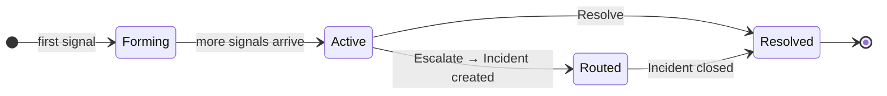

Pulse を有用たらしめる中心的な概念が 2 つあります。**サプレッション**（ノイズをフィードに到達する前に除去する）と**クラスタリング**（残ったシグナルを単一のアクション単位にグループ化する）です。

---

## サプレッション — ノイズを削減する

受信したすべてのシグナルは、フィードに到達するまでに 7 つの層を通過します。いずれかの層が発動すると、そのシグナルは保存されますが非表示になります。ノイズは発生しませんが、監査が必要な場合はいつでも確認できます。

<AccordionGroup>
  <Accordion title="重複（Duplicate）" icon="copy">
    同一のイベントが過去 1 時間以内にすでに受信されている場合、新しい行を作成する代わりに既存シグナルの重複カウントが増加します。47 件の個別アイテムではなく、「×47」と表示された 1 件のシグナルが表示されます。通常、最も件数の多いサプレッションカテゴリーです。
  </Accordion>
  <Accordion title="レート制限（Rate Limited）" icon="gauge-high">
    ソースが 1 分間に 100 件を超えるシグナルを送信した場合、バースト中はしきい値を超えたシグナルが抑制されます。設定ミスのあるアラートによってフィードが溢れることを防ぎます。
  </Accordion>
  <Accordion title="スヌーズ（Snoozed）" icon="clock">
    有効なスヌーズルールに一致するシグナルは抑制されます。これはあなたが直接制御できる唯一の層です。下記の[スヌーズ](#スヌーズ)をご参照ください。
  </Accordion>
  <Accordion title="ノイズシグネチャ（Noise Signature）" icon="waveform">
    既知のノイジーな AWS パターンは自動的に抑制されます。対象は KMS グラントのライフサイクルイベント、EBS ボリュームのチャーン、AutoScaling の内部オペレーション、Signin トークンリダイレクトなどです。これらはほぼ実際の問題を示さない AWS の内部管理イベントです。
  </Accordion>
  <Accordion title="フラッピング（Flapping）" icon="arrows-left-right">
    シグナルが 10 分以内に 4 回以上状態を切り替える場合、5 分間抑制されます。正常と異常の間を行き来するリソースは、状態が安定した後に 1 件の通知に集約されます。
  </Accordion>
  <Accordion title="カスケード（Cascade）" icon="sitemap">
    親リソースが抑制されると、その子リソースからのシグナルも 30 分間抑制されます。既知のノイズに対して子アラートを受け取る必要がなくなります。
  </Accordion>
  <Accordion title="重要度の正規化（Severity Normalization）" icon="arrow-down">
    AWS の自動化サービスが重要度を過大に設定したイベントを送信する場合があります。Pulse は AWS 内部アクターからのイベントを検出し、ルーティング前に重要度をダウングレードします。元の重要度は監査目的で保持されます。
  </Accordion>
</AccordionGroup>

<Frame>
  
</Frame>

時系列サプレッション内訳 — Analytics タブで確認可能

抑制されたシグナルを確認するには、フィルターバーの **「抑制済みを表示」** を有効にします。抑制されたシグナルは透明度を下げて表示され、どの層で検出されたかを示すラベルが付きます。

### スヌーズ

スヌーズはあなたが制御できる唯一のサプレッション層です。任意のシグナルにカーソルを合わせ、スヌーズボタンをクリックします。期間（1 分〜30 日）とスコープを選択します。

| スコープ | 抑制対象 |
|---|---|
| **Signal（シグナル）** | この特定のシグナルのみ |
| **Pattern（パターン）** | 同じソース・タイプ・タイトルパターンを持つすべてのシグナル |
| **Resource（リソース）** | このリソース ID からのすべてのシグナル |

<Tip>
  定期的なメンテナンスウィンドウには **Pattern** を使用します。リソースを廃止するテアダウン中は **Resource** を使用します。
</Tip>

---

## クラスター — 一つのアクション単位

**クラスター**は Pulse における作業の主要単位です。個々のシグナルをすべて個別に表示する代わりに、Pulse は関連するシグナルをグループ化します。15 分間に 9 件のアラートを発した同一の EKS ノードプールは 1 つのクラスターになります。調査は 1 回、アクションは 1 回、解決は 1 回で済みます。

### ステータスのライフサイクル

すべてのクラスターは 4 つのステータスを経由します。

| ステータス | 意味 |
|---|---|
| **Forming** | 最初のシグナルが到着。関連シグナルを収集中 |
| **Active** | シグナルが継続して到着。オープン状態で対応が必要 |
| **Routed** | エスカレーション済み — リンクされたインシデントが作成済み |
| **Resolved** | ユーザーまたは自動で解決済み |

フィードの **Active / All** トグルで、アクティブなクラスターのみ（デフォルト）またはすべてのステータスを切り替えられます。

### クラスター詳細パネル

任意のクラスターをクリックして詳細パネルを開きます。

<Frame>
  
</Frame>

AI 生成の説明、シグナルタイムライン、リソース詳細、およびアクション

パネルには以下が表示されます。

- **AI 生成の説明** — 何が起きたか、影響の可能性を平易な日本語で要約
- **クラスターのコンテキスト** — すべてのメンバーシグナルを時系列で一覧
- **相関情報** — 使用した手法（例：`time_window`）と信頼度スコア
- **リソースメタデータ** — 選択したシグナルの ID・タイプ・リージョン・タグ
- **タブ** — Overview（シグナル詳細）、Routing（エスカレーション履歴）、Raw（完全なイベントペイロード）

### アクション

| アクション | 内容 |
|---|---|
| **Acknowledge（確認）** | クローズせずに確認済みとしてマーク。クラスターが把握済みであることを示す。取り消し可能。 |
| **Assign（割り当て）** | チームメンバーに引き渡す。担当者に通知され、アバターがフィードに表示される。 |
| **Escalate（エスカレーション）** | リンクされたインシデントを作成。クラスターが Routed に移行し、RCA が自動的に開始されます。クラスターの要約とすべてのメンバーシグナルが RCA エージェントの開始コンテキストとして渡されるため、完全なシグナル履歴がロード済みの状態で調査が始まります。 |
| **Resolve（解決）** | 問題が対処されインシデントが不要な場合にクラスターをクローズ。 |

### 自動エスカレーション

Pulse は、**Critical** または **High** の重要度を持つシグナルがあるクラスター、または AI がシグナルを**アクショナブル**と判断したクラスターを自動エスカレーションします。これらは直接 Routed に移行し、根本原因分析をトリガーします。手動エスカレーションは不要です。

---

## 関連

<CardGroup cols={2}>
  <Card title="Pulse アナリティクス" icon="chart-bar" href="/ja/guide/pulse/analytics">
    シグナル量、ノイズ削減、クラスター解決時間、ソースコンバージョン率を計測。
  </Card>
  <Card title="Pulse セットアップ" icon="bolt" href="/ja/guide/pulse/setup">
    モニタリングソースを接続し、ワークスペースの検出ルールを設定。
  </Card>
  <Card title="根本原因分析" icon="magnifying-glass" href="/ja/guide/incident/root-cause-analysis">
    AI エージェントがエスカレーションされたクラスターを調査し、エビデンスチェーンを構築する仕組みを理解する。
  </Card>
</CardGroup>
