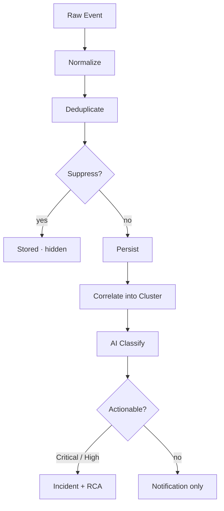

Pulse は接続されたすべてのソース（CloudTrail、GuardDuty、Datadog など）からイベントを取り込み、ノイズを抑制し、注意に値するクラスターのみを表面化します。各クラスターは深刻度でランク付けされ、ワンクリックでインシデントにエスカレーションできます。

<Frame>
  
</Frame>

Pulse は 13K の生イベントを 40 のアクションに値するクラスターに削減 — リアルタイムで 1 つのビューに

監視スタックはすでに異常を検知しています。問題はその量です：エンジニアはアラートの大量発生のトリアージに、実際の問題を修正するより多くの時間を費やしています。Pulse はすべてのソースの前に配置され、注意を向けるべきものを判断するため、6 つのダッシュボードを開く代わりにクラスターのランク付きリストを見るだけで済みます。

## 仕組み

Pulse に到達するすべてのイベントは、表示される前に同じ 8 ステージパイプラインを通過します。

1. **取り込み** — 接続された任意のソースからイベントが届きます：AWS ポーラーが GuardDuty の検出を取得する、アラートチャンネルから Slack メッセージが発火する、Datadog Webhook がアラートをポストするなど。
2. **正規化** — ソース固有のコレクターが生のイベントを共通のシグナル形式に変換し、発生元に関係なくタイトル、深刻度、カテゴリ、リソース ID、タイムスタンプを抽出します。
3. **重複排除** — シグナルのソース、タイプ、リソース、タイムスタンプ（分単位）から SHA-256 フィンガープリントが計算されます。過去 1 時間以内に同一のイベントが到着していた場合、新しい行を作成する代わりに既存シグナルの重複排除カウントがインクリメントされます。
4. **抑制** — シグナルは優先順位の順に抑制レイヤーを通過します。いずれかのレイヤーが発火した場合、シグナルは抑制済みとして保存されフィードから非表示になります。各レイヤーの仕組みについては [Clusters & Suppression](/ja/guide/pulse/clusters) を参照してください。
5. **永続化** — シグナルは最終的な抑制ステータス、深刻度、抽出フィールドと共に書き込まれます。抑制されたシグナルは 90 日間保持されます — **Show suppressed** をトグルしてフィルタリングされた内容を確認できます。
6. **相関** — 15 分間のウィンドウ内で、Pulse は同じリソース、サービス、またはタイトルパターンを共有するシグナルをクラスターにグループ化します。9 件の EC2 アラートは、9 つのメンバーを持つ 1 つのクラスターになります。
7. **分類** — AI モデルがカテゴリ、正規化された深刻度、1 行のサマリー、実行可能性の判定（インシデントの作成が必要かどうか）を割り当てます。
8. **ルーティング** — Critical と High の深刻度のシグナル、および実行可能とマークされたシグナルは自動的にエスカレーションされます：リンクされたインシデントが作成され、根本原因分析が始まります。それ以外は通知のみで配信されます。

## できること

| 機能 | 説明 | 詳細 |
|---|---|---|
| シグナルソースの接続 | AWS ポーラー、Slack と Teams チャンネル、サードパーティ Webhook を Pulse に接続する | [Pulse セットアップ](/ja/guide/pulse/setup) |
| クラスターと抑制の確認 | 関連するシグナルがどのようにグループ化されているかを確認し、何が抑制されたかを監査する | [Clusters & Suppression](/ja/guide/pulse/clusters) |
| インシデントへのエスカレーション | 任意のクラスターを自動根本原因分析付きのフルインシデントに昇格させる | [Resolve](/ja/guide/incident/overview) |
| ノイズ削減の測定 | 抑制率、クラスター解決時間、シグナルのコンバージョンを追跡する | [Pulse Analytics](/ja/guide/pulse/analytics) |

## キーコンセプト

左サイドバーのパイプラインパネルは、4 つのステージをすべてライブのファネルとして表示します：

| ステージ | カウントの意味 |
|---|---|
| **Raw events** | フィルタリング前のすべての取り込まれたイベント |
| **Signals** | 重複排除・正規化されたイベント。深刻度の内訳がアクティブな状況を示す |
| **Clusters** | 相関されたグループ。「510 からグループ化 · 189 件が抑制済み」は何が抑制されたかを示す |
| **Incidents** | エスカレーションされたクラスター — インシデントリストに直接リンク |

## 次のステップ

<CardGroup cols={2}>
  <Card title="Clusters & Suppression" icon="layer-group" href="/ja/guide/pulse/clusters">
    シグナルがどのようにグループ化されノイズがどのようにフィルタリングされるかを理解する
  </Card>
  <Card title="セットアップ" icon="gear" href="/ja/guide/pulse/setup">
    AWS、Slack、Teams、サードパーティ Webhook ソースを接続する
  </Card>
  <Card title="Analytics" icon="chart-bar" href="/ja/guide/pulse/analytics">
    ノイズ削減、クラスター解決時間、コンバージョン率を測定する
  </Card>
  <Card title="Resolve" icon="arrow-right" href="/ja/guide/incident/overview">
    Pulse がインシデント、RCA、ランブック、メモリにどのように繋がるかを確認する
  </Card>
</CardGroup>
