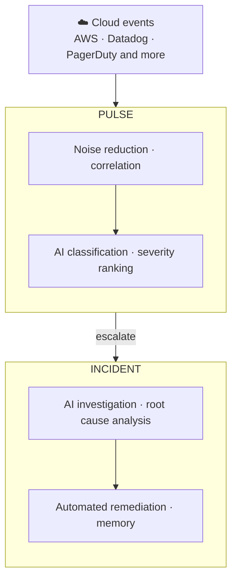

Resolve은 CloudThinker의 인시던트 라이프사이클 모듈입니다. 첫 번째 신호부터 해결된 인시던트까지 모든 이벤트를 처리합니다 — 노이즈 감소, 에스컬레이션, 근본 원인 분석, 수정, 메모리.

대부분의 모니터링 스택은 무언가 잘못되었다고 알려주고 거기서 멈춥니다. Resolve은 이유를 알려줍니다: [Pulse](/ko/guide/pulse/overview)는 누구에게도 알리기 전에 신호를 필터링하고 연관 짓고, Incident는 클러스터가 에스컬레이션되는 순간 — 종종 온콜 엔지니어가 노트북을 열기 전에 — 조사를 시작합니다.

## 동작 방식

어떤 단계도 수동 인계를 필요로 하지 않습니다 — 각 레이어가 다음 레이어에 자동으로 공급됩니다:

1. **수집** — AWS, Datadog, Slack, PagerDuty 등의 소스에서 이벤트가 하나의 Pulse 피드로 스트리밍됩니다.
2. **필터 및 연관** — 억제 레이어가 중복, 속도 제한된 버스트, 플래핑 리소스를 제거합니다. 관련 신호는 클러스터로 그룹화되어, 동일한 노드 풀에 관한 9개의 알림이 하나의 항목이 됩니다.
3. **분류 및 에스컬레이션** — 모든 신호에 카테고리, 표준 심각도, 실행 가능성 점수가 부여됩니다. 클러스터가 Critical 또는 High이거나 AI가 실행 가능으로 표시하면 자동으로 인시던트로 에스컬레이션됩니다.
4. **조사** — AI 에이전트가 명시적 가설을 수립하고, 메트릭과 로그에 대해 각 가설을 테스트하며, 구조화된 리포트를 생성합니다: 가장 가능성 높은 근본 원인, 증거 체인, 배제된 이론.
5. **해결 및 기억** — 에이전트가 설정한 자율성 모드(Manual 또는 Auto)에 따라 루트 원인에 맞는 [런북](/ko/guide/incident/runbooks)을 찾아 실행합니다. 각 해결은 [인시던트 메모리](/ko/guide/incident/incident-memory)에 피드되어 다음 조사를 더 빠르게 합니다.

모든 조사 단계가 가시적입니다 — 어떤 가설이 확인되었는지, 어떤 것이 배제되었는지, 그리고 그 이유.

## 주요 기능

| 기능 | 설명 | 가이드 |
|---|---|---|
| 신호 소스 연결 | AWS, Slack, Teams, 웹훅 이벤트를 Pulse에 공급 | [Pulse 설정](/ko/guide/pulse/setup) |
| 신호 클러스터 관리 | 연관된 신호 그룹을 검토, 병합, 조치 | [클러스터](/ko/guide/pulse/clusters) |
| AI 근본 원인 분석 실행 | 가설 주도 조사를 통해 구조화된 RCA 리포트로 | [동작 방식](/ko/guide/incident/root-cause-analysis) |
| 모니터링 웹훅 수집 | PagerDuty, Datadog, CloudWatch 등의 알림 라우팅 | [웹훅 연동](/ko/guide/incident/webhook-integrations/overview) |
| 수정 자동화 | 에이전트가 일치하는 런북 절차를 실행 | [런북](/ko/guide/incident/runbooks) |
| 인시던트 수동 기록 | Pulse 외부에서 시작된 인시던트 기록 | [수동 기록](/ko/guide/incident/manual-logging) |
| 모든 인시던트에서 학습 | 효과적이었던 것들을 재사용 — 쿼리, 기법, 런북 단계 | [인시던트 메모리](/ko/guide/incident/incident-memory) |
| 루프 측정 | 노이즈 감소, 클러스터 MTTR, 전환율 추적 | [Pulse Analytics](/ko/guide/pulse/analytics) |

## 핵심 개념

| 개념 | 의미 |
|---|---|
| 신호 | 연결된 소스에서 발생한 단일 정규화된 이벤트 |
| 클러스터 | 하나의 항목으로 처리되는 연관된 신호의 그룹 |
| 인시던트 | 클러스터가 에스컬레이션될 때 생성되는 조사 객체 |
| 런북 | 에이전트가 수정 중 찾아 실행할 수 있는 운영 절차 |
| 인시던트 메모리 | 과거 인시던트를 해결한 기법, 쿼리, 단계의 기록 |

## 시작하기

<CardGroup cols={2}>
  <Card title="신호 소스 연결" icon="satellite-dish" href="/ko/guide/pulse/setup">
    Pulse에 공급을 시작하기 위해 AWS, Slack, Teams, 웹훅 소스를 연결합니다.
  </Card>
  <Card title="웹훅 연동 설정" icon="webhook" href="/ko/guide/incident/webhook-integrations/overview">
    PagerDuty, Datadog, CloudWatch 등의 알림을 응답 루프로 라우팅합니다.
  </Card>
  <Card title="런북 추가" icon="book" href="/ko/guide/incident/runbooks">
    에이전트가 수정 중 실행할 수 있는 절차를 제공합니다.
  </Card>
  <Card title="조사 동작 방식 확인" icon="flask" href="/ko/guide/incident/root-cause-analysis">
    가설 주도 근본 원인 분석의 처음부터 끝까지를 따라갑니다.
  </Card>
</CardGroup>
