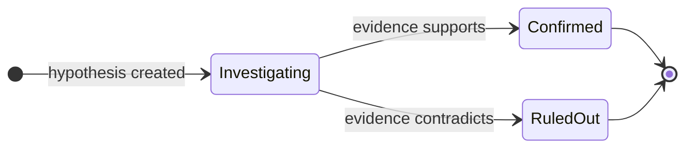

근본 원인 분석(RCA)은 [Resolve](/ko/guide/incident/overview)의 조사 엔진입니다. 전문 에이전트가 가설 기반 조사를 실행하고, 구조화된 증거 체인을 구축하며, 모든 추론 단계에 대한 완전한 가시성과 함께 수정 방안을 제안합니다.

## 조사 진행 방식

1. **트리거** — [Pulse](/ko/guide/pulse/overview) 클러스터가 에스컬레이션되거나 인시던트 상세 페이지에서 수동으로 인시던트가 생성되면 조사가 시작됩니다. 클러스터 에스컬레이션은 클러스터 요약과 모든 멤버 신호를 에이전트의 컨텍스트에 주입하므로, 조사는 전체 신호 기록이 로드된 상태에서 시작됩니다. CloudThinker는 백그라운드에서 RCA 작업을 큐에 추가하고 전용 AI 대화를 엽니다.
2. **에이전트 활성화** — [Anna](/ko/guide/agents/anna)가 조사를 조율하고, 전문가들이 연결된 인프라를 기반으로 각 도메인을 담당합니다.
3. **컨텍스트 수집** — 에이전트가 인프라 토폴로지를 탐색하고, 기준 메트릭을 수집하며, 영향받은 서비스를 식별하고, 최근 배포 및 구성 변경 사항을 검토합니다.
4. **분석** — 에이전트가 경쟁 가설을 수립하고 로그, 트레이스, 의존성에 대해 각 가설을 검증합니다.
5. **해결** — 확인된 가설이 근본 원인이 됩니다. 증거가 정리되고, 수정 제안이 생성되며, 신뢰도 점수와 함께 처분이 설정됩니다.

| 에이전트 | 조사 영역 |
|-------|--------------|
| [Alex](/ko/guide/agents/alex) (Cloud Engineer) | 클라우드 인프라 — EC2, 로드 밸런서, VPC 네트워킹 |
| [Tony](/ko/guide/agents/tony) (Database Engineer) | RDS Aurora 및 DocumentDB 성능, 슬로우 쿼리, 연결 풀 고갈 |
| [Kai](/ko/guide/agents/kai) (Kubernetes Engineer) | 파드 상태, 컨테이너 재시작, 리소스 제한, EKS의 서비스 메시 구성 |
| [Oliver](/ko/guide/agents/oliver) (Security Engineer) | 보안 그룹, 네트워크 정책, IAM 권한, 보안 관련 장애 유형 |
| [Anna](/ko/guide/agents/anna) (General Manager) | 조율 및 도메인 간 종합 |

에이전트는 이러한 도메인 전반에서 병렬로 조사하고 실시간으로 발견 사항을 상관합니다. 증상이 근본 문제와 멀리 나타나는 경우에도 근본 원인을 파악합니다.

## 조사 단계

RCA는 구조화된 3단계 워크플로를 따릅니다. 에이전트가 새 단계로 이동하면 이전 단계가 아직 진행 중이면 자동으로 완료됩니다.

| 단계 | 목표 | 활동 |
|-------|------|------------|
| 1. 컨텍스트 수집 | 기준 조건 설정 | 토폴로지를 통해 영향받은 서비스 및 의존성 매핑; CloudWatch, Prometheus, Datadog에서 메트릭 수집; 인시던트 메트릭을 역사적 기준선과 비교; 최근 배포 및 구성 변경 식별 |
| 2. 분석 및 가설 검증 | 근본 원인 범위 좁히기 | 증상에서 경쟁 이론 생성; 로그, 트레이스, 의존성, 리소스 증거 수집; 증거가 모순되는 가설 배제; 증거가 쌓임에 따라 신뢰도 추적 |
| 3. 해결 | 증거와 함께 근본 원인 확정 | 나머지 모든 가설 해결; 승자를 근본 원인으로 확인; 가장 강력한 증거 정리; 수정 단계 생성; 처분 및 신뢰도 점수 설정 |

에이전트는 어떤 가설을 확인하기 전에 지지 증거를 수집하고 충분한 시간 동안 조사해야 합니다.

<Note>
처분 설정은 조사를 종료하기 위해 필수입니다. 처분이 없으면 인시던트는 **Investigating** 상태로 남습니다.
</Note>

## 증거 체인

RCA는 자동 계산과 함께 구조화된 증거 체인을 구축합니다. 각 항목은 특정 가설에 연결하여 어떤 발견이 각 이론을 지지하는지 표시할 수 있습니다.

| 증거 유형 | 포착 내용 | 필드 |
|---------------|------------------|--------|
| 메트릭 | 자동 계산된 편차 백분율과 함께 인시던트 대 기준선 비교 — 예: "CPU 95% 대 기준선 25% = 280% 편차" | `incident_value`, `baseline_value`, `baseline_period`, `threshold`, `unit` |
| 배포 및 변경 | 인시던트 시작으로부터 자동 계산된 시간 델타가 있는 최근 변경; 양의 델타 = 인시던트 이전(원인 가능성) | `type`, `description`, `timestamp`, `correlation`, `service` |
| 로그 | CloudWatch, Splunk, Datadog 등 로그 콘솔로의 딥 링크가 포함된 관련 로그 항목 | `source`, `description`, `deep_link`, `timestamp`, `severity` |
| 트레이스 | 요청 흐름 및 지연 시간 분석을 보여주는 분산 트레이스 데이터 | `source`, `description`, `raw_data` |
| 구성 | 정확한 매개변수 수정이 포함된 구성 변경 | `source`, `description`, `timestamp` |
| 알림 | 인시던트 기간 동안 모니터링 시스템의 관련 알림 | `source`, `severity`, `description` |

증거는 심각도 순으로 정렬됩니다: **Critical**(직접 원인) → **High**(강력한 지지) → **Medium**(맥락) → **Low**(배경).

## 신뢰도 점수

식별된 모든 근본 원인은 0.0에서 1.0 사이의 신뢰도 점수를 가집니다.

| 점수 범위 | 카테고리 | 의미 | 조치 |
|-------------|----------|---------|--------|
| 0.9 – 1.0 | 매우 높음 | 압도적인 증거로 근본 원인 식별 | 즉시 수정 조치 시행 |
| 0.7 – 0.9 | 높음 | 강력한 증거로 근본 원인 식별 | 일반 우선순위로 수정 조치 시행 |
| 0.5 – 0.7 | 중간 | 가능성 높은 근본 원인이나 갭 존재 | 수정 조치 시행; 대안 모니터링 |
| 0.3 – 0.5 | 낮음 | 가능한 근본 원인이나 증거가 정황적 | 조치 전 수동으로 발견 사항 검증 |
| 0.0 – 0.3 | 불확실 | 근본 원인 특정에 충분한 증거 없음 | 판단 불가; `NOT_FOUND` 고려 |

신뢰도는 시간적 상관관계, 50% 편차를 초과하는 메트릭 이상, 일치하는 오류 패턴, 배제된 대안, 여러 corroborating 데이터 소스로 높아집니다. 대안적 설명, 약한 시간적 상관관계, 검증 누락, 상충하는 증거로 낮아집니다.

## 가설 추적

RCA는 "5 Whys" 및 Fishbone 방법론에서 영감을 받은 가설 기반 조사를 실행합니다.



| 상태 | 의미 |
|-------|---------|
| Investigating | 이론을 검증하기 위한 증거 활발히 수집 중 |
| Confirmed | 충분한 증거가 이것을 근본 원인으로 지지 |
| Ruled out | 증거가 가설을 모순하거나 반증 |

에이전트는 근본 원인을 설정하기 전에 최소 하나의 가설을 확인하고, 조사를 종료하기 전에 확인되거나 배제된 모든 가설을 해결합니다.

지연 시간 인시던트의 가설 체인 예시:

```text
Timeline Entry 1: hypothesis_created
├── Hypothesis 1: "Database connection pool exhaustion"
├── Confidence: 0.75
└── Message: "Pool exhaustion likely given 500s response times"

Timeline Entry 3: hypothesis_ruled_out
├── Hypothesis 1: Ruled Out
├── Reason: "DB metrics show 45/100 connections—well within limits"
└── Evidence: Max concurrent connections remained stable

Timeline Entry 6: hypothesis_created
├── Hypothesis 2: "Lambda cold start latency after memory reduction"
├── Confidence: 0.85

Timeline Entry 8: hypothesis_confirmed
├── Hypothesis 2: Confirmed
├── Updated Confidence: 0.92
└── Evidence: CloudWatch init duration spike, deployment timing match
```

## 조사 타임라인

RCA는 모든 조사 단계의 실시간 타임라인을 스트리밍하며, 타임스탬프와 함께 단계 진행, 가설 검증, 증거 수집을 표시합니다. 각 조사는 최대 100개의 항목을 보유합니다(데이터베이스 수준에서 적용).

| 항목 유형 | 의미 |
|------------|---------|
| `info` | 일반 조사 메모 |
| `finding` | 분석에 영향을 미치는 특정 발견 |
| `warning` | 검증이 필요한 잠재적 문제 |
| `error` | 실패한 조사 시도 |
| `success` | 확인된 발견 |
| `hypothesis_created` | 새로운 이론 제안 |
| `hypothesis_ruled_out` | 이론 반증 |
| `hypothesis_confirmed` | 가설이 근본 원인으로 검증됨 |

## 처분(Disposition)

모든 조사는 인시던트 상태를 업데이트하는 처분으로 종료됩니다.

| 처분 | 의미 | 재개 가능? |
|-------------|---------|------------|
| `IDENTIFIED` | 지지 증거와 함께 근본 원인 발견 | 아니오 (최종) |
| `NOT_FOUND` | 조사 완료, 명확한 근본 원인 없음 | 아니오 (최종) |
| `FALSE_ALARM` | 실제 인시던트가 아니었음 | 아니오 (최종) |
| `ON_HOLD` | 외부 입력 또는 추가 데이터 대기 중 | 예 — 새 정보 도착 시 재개 |

처분이 설정된 후, 팀이 후속 조치를 완료함에 따라 인시던트는 추가 라이프사이클 상태(Resolved, Post-Mortem, Closed)로 진행할 수 있습니다.

## 조사 시작

### 자동으로

[웹훅 통합](/ko/guide/incident/webhook-integrations/overview)을 구성하여 RCA를 자동 트리거하세요. 인시던트가 심각도 임계값을 충족하면 조사가 백그라운드에서 시작됩니다:

```json
{
  "auto_trigger_rca": true,
  "auto_trigger_rca_min_severity": "medium"
}
```

### 수동으로

<Steps>
  <Step title="인시던트 상세 페이지 열기">
    조사할 인시던트를 선택합니다.
  </Step>
  <Step title="Start RCA Analysis 클릭">
    CloudThinker는 중복 RCA가 실행 중이지 않은지 확인한 다음, 1~3초 내에 조사를 시작합니다. 에이전트가 발견 사항을 발견함에 따라 타임라인 항목이 실시간으로 나타납니다.
  </Step>
</Steps>

## 결과 읽기

| 섹션 | 표시 내용 |
|---------|---------------|
| 근본 원인 요약 | 신뢰도 점수 및 식별 타임스탬프와 함께 근본 원인의 명확한 설명 |
| 가설 추적 | 생성 → 검증 → 확인 또는 배제 라이프사이클과 추론이 있는 모든 가설 |
| 증거 체인 | 유형별로 정리된 증거, 심각도 랭킹, 소스 귀속, 딥 링크 |
| 조사 타임라인 | 조사 단계 및 단계 전환의 시간순 로그 |
| 수정 조치 | 우선순위 수준(critical, high, medium, low)이 있는 제안된 수정 방법 |
| 영향받은 서비스 | 인시던트 중 영향받은 서비스, 토폴로지가 연결된 경우 피해 반경 시각화 |

동일한 인시던트에 대해 버전 추적(v1, v2, v3…)으로 여러 조사를 실행할 수 있습니다. 새로운 정보가 제공되거나 첫 번째 실행이 결론에 이르지 못했을 때 RCA를 재실행하고 히스토리 드롭다운에서 결과를 비교하세요.

## 예시: EC2 종료 및 EKS 네트워크 장애

지속적인 모니터링을 통해 하나의 워크스페이스에서 두 가지 상호 연결된 발견 사항이 나타났습니다: 빈번한 EC2 인스턴스 종료와 EKS의 `CreateNetworkInterface` 실패. 에이전트가 이를 함께 조사하는 방법입니다.

먼저, Alex가 종료 패턴을 분석합니다:

```text
@alex #report investigate EC2 termination patterns for the past 60 days.
Break down by Auto Scaling group, termination reason, instance type, and
availability zone — and explain the 17:15 UTC daily terminations.
```

<Frame>
  
</Frame>
<p style={{textAlign: 'center', fontSize: '0.9em', color: '#666', marginTop: '8px'}}>AutoScaling 이벤트를 보여주는 EC2 종료 패턴 분석</p>

다음으로, Alex가 네트워크 장애와 종료를 교차 상관합니다:

```text
@alex #report correlate CreateNetworkInterface failures with EC2
termination events over the last 60 days. Determine whether aggressive
scale-downs cause IP address fragmentation and whether lifecycle hooks
allow proper ENI cleanup.
```

<Frame>
  
</Frame>
<p style={{textAlign: 'center', fontSize: '0.9em', color: '#666', marginTop: '8px'}}>CreateNetworkInterface 오류 및 IP 고갈과의 네트워크 장애 상관 분석</p>

마지막으로, Anna가 Alex(인프라 및 비용), Kai(EKS 네트워킹), Oliver(보안)의 발견 사항을 하나의 문서로 종합합니다:

```text
@anna #report comprehensive RCA for the EC2 termination and EKS network
interface failures. Include an executive summary, the 60-day timeline,
remediation steps with owners and due dates, and preventive measures.
```

<Frame>
  
</Frame>
<p style={{textAlign: 'center', fontSize: '0.9em', color: '#666', marginTop: '8px'}}>발견 사항 및 수정 단계가 있는 종합 RCA 보고서</p>

## 모범 사례

- 인시던트 발생 전에 토폴로지를 연결하세요 — 피해 반경 분석과 서비스 상관 관계가 여기에 의존합니다.
- Medium 이상 심각도의 인시던트에 대해 RCA를 자동 트리거하도록 [웹훅](/ko/guide/incident/webhook-integrations/overview)을 구성하세요.
- 인시던트 설명에 컨텍스트를 추가하세요; 에이전트가 어디를 먼저 볼지 안내합니다.
- 조사 중에 타임라인을 확인하여 어떤 가설이 검증되고 배제되었는지 추적하고, 증거 타임스탬프가 인시던트 시작과 상관관계가 있는지 확인하세요.
- 신뢰도가 0.7 미만일 때는 수정하기 전에 근본 원인을 수동으로 검증하고, critical 우선순위 수정 조치부터 시작하세요.
- [Runbooks](/ko/guide/incident/runbooks)를 연결하여 에이전트가 향후 조사 중에 수정 절차를 찾아 실행할 수 있도록 하세요.

## 관련 문서

<CardGroup cols={2}>
  <Card title="Pulse" icon="wave-pulse" href="/ko/guide/pulse/overview">
    노이즈를 억제하고 실행 가능한 클러스터를 인시던트로 에스컬레이션하는 업스트림 신호 인텔리전스
  </Card>
  <Card title="웹훅 통합" icon="webhook" href="/ko/guide/incident/webhook-integrations/overview">
    PagerDuty, Datadog, Prometheus 등에서 RCA 자동 트리거
  </Card>
  <Card title="인시던트 메모리" icon="brain" href="/ko/guide/incident/incident-memory">
    에이전트가 기록한 교훈을 후속 조사에서 재사용하는 방법 확인
  </Card>
  <Card title="Runbooks" icon="book" href="/ko/guide/incident/runbooks">
    에이전트가 수정 단계를 실행할 수 있도록 운영 Runbook 연결
  </Card>
</CardGroup>
