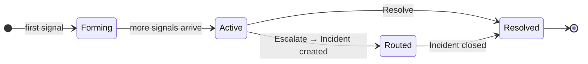

Pulse를 유용하게 만드는 두 가지 핵심 개념이 있습니다: **억제(suppression)** (노이즈가 도달하기 전에 제거)와 **클러스터링(clustering)** (나머지 신호를 단일 작업 단위로 그룹화).

---

## 억제(Suppression) — 노이즈 제거

도착하는 모든 신호는 피드에 도달하기 전에 7개의 레이어를 통과합니다. 어느 레이어에서든 신호가 걸리면, 해당 신호는 저장되지만 숨겨집니다. 노이즈를 생성하지는 않지만, 감사(audit)가 필요할 때 여전히 확인할 수 있습니다.

<AccordionGroup>
  <Accordion title="중복(Duplicate)" icon="copy">
    동일한 이벤트가 지난 1시간 내에 이미 도착한 경우, 새 행을 생성하는 대신 기존 신호의 중복 카운트가 증가합니다. 47개의 별도 항목 대신 "×47"로 표시된 하나의 신호만 확인됩니다. 일반적으로 가장 큰 억제 카테고리입니다.
  </Accordion>
  <Accordion title="전송률 제한(Rate Limited)" icon="gauge-high">
    소스가 분당 100개 이상의 신호를 내보내는 경우, 해당 임계값을 초과하는 신호는 버스트가 지속되는 동안 억제됩니다. 잘못 구성된 알림이 피드를 넘치게 하는 것을 방지합니다.
  </Accordion>
  <Accordion title="스누즈(Snoozed)" icon="clock">
    활성 스누즈 규칙과 일치하는 신호는 억제됩니다. 이것은 직접 제어할 수 있는 유일한 레이어입니다 — 아래의 [스누즈](#snooze)를 참조하세요.
  </Accordion>
  <Accordion title="노이즈 시그니처(Noise Signature)" icon="waveform">
    알려진 노이즈가 많은 AWS 패턴은 자동으로 억제됩니다 — KMS 그랜트 라이프사이클 이벤트, EBS 볼륨 처리, AutoScaling 내부 작업, Signin 토큰 리디렉션. 이러한 이벤트는 거의 실제 문제를 나타내지 않는 AWS 내부 관리 이벤트입니다.
  </Accordion>
  <Accordion title="플래핑(Flapping)" icon="arrows-left-right">
    신호가 10분 내에 4번 이상 상태를 전환하면, 5분 동안 억제됩니다. 정상과 비정상 사이를 오가는 리소스는 상태가 안정화되면 단일 알림으로 압축됩니다.
  </Accordion>
  <Accordion title="연쇄(Cascade)" icon="sitemap">
    상위 리소스가 억제되면, 해당 하위 리소스의 신호도 30분 동안 억제됩니다 — 이미 알려진 노이즈에 대한 하위 알림을 받지 않도록 합니다.
  </Accordion>
  <Accordion title="심각도 정규화(Severity Normalization)" icon="arrow-down">
    AWS 자동화 서비스는 때로 부풀려진 심각도로 이벤트를 내보냅니다. Pulse는 AWS 내부 행위자의 이벤트를 감지하고 라우팅 전에 심각도를 낮춥니다. 원래 심각도는 감사(audit)를 위해 보존됩니다.
  </Accordion>
</AccordionGroup>

<Frame>
  
</Frame>

시간에 따른 억제 분류 현황 — Analytics 탭에서 확인 가능

억제된 신호를 검토하려면 필터 바에서 **Show suppressed**(억제된 항목 표시)를 활성화하세요. 해당 신호는 어느 레이어에서 걸렸는지 레이블과 함께 낮은 불투명도로 나타납니다.

### 스누즈(Snooze)

스누즈(Snooze)는 직접 제어할 수 있는 유일한 억제 레이어입니다. 신호 위에 마우스를 올려 스누즈 버튼을 클릭하세요. 기간(1분~30일)과 범위를 선택합니다:

| 범위 | 억제 대상 |
|---|---|
| **Signal** | 이 특정 신호만 |
| **Pattern** | 동일한 소스, 유형, 제목 패턴을 가진 모든 신호 |
| **Resource** | 이 리소스 ID의 모든 신호 |

<Tip>
  정기 유지보수 기간에는 **Pattern**을 사용하세요. 리소스를 해제하는 동안에는 **Resource**를 사용하세요.
</Tip>

---

## 클러스터(Clusters) — 단일 작업 단위

**클러스터(cluster)**는 Pulse의 기본 작업 단위입니다. 모든 개별 신호를 별도로 표시하는 대신, Pulse는 관련 신호를 그룹화합니다 — 같은 EKS 노드 풀에서 15분 내에 9개의 알림이 발생하면 하나의 클러스터가 됩니다. 한 번 조사하고, 한 번 조치하고, 한 번 해결합니다.

### 상태 라이프사이클

모든 클러스터는 네 가지 상태를 거칩니다:

| 상태 | 의미 |
|---|---|
| **Forming** | 첫 번째 신호 도착; 관련 신호 수집 중 |
| **Active** | 신호가 계속 도착 중; 주의가 필요한 열린 상태 |
| **Routed** | 에스컬레이션 완료 — 연결된 인시던트가 생성됨 |
| **Resolved** | 사용자 또는 자동으로 종료됨 |

피드에서 **Active / All** 토글을 사용하여 활성 클러스터만 보기(기본값)와 모든 상태 보기 사이를 전환하세요.

### 클러스터 상세 패널

클러스터를 클릭하면 상세 패널이 열립니다.

<Frame>
  
</Frame>

AI 생성 설명, 신호 타임라인, 리소스 세부 정보 및 작업

패널에 표시되는 정보:

- **AI 생성 설명** — 발생한 일과 예상 영향에 대한 평문 요약
- **클러스터 컨텍스트** — 시간순으로 나열된 모든 멤버 신호
- **상관 정보** — 사용된 기법(예: `time_window`)과 신뢰도 점수
- **리소스 메타데이터** — 선택한 신호의 id, 유형, 리전, 태그
- **탭** — 신호 세부 정보를 위한 Overview, 에스컬레이션 기록을 위한 Routing, 전체 이벤트 페이로드를 위한 Raw

### 작업

| 작업 | 기능 |
|---|---|
| **Acknowledge** | 종료하지 않고 확인 표시. 클러스터를 인지했음을 표시합니다. 되돌릴 수 있습니다. |
| **Assign** | 팀원에게 할당합니다. 해당 팀원에게 알림이 전송되고 피드에 아바타가 표시됩니다. |
| **Escalate** | 연결된 인시던트를 생성합니다. 클러스터는 Routed로 이동하고 RCA가 자동으로 시작됩니다 — 클러스터 요약과 모든 멤버 신호가 RCA 에이전트의 시작 컨텍스트로 전달되므로, 조사는 전체 신호 기록이 이미 로드된 상태에서 시작됩니다. |
| **Resolve** | 인시던트 없이 문제가 해결되었을 때 클러스터를 종료합니다. |

### 자동 에스컬레이션

Pulse는 **Critical** 또는 **High** 심각도의 신호가 있는 클러스터나 AI가 실행 가능(actionable)으로 표시한 신호가 있는 클러스터를 자동으로 에스컬레이션합니다. 이러한 클러스터는 Routed로 직접 이동하고 근본 원인 분석이 트리거됩니다 — 수동 에스컬레이션이 필요하지 않습니다.

---

## 관련 문서

<CardGroup cols={2}>
  <Card title="Pulse 분석" icon="chart-bar" href="/ko/guide/pulse/analytics">
    신호 볼륨, 노이즈 감소, 클러스터 해결 시간, 소스 전환율을 측정합니다.
  </Card>
  <Card title="Pulse 설정" icon="bolt" href="/ko/guide/pulse/setup">
    모니터링 소스를 연결하고 워크스페이스의 감지 규칙을 구성합니다.
  </Card>
  <Card title="근본 원인 분석" icon="magnifying-glass" href="/ko/guide/incident/root-cause-analysis">
    AI 에이전트가 에스컬레이션된 클러스터를 조사하고 증거 체인을 구축하는 방식을 이해합니다.
  </Card>
</CardGroup>
