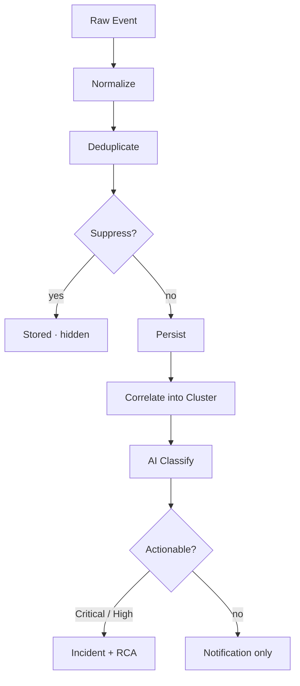

Pulse는 연결된 모든 소스 — CloudTrail, GuardDuty, Datadog 등 — 에서 이벤트를 수집하고, 노이즈를 억제하며, 주의가 필요한 클러스터만 표면화합니다. 각 클러스터는 심각도 순으로 정렬되며 클릭 한 번으로 인시던트로 에스컬레이션됩니다.

<Frame>
  
</Frame>

Pulse가 13K의 원시 이벤트를 40개의 실행 가능한 클러스터로 줄입니다 — 실시간, 하나의 화면에서

모니터링 스택은 이미 이상 징후를 잡아냅니다. 문제는 볼륨입니다: 엔지니어들이 실제 문제를 해결하는 것보다 알림 홍수를 분류하는 데 더 많은 시간을 씁니다. Pulse는 모든 소스 앞에 위치하여 주의가 필요한 것을 결정하므로, 6개의 대시보드 대신 순위 매겨진 클러스터 목록을 열 수 있습니다.

## 동작 방식

Pulse에 도달하는 모든 이벤트는 볼 수 있는 것이 되기 전에 동일한 8단계 파이프라인을 거칩니다.

1. **수집** — 연결된 소스에서 이벤트가 도착합니다: AWS 폴러가 GuardDuty 발견을 가져오거나, Slack 메시지가 알림 채널에서 발생하거나, Datadog 웹훅이 알림을 게시합니다.
2. **정규화** — 소스별 수집기가 원시 이벤트를 공통 신호 형태로 변환하여, 원본에 관계없이 제목, 심각도, 카테고리, 리소스 ID, 타임스탬프를 추출합니다.
3. **중복 제거** — SHA-256 핑거프린트가 신호의 소스, 유형, 리소스, 타임스탬프 분에서 계산됩니다. 지난 1시간 내에 동일한 이벤트가 도착했으면 새 행을 생성하는 대신 기존 신호의 중복 제거 카운트가 증가합니다.
4. **억제** — 신호가 우선순위 순으로 억제 레이어를 통과합니다. 어떤 레이어가 발동되면 신호는 억제됨으로 저장되고 피드에서 숨겨집니다. 각 레이어의 동작 방식은 [클러스터 및 억제](/ko/guide/pulse/clusters)를 참조하세요.
5. **유지** — 신호가 최종 억제 상태, 심각도, 추출된 필드와 함께 기록됩니다. 억제된 신호는 90일간 보존됩니다 — **Show suppressed**를 전환하여 필터링된 내용을 검토하세요.
6. **연관** — 15분 윈도우 내에서 Pulse가 동일한 리소스, 서비스, 또는 제목 패턴을 공유하는 신호를 클러스터로 그룹화합니다. 9개의 EC2 알림이 9명의 멤버가 있는 하나의 클러스터가 됩니다.
7. **분류** — AI 모델이 카테고리, 표준 심각도, 한 줄 요약, 실행 가능성 판정을 할당합니다 — 인시던트 생성이 필요한지 여부.
8. **라우팅** — Critical 및 High 심각도 신호와 실행 가능으로 표시된 신호는 자동으로 에스컬레이션됩니다: 연결된 인시던트가 생성되고 근본 원인 분석이 시작됩니다. 그 외는 알림으로만 전달됩니다.

## 주요 기능

| 기능 | 설명 | 자세히 보기 |
|---|---|---|
| 신호 소스 연결 | AWS 폴러, Slack 및 Teams 채널, 서드파티 웹훅을 Pulse에 연결 | [Pulse 설정](/ko/guide/pulse/setup) |
| 클러스터 및 억제 검토 | 관련 신호가 그룹화되는 방식을 확인하고 억제된 내용을 감사 | [클러스터 및 억제](/ko/guide/pulse/clusters) |
| 인시던트로 에스컬레이션 | 자동 근본 원인 분석으로 클러스터를 전체 인시던트로 승격 | [Deep Response Engine](/ko/guide/incident/overview) |
| 노이즈 감소 측정 | 억제율, 클러스터 해결 시간, 신호 전환율 추적 | [Pulse Analytics](/ko/guide/pulse/analytics) |

## 핵심 개념

왼쪽 사이드바의 파이프라인 패널은 4개 단계를 모두 라이브 퍼널로 표시합니다:

| 단계 | 카운트의 의미 |
|---|---|
| **원시 이벤트** | 필터링 전 수집된 모든 이벤트 |
| **신호** | 중복 제거, 정규화된 이벤트. 심각도 분류는 활성 상태를 보여줌 |
| **클러스터** | 연관된 그룹. "510에서 그룹화됨 · 189 억제됨"은 얼마나 억제되었는지를 보여줌 |
| **인시던트** | 에스컬레이션된 클러스터 — 인시던트 목록으로 직접 연결 |

## 다음 단계

<CardGroup cols={2}>
  <Card title="클러스터 및 억제" icon="layer-group" href="/ko/guide/pulse/clusters">
    신호가 그룹화되는 방식과 노이즈가 필터링되는 방법을 이해합니다
  </Card>
  <Card title="설정" icon="gear" href="/ko/guide/pulse/setup">
    AWS, Slack, Teams, 서드파티 웹훅 소스를 연결합니다
  </Card>
  <Card title="Analytics" icon="chart-bar" href="/ko/guide/pulse/analytics">
    노이즈 감소, 클러스터 해결 시간, 전환율을 측정합니다
  </Card>
  <Card title="Deep Response Engine" icon="arrow-right" href="/ko/guide/incident/overview">
    Pulse가 인시던트, RCA, 런북, 메모리로 어떻게 연결되는지 확인합니다
  </Card>
</CardGroup>
