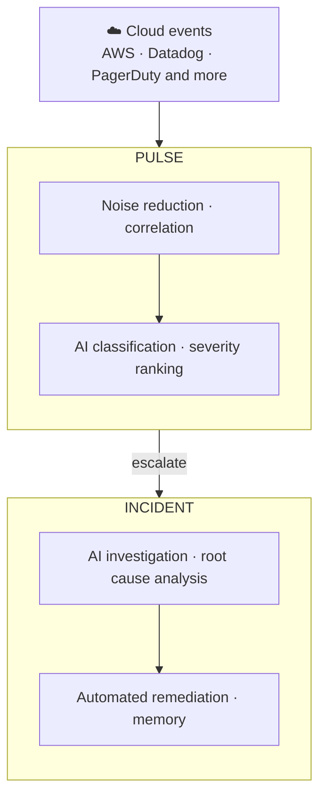

Deep Response Engine là mô-đun vòng đời sự cố của CloudThinker. Nó xử lý mọi sự kiện từ tín hiệu đầu tiên đến sự cố đã giải quyết — giảm nhiễu, leo thang, phân tích nguyên nhân gốc rễ, khắc phục, và ghi nhớ.

Hầu hết stack giám sát cho bạn biết có gì đó sai và dừng lại ở đó. Deep Response Engine cho bạn biết tại sao: [Pulse](/vi/guide/pulse/overview) lọc và tương quan các tín hiệu trước khi thông báo cho bất kỳ ai, và Incident bắt đầu điều tra ngay khi một cluster leo thang — thường là trước khi kỹ sư trực mở laptop.

## Cách hoạt động

Không có giai đoạn nào yêu cầu chuyển giao thủ công — mỗi lớp tự động cung cấp cho lớp tiếp theo:

1. **Thu thập** — sự kiện được truyền từ các nguồn như AWS, Datadog, Slack, và PagerDuty vào một feed Pulse duy nhất.
2. **Lọc và tương quan** — các lớp suppression loại bỏ trùng lặp, burst bị giới hạn tốc độ, và tài nguyên flapping. Các tín hiệu liên quan được nhóm thành cluster, nên chín cảnh báo về cùng một node pool trở thành một mục.
3. **Phân loại và leo thang** — mỗi tín hiệu nhận một danh mục, mức độ nghiêm trọng chuẩn, và điểm khả năng hành động. Khi một cluster ở mức Nghiêm trọng hoặc Cao, hoặc AI đánh dấu nó có thể hành động, nó tự động leo thang thành sự cố.
4. **Điều tra** — một agent AI hình thành các giả thuyết rõ ràng, kiểm tra từng giả thuyết dựa trên metrics và logs, và tạo ra báo cáo có cấu trúc: nguyên nhân gốc rễ có khả năng nhất, chuỗi bằng chứng, và các lý thuyết đã loại trừ.
5. **Giải quyết và ghi nhớ** — agent khớp [runbooks](/vi/guide/incident/runbooks) của bạn với nguyên nhân gốc rễ và thực thi chúng theo chế độ tự trị bạn đặt (Manual hoặc Auto). Mỗi giải pháp đưa vào [incident memory](/vi/guide/incident/incident-memory), giúp điều tra tiếp theo nhanh hơn.

Mỗi bước điều tra đều hiển thị — giả thuyết nào được xác nhận, giả thuyết nào bị loại trừ, và lý do tại sao.

## Những gì bạn có thể làm

| Tính năng | Mô tả | Hướng dẫn |
|---|---|---|
| Kết nối nguồn tín hiệu | Đưa sự kiện AWS, Slack, Teams, và webhook vào Pulse | [Pulse setup](/vi/guide/pulse/setup) |
| Quản lý cluster tín hiệu | Xem xét, merge, và hành động trên các nhóm tín hiệu tương quan | [Clusters](/vi/guide/pulse/clusters) |
| Chạy phân tích nguyên nhân gốc rễ AI | Theo dõi điều tra theo giả thuyết đến báo cáo RCA có cấu trúc | [How it works](/vi/guide/incident/root-cause-analysis) |
| Nhận webhook giám sát | Định tuyến cảnh báo từ PagerDuty, Datadog, CloudWatch, và nhiều hơn | [Webhook integrations](/vi/guide/incident/webhook-integrations/overview) |
| Tự động hóa khắc phục | Để agent thực thi các quy trình runbook phù hợp | [Runbooks](/vi/guide/incident/runbooks) |
| Ghi log sự cố thủ công | Ghi lại các sự cố bắt đầu bên ngoài Pulse | [Manual logging](/vi/guide/incident/manual-logging) |
| Học từ mỗi sự cố | Tái sử dụng những gì đã hoạt động — query, kỹ thuật, bước runbook | [Incident memory](/vi/guide/incident/incident-memory) |
| Đo vòng lặp | Theo dõi giảm nhiễu, MTTR cluster, và tỷ lệ chuyển đổi | [Pulse analytics](/vi/guide/pulse/analytics) |

## Khái niệm chính

| Khái niệm | Ý nghĩa |
|---|---|
| Tín hiệu (Signal) | Một sự kiện đã chuẩn hóa từ bất kỳ nguồn đã kết nối nào |
| Cluster | Một nhóm tín hiệu tương quan được xử lý như một mục |
| Sự cố (Incident) | Đối tượng điều tra được tạo khi một cluster leo thang |
| Runbook | Một quy trình vận hành mà agent có thể khớp và thực thi trong quá trình khắc phục |
| Incident memory | Bản ghi các kỹ thuật, query, và bước đã giải quyết sự cố trong quá khứ |

## Bắt đầu

<CardGroup cols={2}>
  <Card title="Connect signal sources" icon="satellite-dish" href="/vi/guide/pulse/setup">
    Kết nối AWS, Slack, Teams, và nguồn webhook để bắt đầu cung cấp cho Pulse.
  </Card>
  <Card title="Set up webhook integrations" icon="webhook" href="/vi/guide/incident/webhook-integrations/overview">
    Định tuyến cảnh báo từ PagerDuty, Datadog, CloudWatch, và nhiều hơn vào vòng lặp phản hồi.
  </Card>
  <Card title="Add runbooks" icon="book" href="/vi/guide/incident/runbooks">
    Cung cấp cho agent các quy trình có thể thực thi trong quá trình khắc phục.
  </Card>
  <Card title="See how investigation works" icon="flask" href="/vi/guide/incident/root-cause-analysis">
    Theo dõi phân tích nguyên nhân gốc rễ theo giả thuyết từ đầu đến cuối.
  </Card>
</CardGroup>
