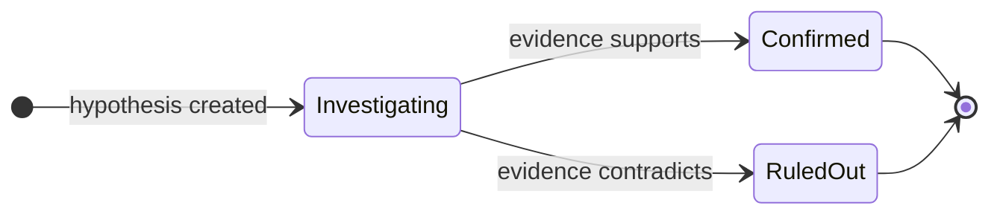

Phân tích Nguyên nhân Gốc rễ (RCA) là cỗ máy điều tra của [Resolve](/vi/guide/incident/overview). Các tác nhân chuyên biệt tiến hành điều tra theo giả thuyết, xây dựng chuỗi bằng chứng có cấu trúc và đề xuất biện pháp khắc phục — với khả năng hiển thị đầy đủ logic lý luận ở mỗi bước.

## Cách cuộc điều tra diễn ra

1. **Kích hoạt** — một incident được tạo, hoặc tự động khi một cluster [Pulse](/vi/guide/pulse/overview) leo thang hoặc thủ công từ trang chi tiết incident. Các leo thang cluster truyền tóm tắt cluster và tất cả tín hiệu thành viên vào ngữ cảnh của tác nhân, do đó điều tra bắt đầu với toàn bộ lịch sử tín hiệu đã được tải. CloudThinker xếp hàng một tác vụ RCA ở nền và mở một cuộc trò chuyện AI riêng biệt.
2. **Kích hoạt tác nhân** — [Anna](/vi/guide/agents/anna) điều phối cuộc điều tra trong khi các chuyên gia phụ trách lĩnh vực của họ, dựa trên hạ tầng đã kết nối của bạn.
3. **Thu thập ngữ cảnh** — các tác nhân khám phá topo hạ tầng, thu thập số liệu cơ bản, xác định các dịch vụ bị ảnh hưởng và kiểm tra các triển khai và thay đổi cấu hình gần đây.
4. **Phân tích** — các tác nhân hình thành các giả thuyết cạnh tranh và kiểm tra từng giả thuyết với log, trace và các phụ thuộc.
5. **Giải quyết** — giả thuyết được xác nhận trở thành nguyên nhân gốc rễ. Bằng chứng được chắt lọc, đề xuất khắc phục được tạo ra và một disposition được đặt với điểm tin cậy.

| Tác nhân | Điều tra |
|-------|--------------|
| [Alex](/vi/guide/agents/alex) (Cloud Engineer) | Hạ tầng cloud — EC2, load balancer, VPC networking |
| [Tony](/vi/guide/agents/tony) (Database Engineer) | Hiệu suất RDS Aurora và DocumentDB, slow query, cạn kiệt connection pool |
| [Kai](/vi/guide/agents/kai) (Kubernetes Engineer) | Sức khỏe pod, container restart, resource limit, cấu hình service mesh trên EKS |
| [Oliver](/vi/guide/agents/oliver) (Security Engineer) | Security group, network policy, quyền IAM, các chế độ lỗi liên quan đến bảo mật |
| [Anna](/vi/guide/agents/anna) (General Manager) | Điều phối và tổng hợp đa lĩnh vực |

Các tác nhân điều tra song song trên các lĩnh vực này và tương quan kết quả theo thời gian thực. Nguyên nhân gốc rễ nổi lên ngay cả khi triệu chứng xuất hiện ở xa vấn đề cơ bản.

## Các giai đoạn điều tra

RCA tuân theo quy trình ba giai đoạn có cấu trúc. Khi các tác nhân chuyển sang giai đoạn mới, giai đoạn trước sẽ tự động hoàn thành nếu vẫn đang tiến hành.

| Giai đoạn | Mục tiêu | Hoạt động |
|-------|------|------------|
| 1. Thu thập ngữ cảnh | Thiết lập điều kiện cơ bản | Lập bản đồ các dịch vụ và phụ thuộc bị ảnh hưởng qua topology; thu thập số liệu từ CloudWatch, Prometheus và Datadog; so sánh số liệu incident với cơ sở lịch sử; xác định các triển khai và thay đổi cấu hình gần đây |
| 2. Phân tích và kiểm tra giả thuyết | Thu hẹp nguyên nhân gốc rễ | Tạo ra các lý thuyết cạnh tranh từ triệu chứng; thu thập log, trace, phụ thuộc và bằng chứng tài nguyên; loại trừ giả thuyết mà bằng chứng mâu thuẫn; theo dõi độ tin cậy khi bằng chứng tích lũy |
| 3. Giải quyết | Xác định nguyên nhân gốc rễ với bằng chứng | Giải quyết tất cả giả thuyết còn lại; xác nhận giả thuyết thắng là nguyên nhân gốc rễ; chắt lọc bằng chứng mạnh nhất; tạo các bước khắc phục; đặt disposition và điểm tin cậy |

Các tác nhân phải thu thập bằng chứng hỗ trợ và điều tra đủ lâu trước khi xác nhận bất kỳ giả thuyết nào.

<Note>
Đặt disposition là bắt buộc để đóng cuộc điều tra. Nếu không có, incident vẫn ở trạng thái **Investigating**.
</Note>

## Chuỗi bằng chứng

RCA xây dựng một chuỗi bằng chứng có cấu trúc với các tính toán tự động. Mỗi mục có thể liên kết với một giả thuyết cụ thể để cho thấy phát hiện nào hỗ trợ từng lý thuyết.

| Loại bằng chứng | Những gì nó ghi lại | Trường |
|---------------|------------------|--------|
| Số liệu | So sánh incident với cơ sở cùng phần trăm độ lệch được tính tự động — ví dụ: "CPU 95% so với cơ sở 25% = độ lệch 280%" | `incident_value`, `baseline_value`, `baseline_period`, `threshold`, `unit` |
| Triển khai và thay đổi | Các thay đổi gần đây với delta thời gian được tính tự động từ khi incident bắt đầu; delta dương = trước incident (có khả năng là nguyên nhân) | `type`, `description`, `timestamp`, `correlation`, `service` |
| Log | Các mục log liên quan với liên kết sâu đến các console log như CloudWatch, Splunk và Datadog | `source`, `description`, `deep_link`, `timestamp`, `severity` |
| Trace | Dữ liệu distributed trace cho thấy luồng yêu cầu và phân tích độ trễ | `source`, `description`, `raw_data` |
| Cấu hình | Các thay đổi cấu hình với các sửa đổi tham số chính xác | `source`, `description`, `timestamp` |
| Cảnh báo | Các cảnh báo liên quan từ hệ thống giám sát trong cửa sổ incident | `source`, `severity`, `description` |

Bằng chứng được xếp hạng theo mức độ nghiêm trọng: **Critical** (nguyên nhân trực tiếp) → **High** (hỗ trợ mạnh) → **Medium** (ngữ cảnh) → **Low** (nền).

## Chấm điểm tin cậy

Mỗi nguyên nhân gốc rễ được xác định mang điểm tin cậy từ 0.0 đến 1.0.

| Khoảng điểm | Danh mục | Ý nghĩa | Hành động |
|-------------|----------|---------|--------|
| 0.9 – 1.0 | Rất cao | Nguyên nhân gốc rễ được xác định với bằng chứng áp đảo | Thực hiện biện pháp khắc phục ngay lập tức |
| 0.7 – 0.9 | Cao | Nguyên nhân gốc rễ được xác định với bằng chứng mạnh | Thực hiện biện pháp khắc phục với mức ưu tiên thông thường |
| 0.5 – 0.7 | Trung bình | Nguyên nhân gốc rễ có khả năng, nhưng còn thiếu sót | Thực hiện biện pháp khắc phục; theo dõi các phương án thay thế |
| 0.3 – 0.5 | Thấp | Nguyên nhân gốc rễ có thể, bằng chứng mang tính hoàn cảnh | Xác thực kết quả thủ công trước khi hành động |
| 0.0 – 0.3 | Không chắc chắn | Bằng chứng không đủ để xác định nguyên nhân gốc rễ | Không thể xác định; xem xét `NOT_FOUND` |

Độ tin cậy tăng với tương quan thời gian, bất thường số liệu trên 50% độ lệch, mẫu lỗi khớp, các phương án thay thế bị loại trừ và nhiều nguồn dữ liệu xác nhận. Nó giảm với các giải thích thay thế, tương quan thời gian yếu, thiếu xác minh hoặc bằng chứng xung đột.

## Theo dõi giả thuyết

RCA thực hiện điều tra theo giả thuyết lấy cảm hứng từ phương pháp "5 Whys" và Fishbone.



| Trạng thái | Ý nghĩa |
|-------|---------|
| Investigating | Đang tích cực thu thập bằng chứng để kiểm tra lý thuyết |
| Confirmed | Bằng chứng đủ hỗ trợ đây là nguyên nhân gốc rễ |
| Ruled out | Bằng chứng mâu thuẫn hoặc bác bỏ giả thuyết |

Các tác nhân xác nhận ít nhất một giả thuyết trước khi đặt nguyên nhân gốc rễ, và giải quyết mọi giả thuyết — đã xác nhận hoặc đã loại trừ — trước khi đóng cuộc điều tra.

Một chuỗi giả thuyết mẫu từ một incident độ trễ:

```text
Timeline Entry 1: hypothesis_created
├── Hypothesis 1: "Database connection pool exhaustion"
├── Confidence: 0.75
└── Message: "Pool exhaustion likely given 500s response times"

Timeline Entry 3: hypothesis_ruled_out
├── Hypothesis 1: Ruled Out
├── Reason: "DB metrics show 45/100 connections—well within limits"
└── Evidence: Max concurrent connections remained stable

Timeline Entry 6: hypothesis_created
├── Hypothesis 2: "Lambda cold start latency after memory reduction"
├── Confidence: 0.85

Timeline Entry 8: hypothesis_confirmed
├── Hypothesis 2: Confirmed
├── Updated Confidence: 0.92
└── Evidence: CloudWatch init duration spike, deployment timing match
```

## Dòng thời gian điều tra

RCA truyền trực tiếp dòng thời gian của mỗi bước điều tra, hiển thị tiến độ giai đoạn, kiểm tra giả thuyết và thu thập bằng chứng với dấu thời gian. Mỗi cuộc điều tra giữ tối đa 100 mục (được thực thi ở cấp cơ sở dữ liệu).

| Loại mục | Ý nghĩa |
|------------|---------|
| `info` | Ghi chú điều tra chung |
| `finding` | Phát hiện cụ thể ảnh hưởng đến phân tích |
| `warning` | Vấn đề tiềm năng cần xác minh |
| `error` | Lần thử điều tra thất bại |
| `success` | Phát hiện đã xác nhận |
| `hypothesis_created` | Lý thuyết mới được đề xuất |
| `hypothesis_ruled_out` | Lý thuyết bị bác bỏ |
| `hypothesis_confirmed` | Giả thuyết được xác nhận là nguyên nhân gốc rễ |

## Disposition

Mỗi cuộc điều tra kết thúc bằng một disposition, cập nhật trạng thái incident.

| Disposition | Ý nghĩa | Có thể tiếp tục? |
|-------------|---------|------------|
| `IDENTIFIED` | Nguyên nhân gốc rễ được tìm thấy với bằng chứng hỗ trợ | Không (kết thúc) |
| `NOT_FOUND` | Điều tra đã cạn kiệt, không có nguyên nhân gốc rễ rõ ràng | Không (kết thúc) |
| `FALSE_ALARM` | Vấn đề không phải là incident thực sự | Không (kết thúc) |
| `ON_HOLD` | Đang chờ đầu vào bên ngoài hoặc dữ liệu bổ sung | Có — tiếp tục khi thông tin mới đến |

Sau khi disposition được đặt, incident có thể tiến qua các trạng thái vòng đời bổ sung (Resolved, Post-Mortem, Closed) khi nhóm của bạn hoàn thành các hành động tiếp theo.

## Bắt đầu điều tra

### Tự động

Cấu hình [tích hợp webhook](/vi/guide/incident/webhook-integrations/overview) để tự động kích hoạt RCA. Khi incident đáp ứng ngưỡng mức độ nghiêm trọng, cuộc điều tra bắt đầu ở nền:

```json
{
  "auto_trigger_rca": true,
  "auto_trigger_rca_min_severity": "medium"
}
```

### Thủ công

<Steps>
  <Step title="Mở trang chi tiết incident">
    Chọn incident bạn muốn điều tra.
  </Step>
  <Step title="Nhấp Start RCA Analysis">
    CloudThinker xác thực rằng không có RCA trùng lặp nào đang chạy, sau đó bắt đầu cuộc điều tra trong vòng 1–3 giây. Các mục dòng thời gian xuất hiện theo thời gian thực khi các tác nhân khám phá ra phát hiện.
  </Step>
</Steps>

## Đọc kết quả

| Phần | Những gì nó hiển thị |
|---------|---------------|
| Tóm tắt nguyên nhân gốc rễ | Giải thích rõ ràng về nguyên nhân gốc rễ với điểm tin cậy và dấu thời gian xác định |
| Theo dõi giả thuyết | Mỗi giả thuyết với vòng đời của nó: tạo → kiểm tra → xác nhận hoặc loại trừ, với lý luận |
| Chuỗi bằng chứng | Bằng chứng được tổ chức theo loại với xếp hạng mức độ nghiêm trọng, ghi chú nguồn và liên kết sâu |
| Dòng thời gian điều tra | Nhật ký thứ tự thời gian của các bước điều tra và chuyển đổi giai đoạn |
| Hành động khắc phục | Các bản sửa lỗi được đề xuất với mức ưu tiên (critical, high, medium, low) |
| Dịch vụ bị ảnh hưởng | Các dịch vụ bị ảnh hưởng trong incident, với hình ảnh hóa phạm vi ảnh hưởng khi topology được kết nối |

Bạn có thể chạy nhiều cuộc điều tra trên cùng một incident với theo dõi phiên bản (v1, v2, v3…). Chạy lại RCA khi thông tin mới có sẵn hoặc lần chạy đầu tiên không có kết luận, và so sánh kết quả từ dropdown lịch sử.

## Ví dụ: EC2 termination và EKS network failure

Giám sát liên tục phát hiện hai phát hiện liên kết nhau trong một workspace: EC2 instance bị chấm dứt thường xuyên và `CreateNetworkInterface` thất bại trên EKS. Đây là cách các tác nhân điều tra chúng cùng nhau.

Đầu tiên, Alex phân tích mẫu chấm dứt:

```text
@alex #report investigate EC2 termination patterns for the past 60 days.
Break down by Auto Scaling group, termination reason, instance type, and
availability zone — and explain the 17:15 UTC daily terminations.
```

<Frame>
  
</Frame>
<p style={{textAlign: 'center', fontSize: '0.9em', color: '#666', marginTop: '8px'}}>Phân tích mẫu chấm dứt EC2 cho thấy các sự kiện AutoScaling</p>

Tiếp theo, Alex tương quan các lỗi mạng với các sự kiện chấm dứt:

```text
@alex #report correlate CreateNetworkInterface failures with EC2
termination events over the last 60 days. Determine whether aggressive
scale-downs cause IP address fragmentation and whether lifecycle hooks
allow proper ENI cleanup.
```

<Frame>
  
</Frame>
<p style={{textAlign: 'center', fontSize: '0.9em', color: '#666', marginTop: '8px'}}>Tương quan lỗi mạng với lỗi CreateNetworkInterface và cạn kiệt IP</p>

Cuối cùng, Anna tổng hợp kết quả từ Alex (hạ tầng và chi phí), Kai (EKS networking) và Oliver (bảo mật) thành một tài liệu:

```text
@anna #report comprehensive RCA for the EC2 termination and EKS network
interface failures. Include an executive summary, the 60-day timeline,
remediation steps with owners and due dates, and preventive measures.
```

<Frame>
  
</Frame>
<p style={{textAlign: 'center', fontSize: '0.9em', color: '#666', marginTop: '8px'}}>Báo cáo RCA toàn diện với kết quả và các bước khắc phục</p>

## Thực hành tốt nhất

- Kết nối topology trước khi incident xảy ra — phân tích phạm vi ảnh hưởng và tương quan dịch vụ phụ thuộc vào nó.
- Cấu hình [webhook](/vi/guide/incident/webhook-integrations/overview) để tự động kích hoạt RCA cho incident có mức độ nghiêm trọng medium trở lên.
- Thêm ngữ cảnh vào mô tả incident; nó hướng dẫn nơi các tác nhân tìm kiếm đầu tiên.
- Theo dõi dòng thời gian trong quá trình điều tra để biết giả thuyết nào đã được kiểm tra và loại trừ, và xác minh dấu thời gian bằng chứng tương quan với thời điểm bắt đầu incident.
- Xác thực nguyên nhân gốc rễ thủ công trước khi khắc phục khi độ tin cậy dưới 0.7, và bắt đầu với các hành động khắc phục ưu tiên critical.
- Kết nối [Runbooks](/vi/guide/incident/runbooks) để các tác nhân có thể tìm và thực thi các quy trình khắc phục trong các cuộc điều tra tương lai.

## Liên quan

<CardGroup cols={2}>
  <Card title="Pulse" icon="wave-pulse" href="/vi/guide/pulse/overview">
    Thông tin tình báo tín hiệu ngược dòng giúp triệt tiêu nhiễu và leo thang các cluster cần xử lý thành incident
  </Card>
  <Card title="Webhook integrations" icon="webhook" href="/vi/guide/incident/webhook-integrations/overview">
    Tự động kích hoạt RCA từ PagerDuty, Datadog, Prometheus và nhiều hơn nữa
  </Card>
  <Card title="Bộ nhớ incident" icon="brain" href="/vi/guide/incident/incident-memory">
    Xem cách các bài học do tác nhân ghi lại hỗ trợ những lần điều tra sau
  </Card>
  <Card title="Runbooks" icon="book" href="/vi/guide/incident/runbooks">
    Kết nối các runbook vận hành để các tác nhân có thể thực thi các bước khắc phục
  </Card>
</CardGroup>
