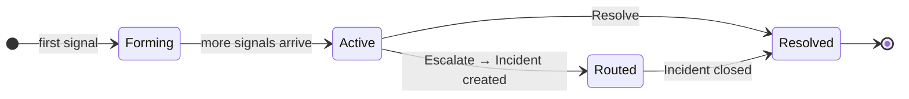

Hai khái niệm cốt lõi tạo nên giá trị của Pulse: **triệt tiêu** (lọc nhiễu trước khi đến tay bạn) và **clustering** (nhóm những gì còn lại thành một đơn vị hành động duy nhất).

---

## Triệt tiêu — lọc bỏ nhiễu

Mỗi tín hiệu đến đều phải đi qua bảy lớp lọc trước khi xuất hiện trong feed của bạn. Nếu bất kỳ lớp nào kích hoạt, tín hiệu sẽ được lưu nhưng ẩn đi. Nó sẽ không tạo ra nhiễu, nhưng vẫn ở đó nếu bạn cần kiểm tra lại.

<AccordionGroup>
  <Accordion title="Duplicate" icon="copy">
    Nếu một sự kiện giống hệt đã xuất hiện trong vòng một giờ qua, bộ đếm dedup trên tín hiệu hiện có sẽ tăng lên thay vì tạo một hàng mới. Bạn thấy một tín hiệu được đánh dấu "×47" thay vì 47 mục riêng lẻ. Đây thường là danh mục triệt tiêu lớn nhất.
  </Accordion>
  <Accordion title="Rate Limited" icon="gauge-high">
    Nếu một nguồn phát ra hơn 100 tín hiệu mỗi phút, các tín hiệu vượt ngưỡng đó sẽ bị triệt tiêu trong suốt thời gian bùng phát. Ngăn chặn một cảnh báo bị cấu hình sai làm tràn ngập feed của bạn.
  </Accordion>
  <Accordion title="Snoozed" icon="clock">
    Các tín hiệu khớp với quy tắc snooze đang hoạt động sẽ bị triệt tiêu. Đây là lớp duy nhất bạn kiểm soát trực tiếp — xem [Snooze](#snooze) bên dưới.
  </Accordion>
  <Accordion title="Noise Signature" icon="waveform">
    Các mẫu AWS có nhiều nhiễu đã biết được tự động triệt tiêu — sự kiện vòng đời KMS grant, thay đổi EBS volume, hoạt động nội bộ AutoScaling, chuyển hướng token Signin. Đây là các sự kiện quản trị AWS hầu như không bao giờ chỉ ra vấn đề thực sự.
  </Accordion>
  <Accordion title="Flapping" icon="arrows-left-right">
    Nếu một tín hiệu chuyển đổi trạng thái bốn lần trở lên trong vòng 10 phút, nó sẽ bị triệt tiêu trong 5 phút. Một tài nguyên dao động giữa trạng thái lành mạnh và không lành mạnh sẽ hợp nhất thành một thông báo duy nhất khi trạng thái ổn định.
  </Accordion>
  <Accordion title="Cascade" icon="sitemap">
    Khi một tài nguyên cha bị triệt tiêu, các tín hiệu từ tài nguyên con của nó cũng bị triệt tiêu trong 30 phút — do đó bạn không nhận được cảnh báo từ con khi cái đó đã được xác định là nhiễu.
  </Accordion>
  <Accordion title="Severity Normalization" icon="arrow-down">
    Các dịch vụ tự động hóa AWS đôi khi phát ra sự kiện với mức độ nghiêm trọng bị thổi phồng. Pulse phát hiện các sự kiện từ các tác nhân nội bộ AWS và hạ cấp mức độ nghiêm trọng trước khi định tuyến. Mức độ nghiêm trọng gốc được giữ lại để kiểm tra.
  </Accordion>
</AccordionGroup>

<Frame>
  
</Frame>

Phân tích triệt tiêu theo thời gian — hiển thị trong tab Analytics

Để xem lại các tín hiệu bị triệt tiêu, hãy bật **Show suppressed** trong thanh lọc. Chúng xuất hiện với độ mờ thấp hơn cùng nhãn cho biết lớp nào đã lọc chúng.

### Snooze

Snooze là lớp triệt tiêu duy nhất bạn kiểm soát. Di chuột qua bất kỳ tín hiệu nào và nhấp nút snooze. Chọn thời lượng (1 phút đến 30 ngày) và phạm vi:

| Phạm vi | Những gì bị im lặng |
|---|---|
| **Signal** | Chỉ tín hiệu cụ thể này |
| **Pattern** | Tất cả tín hiệu có cùng nguồn, loại và mẫu tiêu đề |
| **Resource** | Tất cả tín hiệu từ ID tài nguyên này |

<Tip>
  Dùng **Pattern** cho các cửa sổ bảo trì định kỳ. Dùng **Resource** khi ngừng sử dụng một tài nguyên trong quá trình tháo gỡ.
</Tip>

---

## Clusters — một đơn vị hành động

Một **cluster** là đơn vị làm việc chính trong Pulse. Thay vì trình bày từng tín hiệu riêng lẻ, Pulse nhóm các tín hiệu liên quan lại — cùng một node pool EKS kích hoạt chín cảnh báo trong 15 phút trở thành một cluster duy nhất. Bạn điều tra một lần, hành động một lần, giải quyết một lần.

### Vòng đời trạng thái

Mỗi cluster đi qua bốn trạng thái:

| Trạng thái | Ý nghĩa |
|---|---|
| **Forming** | Tín hiệu đầu tiên đã đến; đang thu thập các tín hiệu liên quan |
| **Active** | Tín hiệu tiếp tục đến; đang mở và cần xử lý |
| **Routed** | Đã được leo thang — một Incident được liên kết đã được tạo |
| **Resolved** | Đã đóng bởi người dùng hoặc tự động |

Dùng nút chuyển đổi **Active / All** trong feed để chuyển giữa chỉ xem cluster đang hoạt động (mặc định) hoặc tất cả các trạng thái.

### Bảng chi tiết cluster

Nhấp vào bất kỳ cluster nào để mở bảng chi tiết.

<Frame>
  
</Frame>

Mô tả do AI tạo ra, dòng thời gian tín hiệu, chi tiết tài nguyên và các hành động

Bảng này hiển thị:

- **Mô tả do AI tạo ra** — tóm tắt bằng ngôn ngữ tự nhiên về những gì đã xảy ra và tác động có thể có
- **Ngữ cảnh cluster** — tất cả tín hiệu thành viên được liệt kê theo thứ tự thời gian
- **Thông tin tương quan** — kỹ thuật được sử dụng (ví dụ: `time_window`) và điểm tin cậy
- **Metadata tài nguyên** — id, loại, khu vực, thẻ của tín hiệu được chọn
- **Tab** — Overview để xem chi tiết tín hiệu, Routing để xem lịch sử leo thang, Raw để xem toàn bộ payload sự kiện

### Hành động

| Hành động | Chức năng |
|---|---|
| **Acknowledge** | Đánh dấu là đã xem mà không đóng. Báo hiệu cluster đang trong tầm kiểm soát của bạn. Có thể hoàn tác. |
| **Assign** | Chuyển cho thành viên trong nhóm. Họ sẽ được thông báo và avatar của họ xuất hiện trong feed. |
| **Escalate** | Tạo một Incident được liên kết. Cluster chuyển sang Routed và RCA bắt đầu tự động — tóm tắt cluster và tất cả tín hiệu thành viên được truyền cho tác nhân RCA làm ngữ cảnh ban đầu, do đó cuộc điều tra bắt đầu với toàn bộ lịch sử tín hiệu đã được tải. |
| **Resolve** | Đóng cluster khi vấn đề đã được giải quyết và không cần Incident. |

### Leo thang tự động

Pulse tự động leo thang các cluster có bất kỳ tín hiệu nào với mức độ nghiêm trọng **Critical** hoặc **High**, hoặc khi AI đánh dấu tín hiệu là **actionable** (cần xử lý). Những cluster này chuyển thẳng sang Routed và kích hoạt phân tích nguyên nhân gốc rễ — không cần leo thang thủ công.

---

## Liên quan

<CardGroup cols={2}>
  <Card title="Pulse analytics" icon="chart-bar" href="/vi/guide/pulse/analytics">
    Đo lường khối lượng tín hiệu, mức giảm nhiễu, thời gian giải quyết cluster và tỷ lệ chuyển đổi theo nguồn.
  </Card>
  <Card title="Pulse setup" icon="bolt" href="/vi/guide/pulse/setup">
    Kết nối các nguồn giám sát và cấu hình quy tắc phát hiện cho workspace của bạn.
  </Card>
  <Card title="Root cause analysis" icon="magnifying-glass" href="/vi/guide/incident/root-cause-analysis">
    Tìm hiểu cách các tác nhân AI điều tra cluster được leo thang và xây dựng chuỗi bằng chứng.
  </Card>
</CardGroup>
