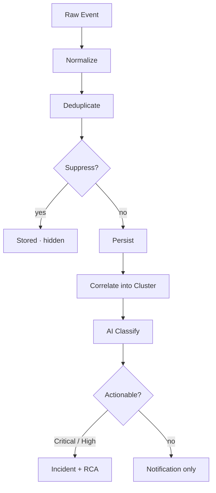

Pulse nhận sự kiện từ mọi nguồn đã kết nối — CloudTrail, GuardDuty, Datadog, và nhiều hơn — loại bỏ nhiễu, và chỉ hiển thị các cluster xứng đáng với sự chú ý của bạn. Mỗi cluster được xếp hạng theo mức độ nghiêm trọng và leo thang thành sự cố chỉ với một cú nhấp.

<Frame>
  
</Frame>

Pulse giảm 13K sự kiện thô xuống 40 cluster có thể hành động — trực tiếp, trong một giao diện

Stack giám sát của bạn đã phát hiện bất thường. Vấn đề là khối lượng: kỹ sư tốn nhiều thời gian phân loại luồng cảnh báo hơn là sửa các vấn đề thực sự. Pulse đứng trước mọi nguồn và quyết định điều gì xứng đáng với sự chú ý của bạn, để bạn mở một danh sách cluster có thứ tự ưu tiên thay vì sáu dashboard.

## Cách hoạt động

Mỗi sự kiện đến Pulse đều trải qua cùng một pipeline tám giai đoạn trước khi trở thành thứ bạn nhìn thấy.

1. **Nhận** — Một sự kiện đến từ bất kỳ nguồn nào đã kết nối: một AWS poller nhận phát hiện GuardDuty, một tin nhắn Slack kích hoạt từ kênh cảnh báo, hoặc Datadog webhook đăng cảnh báo.
2. **Chuẩn hóa** — Một collector theo nguồn dịch sự kiện thô thành dạng tín hiệu chung, trích xuất tiêu đề, mức độ nghiêm trọng, danh mục, ID tài nguyên, và dấu thời gian bất kể nguồn gốc.
3. **Loại bỏ trùng lặp** — Một fingerprint SHA-256 được tính từ nguồn, loại, tài nguyên, và phút timestamp của tín hiệu. Nếu một sự kiện giống hệt đã đến trong giờ qua, số đếm dedup của tín hiệu hiện tại tăng lên thay vì tạo hàng mới.
4. **Suppression** — Tín hiệu đi qua các lớp suppression theo thứ tự ưu tiên; nếu bất kỳ lớp nào kích hoạt, tín hiệu được lưu dưới dạng suppressed và ẩn khỏi feed. Xem [Clusters & Suppression](/vi/guide/pulse/clusters) để biết từng lớp hoạt động như thế nào.
5. **Lưu trữ** — Tín hiệu được ghi với trạng thái suppressed cuối cùng, mức độ nghiêm trọng, và các trường đã trích xuất. Tín hiệu suppressed được giữ trong 90 ngày — bật **Show suppressed** để xem những gì đã bị lọc.
6. **Tương quan** — Trong cửa sổ 15 phút, Pulse nhóm các tín hiệu cùng tài nguyên, dịch vụ, hoặc mô hình tiêu đề vào một cluster. Chín cảnh báo EC2 trở thành một cluster với chín thành viên.
7. **Phân loại** — Một mô hình AI gán danh mục, mức độ nghiêm trọng chuẩn, tóm tắt một dòng, và phán quyết khả năng hành động — liệu điều này có đáng tạo sự cố không.
8. **Định tuyến** — Tín hiệu mức độ Nghiêm trọng và Cao, cộng với bất kỳ tín hiệu nào được đánh dấu có thể hành động, tự động leo thang: một sự cố liên kết được tạo và phân tích nguyên nhân gốc rễ bắt đầu. Mọi thứ khác được gửi dưới dạng thông báo.

## Những gì bạn có thể làm

| Tính năng | Mô tả | Tìm hiểu thêm |
|---|---|---|
| Kết nối nguồn tín hiệu | Kết nối AWS poller, kênh Slack và Teams, và webhook bên thứ ba vào Pulse | [Pulse Setup](/vi/guide/pulse/setup) |
| Xem xét cluster và suppression | Xem cách các tín hiệu liên quan được nhóm và kiểm tra những gì đã bị tắt | [Clusters & Suppression](/vi/guide/pulse/clusters) |
| Leo thang thành sự cố | Đề bạt bất kỳ cluster nào thành sự cố đầy đủ với phân tích nguyên nhân gốc rễ tự động | [Resolve](/vi/guide/incident/overview) |
| Đo lường giảm nhiễu | Theo dõi tỷ lệ suppression, thời gian giải quyết cluster, và chuyển đổi tín hiệu | [Pulse Analytics](/vi/guide/pulse/analytics) |

## Khái niệm chính

Bảng điều khiển pipeline trong thanh bên trái hiển thị tất cả bốn giai đoạn dưới dạng phễu trực tiếp:

| Giai đoạn | Ý nghĩa của số đếm |
|---|---|
| **Raw events** | Mọi sự kiện được nhận — trước bất kỳ lọc nào |
| **Signals** | Sự kiện đã loại bỏ trùng lặp, chuẩn hóa. Phân tích mức độ nghiêm trọng cho thấy những gì đang active |
| **Clusters** | Các nhóm tương quan. "grouped from 510 · 189 suppressed" cho thấy bao nhiêu đã bị tắt |
| **Incidents** | Cluster đã được leo thang — liên kết trực tiếp đến danh sách sự cố |

## Bước tiếp theo

<CardGroup cols={2}>
  <Card title="Clusters & Suppression" icon="layer-group" href="/vi/guide/pulse/clusters">
    Hiểu cách tín hiệu được nhóm và cách nhiễu được lọc
  </Card>
  <Card title="Setup" icon="gear" href="/vi/guide/pulse/setup">
    Kết nối AWS, Slack, Teams, và nguồn webhook bên thứ ba
  </Card>
  <Card title="Analytics" icon="chart-bar" href="/vi/guide/pulse/analytics">
    Đo lường giảm nhiễu, thời gian giải quyết cluster, và tỷ lệ chuyển đổi
  </Card>
  <Card title="Resolve" icon="arrow-right" href="/vi/guide/incident/overview">
    Xem cách Pulse cung cấp cho sự cố, RCA, runbooks, và memory
  </Card>
</CardGroup>
