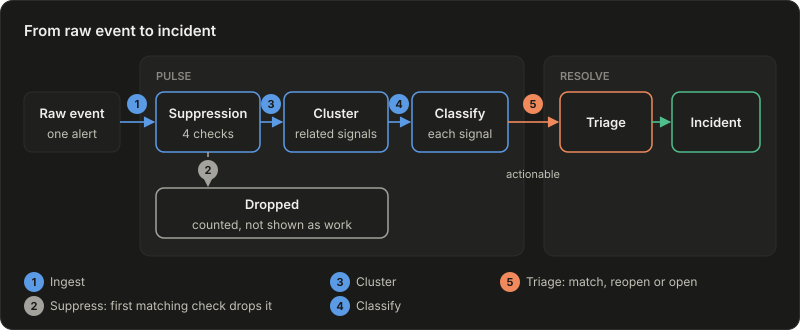

Pulse là lớp phát hiện của [Resolve](/vi/guide/incident/overview), module ứng phó sự cố của CloudThinker; ứng dụng hiển thị Pulse dưới tên **Signals**. Pulse nhận mọi cảnh báo từ các công cụ của bạn, lọc bỏ nhiễu, gom phần còn lại thành cluster và chỉ chuyển những cluster cần xử lý sang bước phân loại, nhờ vậy một sự cố ngừng dịch vụ chỉ hiện thành một mục thay vì hàng trăm lần gọi người trực.

## Cách hoạt động

**Raw event** là một thông báo từ một nguồn, chẳng hạn một CloudWatch alarm hoặc một Datadog monitor. **Signal** là sự kiện đã vượt qua bước lọc nhiễu. **Cluster** là nhóm các signal liên quan được coi là một vấn đề.

<Frame caption="Pulse loại bỏ nhiễu và nhóm signal thành cluster; chỉ cluster có signal cần xử lý mới tới bước triage.">
  
  
</Frame>

1. **Tiếp nhận.** Sự kiện đến từ webhook, từ các dịch vụ AWS được thăm dò định kỳ, và từ các kênh Slack hoặc Microsoft Teams bạn chọn. Webhook đến ngay khi được gửi. Dịch vụ AWS được thăm dò theo lịch; [Kết nối nguồn Pulse](/vi/guide/pulse/setup) liệt kê các chu kỳ.
2. **Lọc nhiễu.** Bốn bước kiểm tra chạy theo thứ tự, và bước đầu tiên khớp sẽ loại bỏ sự kiện. Xem [lọc nhiễu](/vi/guide/pulse/clusters#lọc-nhiễu).
3. **Gom cluster.** Pulse gắn signal vào một cluster đang mở gần đây có signal cùng resource ID hoặc tiêu đề, hoặc nếu không có thì cùng service. [Cách signal được gắn vào cluster](/vi/guide/pulse/clusters#tín-hiệu-gia-nhập-cluster-như-thế-nào) trình bày đầy đủ quy tắc.
4. **Phân loại.** Sau khi signal vào cluster, CloudThinker phân loại signal đó: một nhóm (compute, network, security, deploy, communication, cost hoặc data, trùng với các giá trị của bộ lọc nhóm), một mức độ nghiêm trọng, và signal có cần xử lý hay không.
5. **Phân loại sự cố.** Cluster có signal cần xử lý sẽ được chuyển sang bước phân loại sự cố. CloudThinker khớp cluster với một sự cố đang mở, mở lại sự cố đã đóng khi cùng lỗi quay lại, hoặc mở sự cố mới.

Bản thân Pulse chỉ tiếp nhận, lọc nhiễu và gom nhóm. Mọi thứ từ bước phân loại sự cố trở đi thuộc về [Resolve](/vi/guide/incident/overview).

Pulse vẫn tiếp tục phát hiện và gom nhóm cảnh báo dù công tắc **AI auto-investigate** ở hàng tiêu đề của **Resolve → Issues** đang bật hay tắt. Khi công tắc tắt, cluster cần xử lý vẫn được ghi nhận thành sự cố với trạng thái **Open**, nhưng CloudThinker không tự phân loại hay điều tra sự cố đó. **Send to triage** vẫn chạy khi có người nhấn. [Điều gì bắt đầu một cuộc điều tra](/vi/guide/incident/settings#điều-gì-khởi-động-một-cuộc-điều-tra) trình bày đầy đủ các quy tắc.

## Làm việc trên trang Signals

Mở **Resolve → Signals**. Phần đầu trang hiển thị phễu trực tiếp từ sự kiện thô đến cluster, cùng bộ chọn khoảng thời gian (**Last 1 hour** đến **Last 30 days**). Khoảng thời gian áp dụng cho mọi làn, kể cả **Needs you**: cluster chỉ hiện nếu có signal nằm trong khoảng đó, nên hãy mở rộng khoảng thời gian để tìm cluster cũ chưa ai xử lý. Ba làn cho phép chọn cluster bạn muốn xem:

| Làn | Hiển thị gì | Dùng để |
|---|---|---|
| **Needs you** (mặc định) | Cluster mức critical hoặc high đang chờ người xử lý (xem bên dưới). | Bắt đầu ca trực tại đây. |
| **Handled** | Cluster đang mở mà một sự cố đang giữ, một người đã xác nhận hoặc nhận xử lý, hoặc một agent đang xử lý. | Kiểm tra những gì đã có người phụ trách. |
| **History** | Mọi cluster trong khoảng thời gian, kể cả cluster đã giải quyết. | Tìm kiếm các cluster trước đây. |

Cluster mức critical hoặc high nằm trong **Needs you** khi thỏa một trong hai điều kiện:

- Cluster ở trạng thái **Forming** hoặc **Active**, chưa ai xác nhận hay nhận xử lý, không có agent nào đang xử lý, và không thuộc sự cố đang mở nào.
- Bước phân loại sự cố của cluster thất bại và đang chờ **Retry triage**.

Chỉ **History** có bộ lọc. Thu hẹp làn này bằng bộ lọc mức độ nghiêm trọng, nguồn, nhóm và trạng thái, hoặc bằng **Search signals...**. Nhấn vào một cluster để mở bảng chi tiết, nơi bạn có thể nhấn **Open incident** hoặc **Take it**, hoặc mở menu **⋯** để **Escalate**, **Link to incident**, **Resolve**, **Assign to…**, **Acknowledge** hoặc **Snooze**. [Cluster](/vi/guide/pulse/clusters) giải thích từng thao tác.

Để kiểm tra một nguồn mới có hoạt động không, hãy làm theo [Gửi cảnh báo thử nghiệm](/vi/guide/pulse/setup#kết-nối-một-nguồn) trên trang thiết lập.

## Khi Signals trống hoặc yên ắng

| Bạn thấy gì | Ý nghĩa | Cách làm |
|---|---|---|
| **No signals yet** kèm nút **Connect a source** | Chưa có gì đến workspace này. | Làm theo [Kết nối nguồn Pulse](/vi/guide/pulse/setup). |
| **No signals yet** kèm nút **Manage sources** | Đã có webhook nhưng chưa có sự kiện nào đến. | Gửi một cảnh báo thử nghiệm từ công cụ nguồn. |
| Một banner như **No new signals in 2h**, cho biết nguồn có thể đang ngừng | Không có gì đến trong hơn một giờ. Banner hiển thị đã bao lâu. | Nhấn **Check sources** và tìm nền tảng được đánh dấu **Needs attention**. |
| **Nothing needs you** | Không có cluster mức critical hoặc high nào chờ người xử lý. | Nhấn **Go to Handled**, hoặc chuyển sang **History**. Nguồn chủ yếu gửi cảnh báo mức low hoặc info sẽ không bao giờ lấp đầy **Needs you**. |

## Bước tiếp theo

<CardGroup cols={2}>
  <Card title="Kết nối nguồn Pulse" icon="plug" href="/vi/guide/pulse/setup">
    Gửi những cảnh báo đầu tiên vào Signals và xác nhận chúng đã đến.
  </Card>
  <Card title="Làm việc với cluster" icon="layer-group" href="/vi/guide/pulse/clusters">
    Tìm hiểu vòng đời cluster, cách lọc nhiễu và mọi thao tác trên cluster.
  </Card>
  <Card title="Pulse Analytics" icon="chart-line" href="/vi/guide/pulse/analytics">
    Đo lượng nhiễu Signals loại bỏ và tốc độ đóng cluster.
  </Card>
  <Card title="Phân tích nguyên nhân gốc" icon="magnifying-glass" href="/vi/guide/incident/root-cause-analysis">
    Xem điều gì xảy ra sau khi bước phân loại mở sự cố.
  </Card>
</CardGroup>
